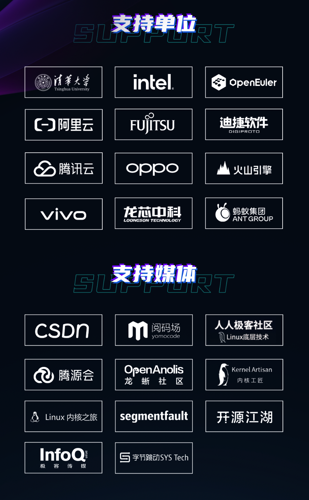

2023 年 10 月 28 日，第 18 届中国 Linux 内核开发者大会（简称 CLK 2023）于深圳成功举办。**作为国内最活跃的开源操作系统社区，openEuler大力支持并赞助了本次会议**。openEuler社区专家出席CLK大会并进行议题分享，就
Linux
内核领域的前沿探索与实践，展开讨论与分享。openEuler社区还同步直播了本次大会，文末放上了直播视频回放和演讲课件获取方式，欢迎感兴趣的开发者查看。

CLK
大会由清华大学、Intel、华为、openEuler、阿里云、富士通南大、迪捷软件、腾讯云、OPPO、字节跳动、vivo、蚂蚁集团、龙芯中科等企业发起，以"自由，协作，创新"为理念，以开源技术的推广和普及为使命，旨在促进
Linux 内核开发爱好者相互交流、共同进步，是中国 Linux
内核领域颇有影响力的峰会之一。

**openEuler相关议题：**

在主论坛圆桌会议上，**openEuler
社区 Kernel SIG Maintainer 郭寒军与腾讯资深内核研发专家，龙芯中科 Linux
内核开发工程师，英特尔技术专家和蚂蚁集团高级技术专家**参与讨论。各位专家阐明了社区发展中的实际问题和解决思路，为新手乃至资深内核开发者均提供了建设性建议。只有开发者在社区和公司内部的需求中找到平衡点，在社区和企业的利益之间找到共同点，才能真正更好得推动内核开发事业，从而增强中国开源社区的影响力。郭寒军老师还鼓励开发者积极参与
openEuler社区建设。

**在「云和服务器」分论坛上，openEuler社区开发者朱维希**分享了GMEM，一种面向领域加速器的Linux通用内存管理框架，希望通过改进Linux
MM以便捷托管任意厂商的加速器，提供基于C/C++标准的统一内存编程生态。GMEM已成功demo使用Linux
MM托管华为昇腾AI加速卡的内存管理，由OS透明地支持单卡训练13B大模型。

**在「Arch&虚拟化&I/O」分论坛上，openEuler社区开发者左泽**以《ARM64 SPE在numa
balance和damon中的实践》为主题进行分享，提出了使用SPE硬件采样替代传统页表扫描的方式，实现更精准的冷热页识别。分享了NUMA
balancing机制结合SPE在内核态实现精准跨NUMA数据访问监控，减少应用进程跨numa访问，和DAMON机制结合SPE在内核态实现冷数据页的精准回收，降低主动回收时对业务性能影响。

**在「调试/eBPF/调度」分论坛上，openEuler社区开发者龚睿奇**以《kmalloc随机化：一种新的堆喷攻击缓解手段》为主题进行分享，介绍了一种新的基于调用路径的
kmalloc
堆隔离技术。该技术能以极低内存代价实现对基于堆喷的内核漏洞攻击的有效防护，获得了内核社区的积极评价。该特性已随
Linux Kernel 6.6 版本发布，后续将合入 openEuler 社区。

此外，大会还进行了
30+ 精彩技术分享，大家期待已久的视频回放也已上线，欢迎 PC
端打开选择对应主题观看。

主论坛：

[https://live.csdn.net/room/csdnnews/roru5arM](https://live.csdn.net/room/csdnnews/roru5arM)

内存管理分论坛：

[https://live.csdn.net/room/wl5875/vsWNFfGP](https://live.csdn.net/room/wl5875/vsWNFfGP)

云和服务器分论坛：

[https://live.csdn.net/room/Hansen666666/OzVSYgu0](https://live.csdn.net/room/Hansen666666/OzVSYgu0)

Arch&虚拟化&I/O分论坛：

[https://live.csdn.net/room/csdnlive1/Q02dgSuj](https://live.csdn.net/room/csdnlive1/Q02dgSuj)

调试/eBPF/调度分论坛：

[https://live.csdn.net/room/csdnlive2/zOQlqHak](https://live.csdn.net/room/csdnlive2/zOQlqHak)

 **演讲课件**

Github 仓库：

[https://github.com/ChinaLinuxKernel/CLK2023](https://github.com/ChinaLinuxKernel/CLK2023)

CLK 大会官网：[http://ckernel.org/](http://ckernel.org/)

