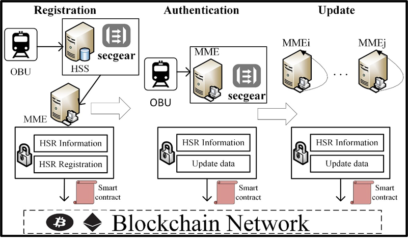

近日，由兰州大学智能计算技术研究团队的科研论文"Improved LTE-R Access
Authentication Scheme Based on Blockchain and
secGear"被中科院一区物联网顶级期刊**IOTJ（IEEE Internet of Things
Journal）**录取为长文（Regular）。这篇论文由刘忻副教授、硕士生王家寅、博士生王淼、以及张瑞生教授共同合作完成，**这是机密计算框架secGear首次被正式发表在国际顶级期刊上**，目前论文已经被预发表：https://ieeexplore.ieee.org/stamp/stamp.jsp?tp=&arnumber=10288119

该文针对高速铁路现有认证方案（LTE-R）中存在的安全漏洞和认证延迟问题，设计了一种基于区块链和secGear的LTE-R接入认证方案。鉴于现有其他方案的局限性，该研究通过区块链技术建立分布式的认证系统，消除了单点故障等漏洞，并结合secGear框架为区块链提供强大的隐私保护措施。

在该研究工作中，secGear被用于保护区块链账本隐私，包括计算过程隐私、身份隐私以及链上隐私。在区块链技术和secGear框架的具体的集成过程中，巧妙地采用系统主密钥与区块索引加密的方法，一方面减少了大量数据在TEE和REE之间的IO开销，另一方面，对攻击者来说，无法通过特权用户攻击或恶意软件植入等推算在TEE中的计算过程，也无法窃取到区块链账本数据。

与其他单一机密计算产品相比，secGear框架的优势是实现了不同架构共源码、降低安全应用开发维护成本。在高速铁路以及其他应用场景中，如何保障不同系统、不同架构下数据的安全性已经成为了亟需解决的问题。secGear框架凭借其强大的兼容性优势可以有效地解决上述问题，也是该篇文章的创新点之一。

领域专家认为，本篇论文所做的创新性工作都非常有价值，首次考虑到将区块链技术应用于高速铁路认证场景，并结合secGear机密计算框架为区块链提供"可用而不可见"的隐私保护属性。secGear框架的集成充分发挥了区块链赋能智能物联网应用的优势。

**兰州大学智能计算技术研究中心安全团队：**

兰州大学智能计算技术研究中心安全团队长期从事机密计算、零信任安全、数据安全相关的研究工作。近年来，团队主持和参加多项国家自然科学基金重点项目、甘肃省重点研发项目，主持企业横向课题二十余项，获批国家发明专利5项，发表科研论文30余篇。此外，团队的科研工作也得到了openEuler社区的大力支持，在开源之夏、开源实习、课程建设等方面与社区secGear团队开展了深入的科研合作。同时在openEuler的专家指导下，在Gitee上线了基于机密技术的"Wallfacer"、"Zerotrust"等信创开源项目。
