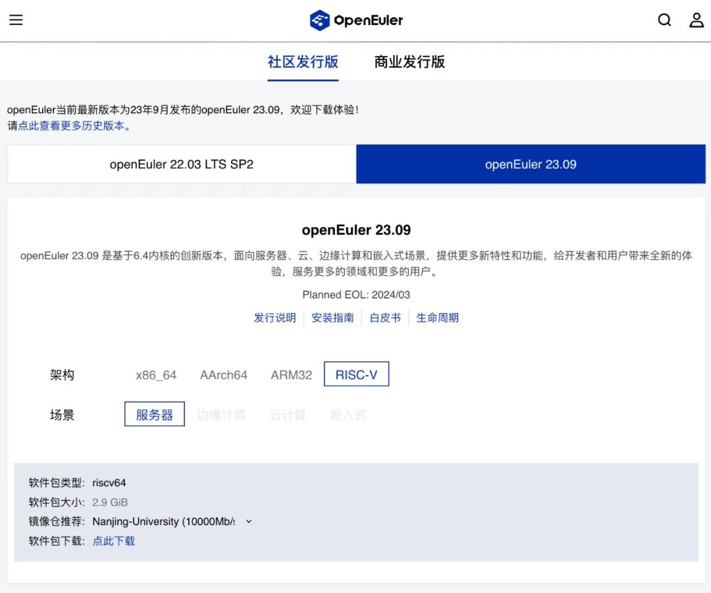
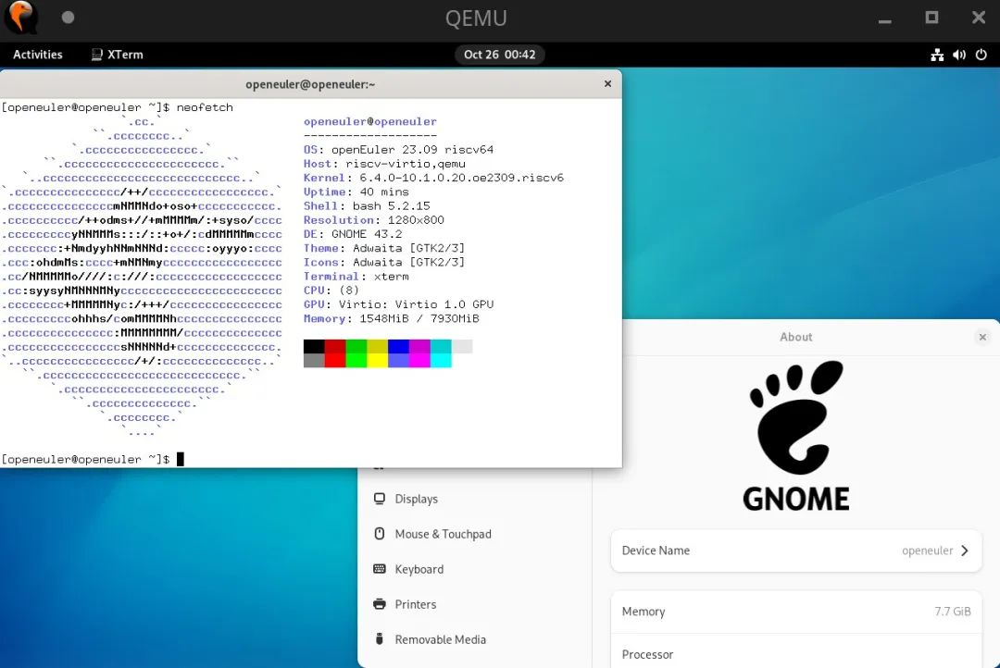

近期，openEuler加入了 RISC-V International，同时 RISC-V 正式成为
openEuler 的官方支持架构。RISC-V SIG 领头完成了 openEuler RISC-V 23.09
的主线集成工作，该项目涵盖了主线代码回合、官方工程整合及正式的镜像的发布。自
23.09 版本起，RISC-V 进入 openEuler T1 架构级别，这一进展标志着
openEuler RISC-V 发展的一个重要里程碑。openEuler RISC-V 23.09
主线版本基于 BaseOS 列表，依托 openEuler OBS
构建系统，完成了代码主线化，生成流程正规化等流程。最终通过 Release SIG
和 QA SIG 的正式评审，并在 openEuler 官方网站进行发布。

**网站链接**

**<https://www.openeuler.org/zh/download/>**

## 正式版本：主线化的集成与发布

openEuler RISC-V 23.09 是 RISC-V
首次成为官方支持架构的创新版本。该版本将经过全量测试与评审的 BaseOS
作为软件包发布列表，结合 RISC-V SIG 提供的第三方仓库，用户能够体验到
RISC-V 架构的完整生态。

### 代码主线集成

经过细致的调整和优化，LuaJIT、OpenJDK 系列、Kernel 以及 GCC 等重要软件在
RISC-V 架构上的支持已成功完成主线化，并为 RISC-V
进行了特定的修补。对于核心的运行时环境，RISC-V SIG 也已实现其主线分支的
RISC-V 架构支持。值得一提的是，中国科学院软件研究所主导的 LuaJIT RISC-V
开发工作接近尾声，并即将进入 upstream 阶段，相关工作成果在 openEuler
RISC-V 23.09 中得到验证。

### 生成流程正规化

在 openEuler RISC-V 23.09 版本中，RISC-V SIG 与 openEuler 工程组共同将
SG2042 开发板接入官方 OBS 工程作为构建 worker，同时赋能了官方的 RISC-V
架构仓库，并为镜像制作提供了基本的软件源。此外，RISC-V SIG 也为
imageTailor 等镜像制作工具适配了 RISC-V 架构支持，并且为 openEuler
的上游增加了制作 QEMU 镜像流程的相应脚本。由此，SIG 组为 openEuler 官方
CI 平台提供了构建 RISC-V 镜像的能力。

### 发布列表与镜像内容

为保障质量，本次发布的软件包列表以 BaseOS
为基础进行了筛选与优化，确保列表可以通过官方测试用例并实现软件下载依赖自包含。经过
DailyBuild
的反复迭代和测试组的多次审核，相应的软件源和镜像最终在官方仓库正式发布。此外，在基础的
BaseOS 运行环境中，包含着相当多的亮点软件，如由中国科学院软件研究所针对
RISC-V 架构进行了 JIT 优化的 Mesa 和 mozjs102，以及由 RISC-V SIG
成员参与贡献，并在 RISC-V 23.09 环境验证测试的 EDK2、GNOME 桌面 和
TeXLive2021
等。

正式发布范围提供了一个经过全面验证的工作环境，用户可以在此基础上通过第三方仓库补充软件源，从而获得更完善的
openEuler RISC-V 环境体验。

## 展望未来：RISC-V SIG 的下一步

为了更好地满足用户的需求和期待，RISC-V SIG
已明确规划了接下来的发展方向：

1.  在 openEuler 24.03 版本发布之前，完成 Everything、EPOL等所有软件包的主线更新，这包含 FireFox 和 Chromium 等软件包的RISC-V 主线化布局。

2.  与上海交通大学合作，推动"蓬莱"镜像进入主线。蓬莱项目作为 RISC-V 平台目前主流的三个 TEE 之一，旨在完善 RISC-V 安全相关的支持。

3.  将更多硬件支持的镜像推入主线，以适配更广泛的硬件设备。

4.  完善社区门禁 CI、EBS构建等一级架构支撑的所有相关功能，为用户提供稳定且高效的服务体验。

openEuler RISC-V 23.09 主线化项目证明了 openEuler 生态的稳健与可靠性。在
RISC-V SIG
的带领下，来自中国科学院软件研究所以及华为和各个社区的开发者贡献了主要的代码工作，同时
QA SIG、Release SIG、TC SIG 以及 Infra
部门成员全力配合，加速了项目的成熟和落地。贡献者们的努力为 RISC-V 架构在
openEuler 系统的广泛应用奠定了坚实的基础。在 openEuler 社区中，RISC-V
展现出了广阔的前景，用户也可以得到国内最为先进的 RISC-V
发行版体验。RISC-V 成为官方支持的架构是一个里程碑，它为 openEuler
的其他架构向主线化迈进提供了有益的参考，共同促进了 openEuler
社区基础设施的繁荣与进步。

## 联系我们

如果您对 RISC-V 感兴趣，欢迎加入 RISC-V SIG 交流群，讨论更多关于 RISC-V
的更多内容，为推动 openEuler & RISC-V 生态贡献力量

**中科院软件所吴伟微信**

**添加请备注 oerv**

## 关于作者

杨延玲，中科院软件所 PLCT 实验室实习生，欧拉开源社区 RISC-V SIG
成员，目前在温州大学读研二，负责协助 RISC-V SIG 和 ROS SIG 的日常运营。
