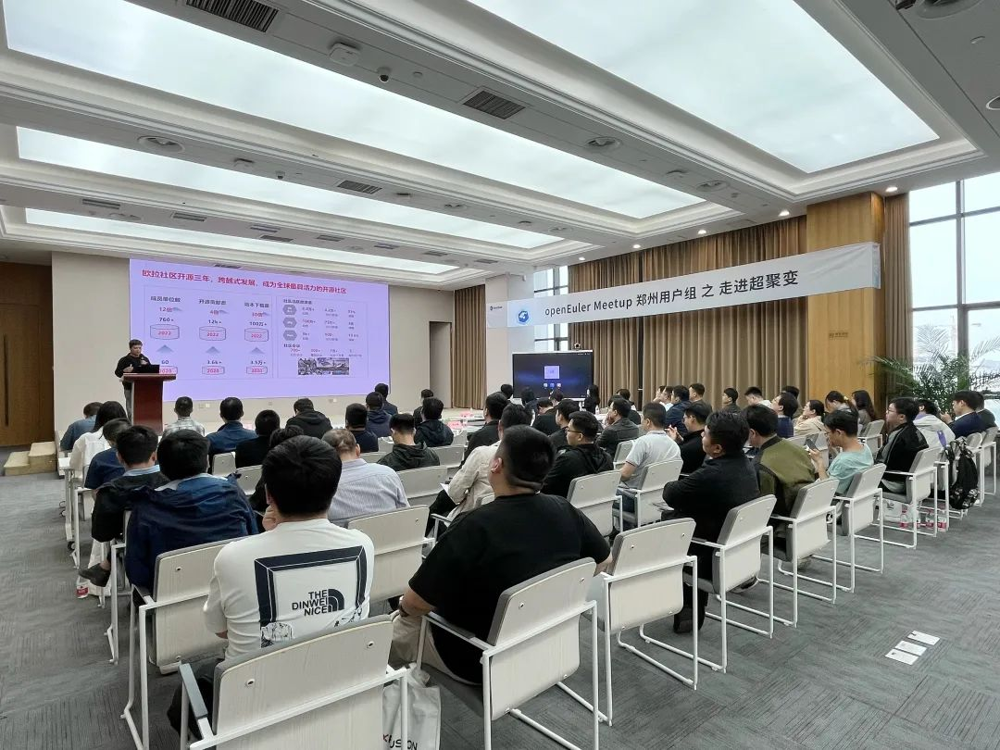
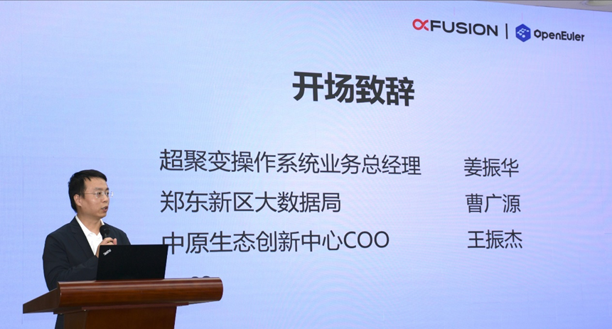
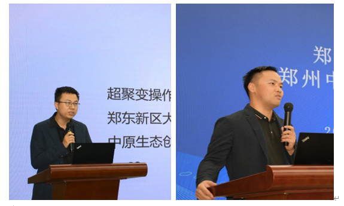
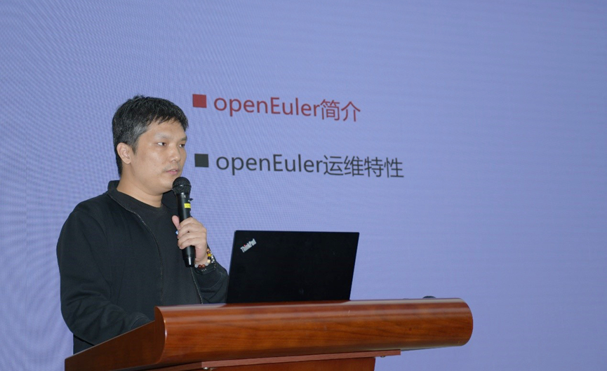
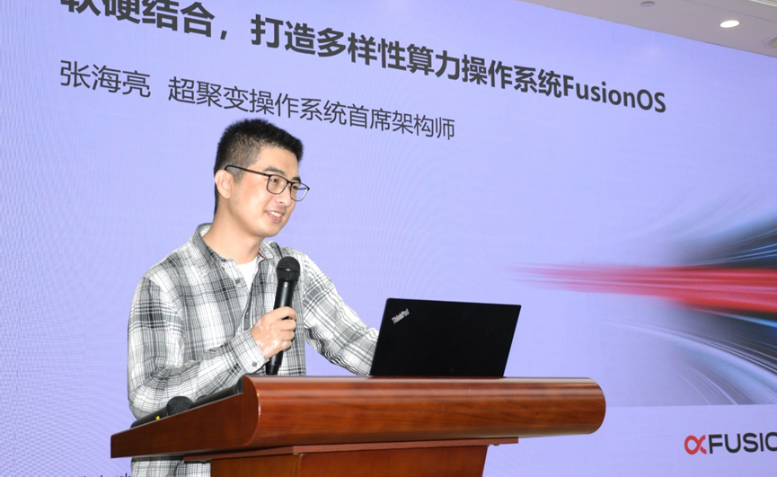
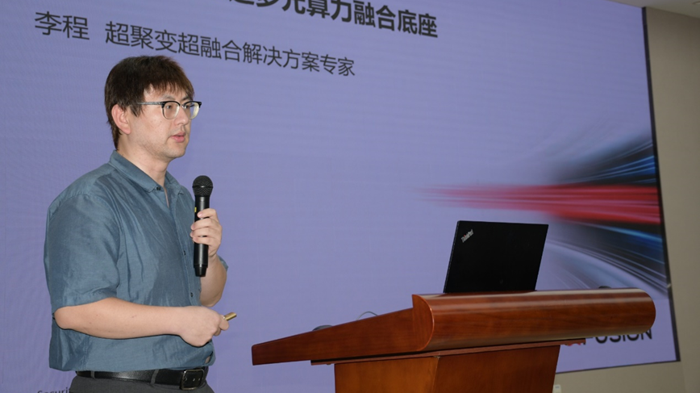
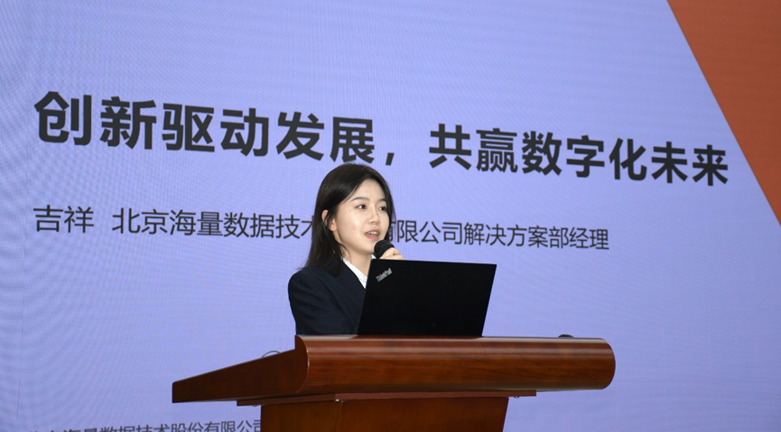
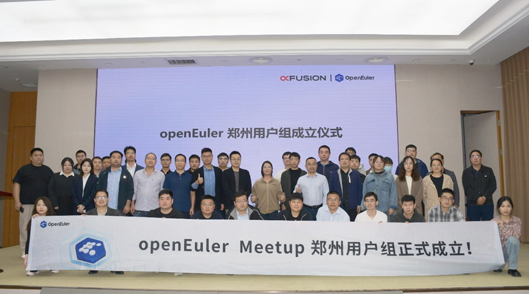

10月27日，openEuler社区与超聚变联合举办郑州用户组线下Meetup，此次活动邀请河南区域的操作系统用户走进超聚变，围绕openEuler和Fushion
OS
相关技术、生态进行分享和交流。本次活动有60余人参加，并在活动中正式成立openEuler郑州用户组，为河南区域用户后续持续交流、寻求生态合作机会提供一个大本营。

本次 Meetup 精彩内容回顾：

## 开场致辞

**超聚变操作系统业务总经理/openEuler委员会委员姜振华**为本次活动致辞，他提到作为早期就参与openEuler社区建设的一员，超聚变见证了openEuler从建立到在各行各业商业落地，再到跨越生态拐点的过程，感谢openEuler为全产业链提供一个联合创新的平台，共同推动创新技术的商业落地。

同时，本次活动受到郑州市郑东新区大数据管理局、郑州中原科技城招商服务局的支持，**郑东新区大数据管理局曹广源**在活动发言中表示openEuler在政务应用设施上的应用和深度优化，为郑东新区数字化转型提供安全可靠、高性能的技术底座；**郑州中原科技城招商服务局王林**表示郑东新区欢迎各openEuler生态相关企业在当地扎根发展，围绕openEuler社区共同发展，形成合力。

**openEuler 社区&运维特性介绍**

**openEuler技术委员会委员胡峰**在本次活动上为大家介绍了openEuler社区当前发展的整体情况，在技术方面重点分享了当前openEuler的运维特性。openEuler在打造高效运维的操作系统上不断努力，胡峰老师为大家介绍了智能运维工具A-Ops与openEuler
gala、Apollo智能漏洞管理解决方案等新特性，以及覆盖各类运维场景的精品运维组件。在自由交流环节，不少用户就当前使用openEuler遇到的一些疑问与胡峰老师进行进一步交流。

**软硬结合，构建多样性算力操作系统**

超聚变基于openEuler，结合自身软硬件技术积累，推出了超聚变服务器操作系统FusionOS。**超聚变操作系统首席架构师张海亮**分享了FusionOS软硬协同的优势，在性能、可靠性方面的卓越表现，以及FusionOS在金融、运营商、政府、互联网等多个行业的实践案例，引起众多用户的兴趣，分享结束后现场多位参会者针对FusionOS的特性向讲师提问交流。

## 一云多芯，打造多元算力融合底座

**超聚变超融合解决方案专家李程**表示以高度集成、软硬一体、统一运维为特征的"超融合架构"是业界公认的升级方向和实现软件定义数据中心（SDDC）的终极技术途径，他对超聚变推出的计算虚拟化、存储资源池化、运维统一化、提供广泛生态兼容的FusionOne
HCI超融合解决方案进行了深入解读。

**创新驱动发展，共赢数字化未来**\
**北京海量数据技术股份有限公司解决方案部经理吉祥**分享了海量数据在完善生态建设上的努力，实现了与芯片、操作系统、独立软件开发商的全面兼容适配，海量数据完成与openEuler、超聚变FusionOS适配，经严格测试，在主流运算环境下适配性能达到行业领先水平，在行业已有多个成功实践案例。

## 郑州用户组！！

在活动最后环节，openEuler郑州用户组正式成立，30余人已申请加入用户组，后续持续开放给更多用户加入，方便河南区域用户集中交流、开展活动、反馈用户诉求。

未来超聚变将继续携手openEuler，推动郑州用户组积极开展相关活动，助力openEuler在河南省各行业的应用实践，共同为当地企业提供强大的操作系统支持，共创算力新发展。

扫码申请加入openEuler郑州用户组
