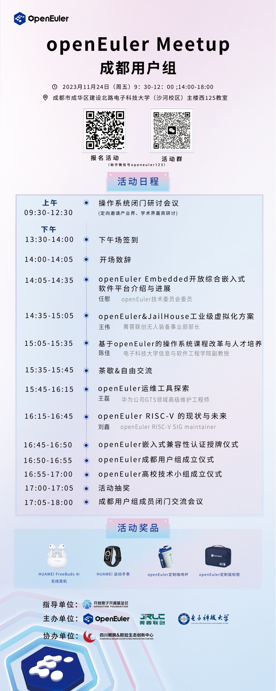

openEuler Meetup即将来到成都！本次活动上将正式成立成都用户组，欢迎成都的用户、开发者们来线下认识交流。

**11月24日，openEuler社区、成都菁蓉联创科技有限公司、电子科技大学、四川鲲鹏&欧拉生态创新中心**联合在电子科技大学沙河校区举办此次Meetup，上午操作系统技术闭门研讨会议将邀请成都产业界、学术界嘉宾共同探讨操作系统技术的自主创新发展、开源协作，下午公开Meetup面向所有操作系统用户、开发者、爱好者，分享交流openEuler嵌入式、运维、Risc-V等技术方向，欢迎大家报名！

**活动信息**

**时间**：2023年11月24日（周五）9:30-12:00；14:00-18:00

**地点**：成都市成华区建设北路电子科技大学（沙河校区）主楼西125教室

**扫码报名**

