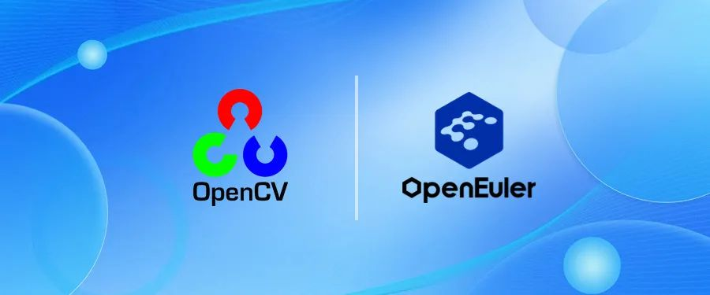
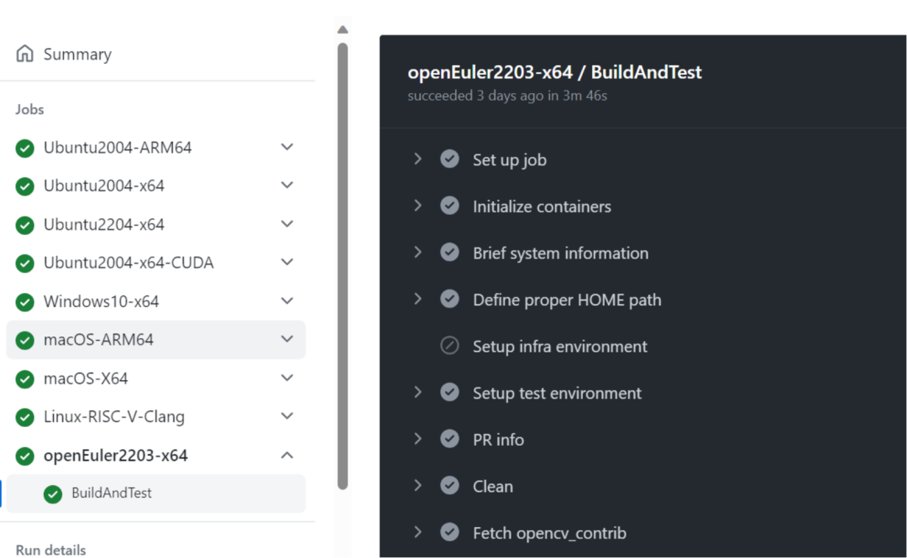

**2023年11月17日，OpenCV社区正式接纳openEuler作为持续集成（Continuous
Integration，CI）系统的操作系统之一，对openEuler提供上游原生支持。openEuler成为继Ubuntu之外第二个被OpenCV上游社区原生支持的Linux发行版。**

**关于OpenCV**

OpenCV（Open Source Computer Vision
Library），是一个多平台的开源计算机视觉库。它提供了丰富的功能，包括图像处理，特征检测，目标识别，机器学习等，在计算机视觉领域，OpenCV凭借其强大的功能、性能和广泛的应用场景，已经建立起绝对的领导地位。开发者可以使用C++，Python等多种编程语言进行OpenCV应用的开发。

**关于持续集成**

持续集成（Continuous
Integration，CI）提供了一个高效、自动化的开发环境，开发者可以实时检测和解决可能出现的问题，确保软件系统的稳定性和质量。持续集成系统不仅加速了开发周期，也为开发者提供了更快速、可靠的反馈机制，从而推动了软件开发的创新和进步。openEuler接入OpenCV持续集成系统，有助于确保OpenCV在openEuler上的稳定性和性能。

**关于openEuler**

在数字化时代，操作系统（OS）的角色愈发重要，而人工智能（AI）技术的崛起为操作系统带来了新的使命。openEuler秉持着"OS
for AI, AI for
OS"的理念，致力于将人工智能融入操作系统的方方面面。openEuler将为开发者提供一个更为智能、高效的开发运行环境，推动操作系统与人工智能的深度融合，开启AI
for OS的全新时代。

接下来，OpenCV社区与openEuler社区将持续共同合作，确保OpenCV的特性和问题修复均在昇腾硬件和openEuler上进行高效验证，为用户提供更高质量更好性能的能力，促进计算机视觉技术的应用和发展。
