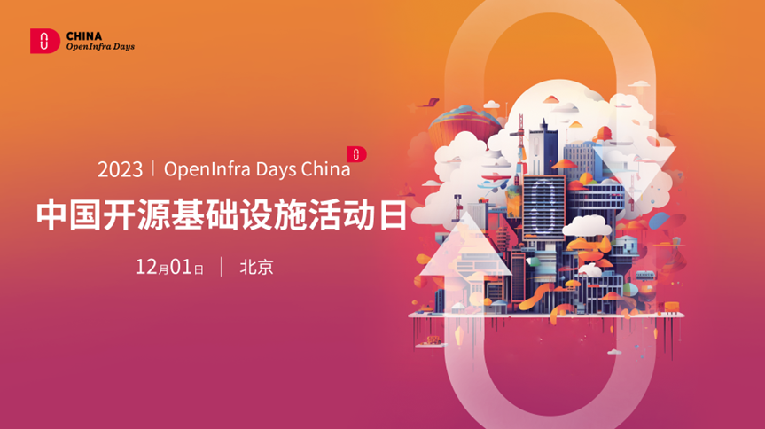
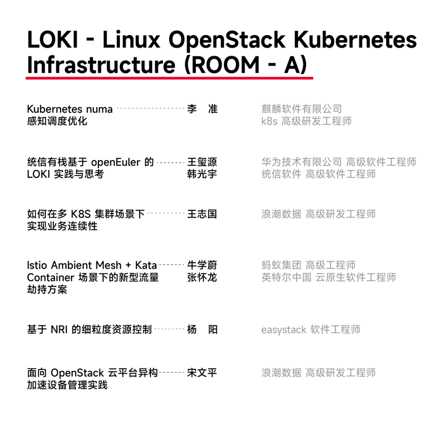
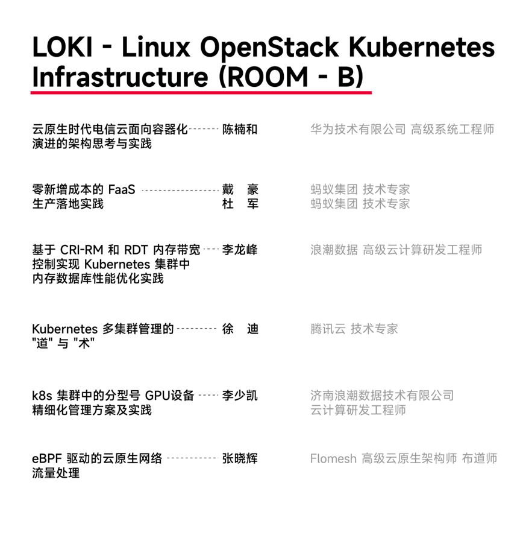
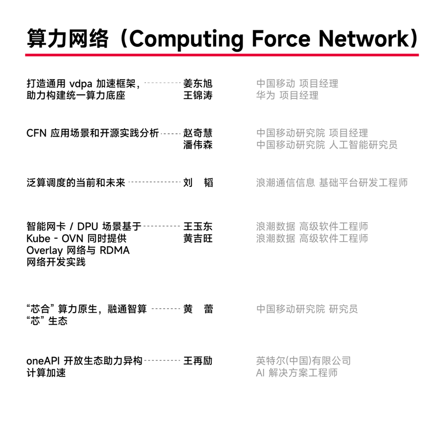
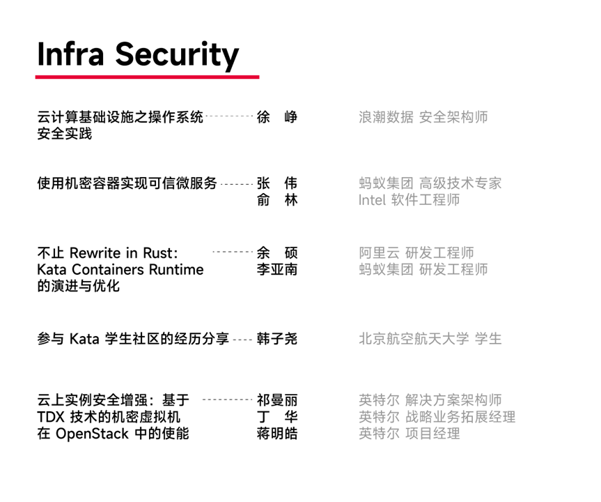
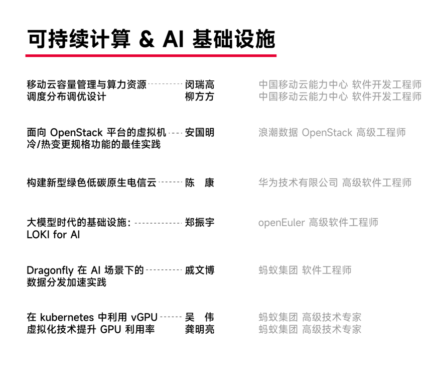
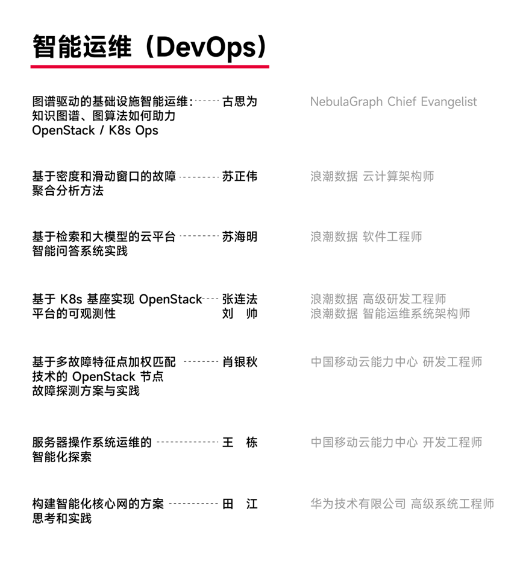
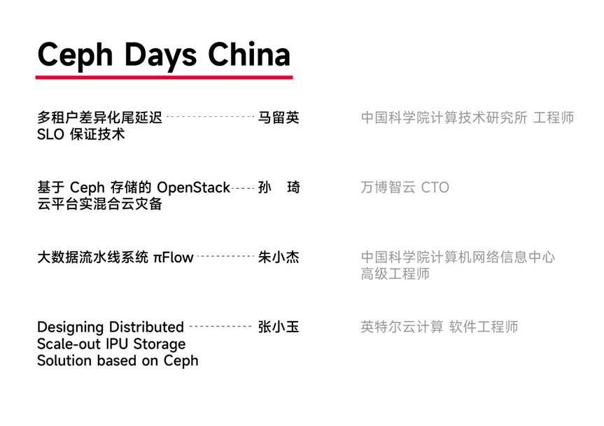

OpenInfra Days China
2023由 OpenInfra 基金会授权，社区志愿者团队共同筹划组织，本次大会将于 12 月 1 日在北京海航万豪酒店举行。\
今年，Openlnfra Days
China 聚焦开源基础设施前沿技术，汇集了全球社区的技术专家和行业领袖，以及国内活跃的开源基础设施技术企业，中国开发者将能够近距离了解 OpenInfra 基金会诸多开源基础设施项目的最新进展，以及全球前沿基础设施技术的应用实践。\
秉持为全球云计算重塑开源基础设施技术的理念，本次大会分论坛将围绕 LOKI（Linux
OpenStack Kubernetes
Infrastructure）、算力网络、基础设施安全、可持续计算 &
AI 基础设施、智能运维、Ceph 6 大方向展开。详细议程如下：\

访问大会官网即可免费注册：<https://pages.segmentfault.com/openinfra-2023>
