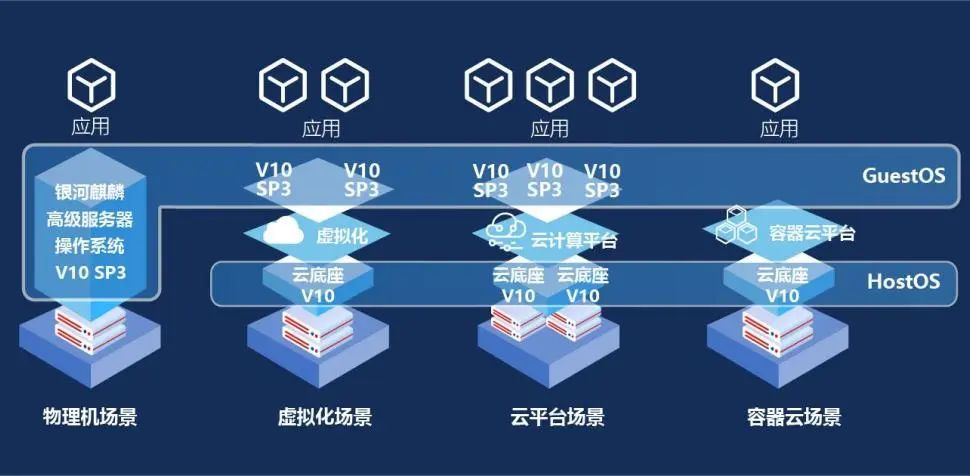
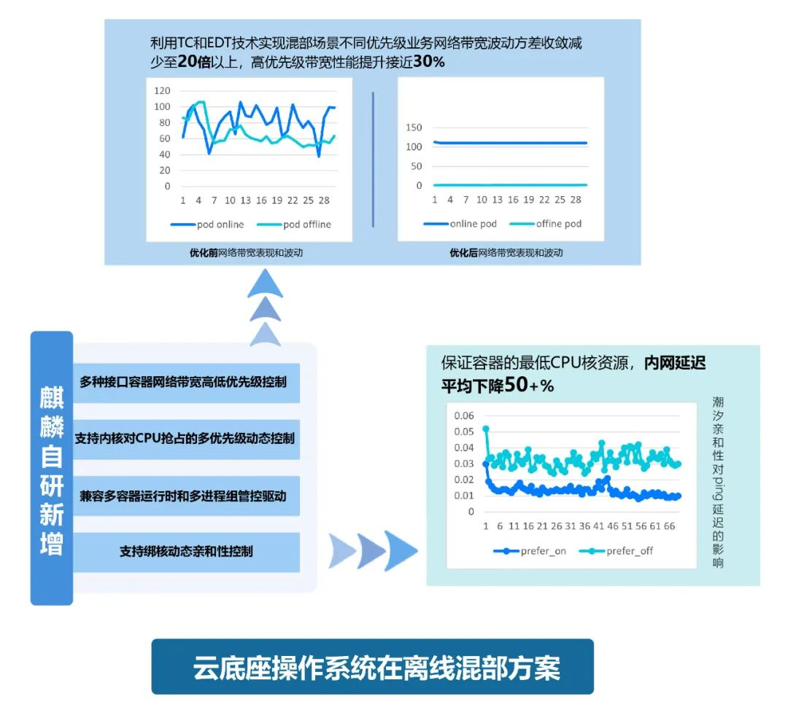
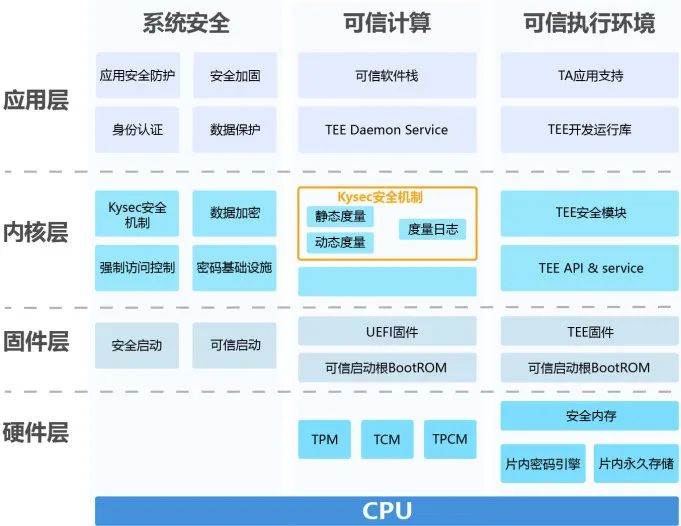
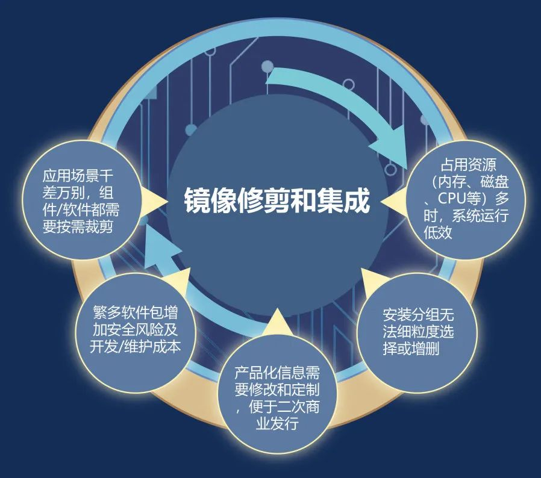

近年来，云计算发展呈现明显扩张趋势，中国私有云市场保持高速增长，增速维持在30%以上，预计到2024年中国私有云市场规模将达到2768.2亿元（数据来源：赛迪顾问）。业务云化为云厂商带来机遇的同时，也带来了诸多挑战，就云宿主机而言，成本增加、服务能力欠缺、先进技术引入慢、安全合规挑战大等是必须面对的现实问题。

银河麒麟云底座操作系统V10是针对云宿主机关键诉求，整合麒麟操作系统云业务专业能力，同时广泛吸收开源社区先进特性，面向云场景打造功能增强、性能优化、技术兜底、安全无忧、运维便捷的云底座操作系统，能够满足国内云厂商发展需要，助力云伙伴打造安全可信的国产云平台解决方案，服务企业"上云"和数字化转型。

**场景特性增强**

**资源调度持续优化**

银河麒麟云底座操作系统V10以独立的内核研发能力及先进技术商业实践为基础，吸收openEuler等主流社区云宿主机场景技术特性，并对云计算专项优化，增强在离线混部技术、优化分布式存储方案、持续扩大eBPF应用范围等，充分提升云资源利用率；同时广泛兼容国产计算底座，充分发挥国产算力资源。

**安全能力突出**

**数据资产保驾护航**

银河麒麟云底座操作系统V10支持核内核外一体化内生安全体系、安全审计、安全加固、国密算法组件等多重安全联防机制，并支持通用安全和可信计算，系统性地增强HostOS底层安全。

**管理手段丰富**

**运维体验轻松便捷**

为了兼顾生产环境的服务水平及管理能力，银河麒麟云底座操作系统V10在易管理特性基础上，引入低系统开销的kfence内存安全错误检测机制、基于eBPF的nettrace网络故障诊断工具集；并且在社区版本支持X86同架构热迁移的基础上，实现ARM架构的不同CPU虚拟机热迁移支持；同时为用户提供镜像裁剪定制工具进行裁剪和增加操作系统镜像中的外围软件包，以及修改定制产品信息，全面优化运维管理。

**合作模式灵活**

**技术服务深度兜底**

银河麒麟云底座操作系统V10对云场景用户开放，支持进行源码定制增强，同时支持联合创新，与商业伙伴共同打造云场景解决方案。

为更好地助力服务上云，银河麒麟云底座操作系统V10可向商业用户提供企业级技术兜底，及时响应客户对产品升级及漏洞修复、补丁更新技术诉求，并提供高级技术咨询、专家技术维护等服务，为不同需求的客户提供细致周到、满意至上的服务体验。
