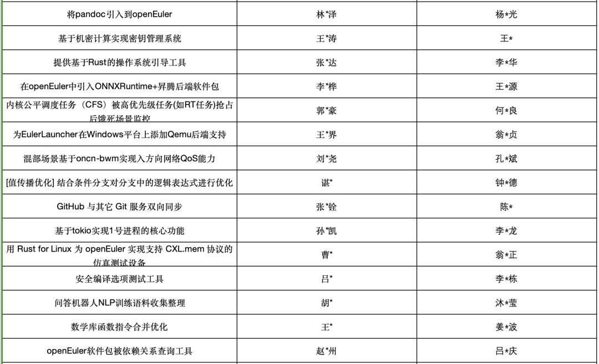

激动人心的时刻终于到来！开源之夏 2023 活动结项审核结果正式出炉！

经过长达一个多月的严格审核，共有 400
余位学生通过导师与组委会的重重考核，顺利结项！在此恭喜所有成功结项的同学，愿你们继续怀抱对开源的热情，不断追求卓越，在开源之路上越走越远。同时，也衷心感谢每位项目导师与社区负责人的悉心指导与辛勤付出，用自己的智慧与经验为学生揭开开源世界的奥秘。开源之旅，因你们而精彩！

**结项公示地址**：https://summer-ospp.ac.cn/final

**\# 结项公示**

-   学生与导师可在活动官网和系统中查看结项审核结果。

-   通过结项审核的学生将获得项奖金以及结项证书，并有机会参与优秀学生评选。

近期，组委会将通过邮件方式向社区及导师征集优秀学生推荐名单，请老师们留意。优秀学生预期有四个奖项共
20 位，并将获得开源之夏优秀学生证书和奖杯。

**\# openEuler社区成功结项项目如下**

openEuler社区上线96个项目，其中89个项目中选，收到309份申请书，提交结项报告71份，最终通过组委会审核公示66个项目，恭喜以下项目导师与学生成功结项。

**\# 学生与导师结项奖金**

-   通过结项审核的学生与导师，请及时登录系统，在【我的项目】界面（导师为【导师结项审核】界面）中，**上传签字版参与协议扫描件**，并按要求**及时填写收款银行卡信息**。

-   学生奖金总额根据项目难度分为**进阶税前 12000 元人民币**、**基础税前8000 元人民币**。

-   导师奖金均为**税前 3000 元人民币**。

**\# 奖金接收注意事项**

-   通过结项审核的学生与导师在系统中下载、手签、上传签字版学生参与协议电子扫描件，**银行卡信息录入界面将在参与协议上传完成后出现**。

-   学生与导师奖金将由**银行转账**方式发放，收款银行卡须为**本人名下借记卡，**银行卡需为**一类银行卡**（二类银行卡日转账限额将影响奖金发放）。

-   学生与导师奖金将根据《中华人民共和国个人所得税法》居民个人劳务报酬所得个税计算方式进行预扣预缴。满足个人所得税退税条件的学生与导师，可在第二年的
    3 至 6 月在个人所得税 APP 中申请退税。

-   为避免因信息错误而导致的奖金发放延误，请学生与导师认真核对银行卡账号信息。如有任何问题，请及时联系开源小助手微信账号或发送邮件至组委会邮箱  org@summer-ospp.ac.cn。

*注：采集数据仅用于此次活动，活动组委会将采取合理的措施来保护隐私数据、个人身份信息和其他敏感资料。*

**\# 其他问题**

-   如遇其他问题，可参考官网学生指南中的相关内容，或发送邮件至组委会邮箱 org@summer-ospp.ac.cn，或通过开源之夏小助手微信账号联系组委会。

-   学生指南：https://summer-ospp.ac.cn/help/student/

-   导师指南：https://summer-ospp.ac.cn/help/mentor/

**\# 关于开源之夏**

"开源之夏（英文简称
OSPP）"是中科院软件所"开源软件供应链点亮计划"指导下的系列暑期活动，由软件所与
openEuler
社区共同主办、中科南京软件技术研究院承办，旨在鼓励在校学生积极参与开源软件的开发维护，培养和发掘更多优秀的开发者，促进优秀开源软件社区的蓬勃发展，助力开源软件供应链建设。

活动联合各大开源社区，针对重要开源软件的开发与维护提供项目，并向全球高校学生开放报名。学生可自主选择感兴趣的项目进行申请，中选后在项目资深开发者（社区导师）的指导下进行开发。根据项目的难易程度和完成情况，结项者将获取开源之夏活动奖金和结项证书。

开源之夏活动已迈入第四个年头。在过去的三年中，开源之夏与众多蓬勃发展的开源社区携手并进，不断推动开源技术在高校学生中的普及和推广，使得越来越多的学生参与到开源项目中来，更多优秀的开源贡献者和开源项目应运而生，为推动开源生态发展提供了有力的支持。

**\# 联系我们**\
欢迎开源社区、高校、科研机构、企业、媒体等加入开源之夏，欲对活动有更详细了解，请随时联系我们------**活动官网：**https://summer-ospp.ac.cn**官方邮箱：**org@summer-ospp.ac.cn**通用邮件列表：**summer-ospp@googlegroups.com组委会将在
Slack 频道里发布与微信群一致的通知，不习惯使用微信群的参与者可以订阅
Slack 频道：https://slack.summer-ospp.ac.cn

**\# 活动组织方**

**主办方：**

**承办方：**

**特约合作伙伴：**

**媒体合作伙伴：**

