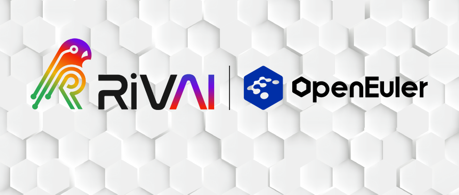
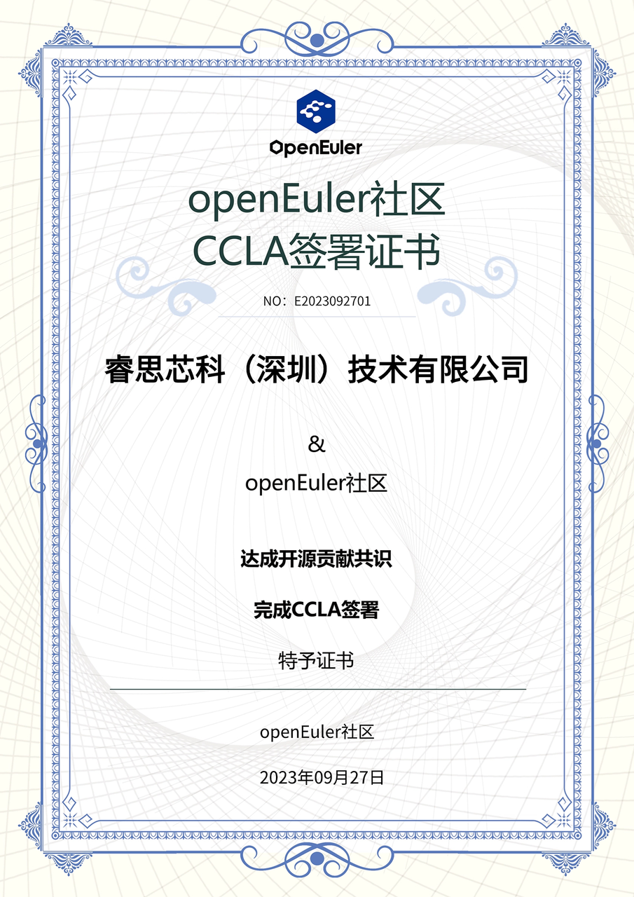

近日，**睿思芯科**签署了贡献者许可协议（Contributor License
Agreement，CLA），正式加入**openEuler社区**。

**睿思芯科**作为RISC-V
CPU领域的领先厂商，其创始团队来自于加州大学伯克利分校RISC-V原创项目组，始终致力于高端处理器解决方案的自主研发，并聚焦RISC-V
CPU核心技术和产品的研究与突破。加入**openEuler社区**后，睿思芯科已着手开展**RiVAI
P系列SoC与openEuler操作系统的适配工作**，在安全启动、数据存储等应用场景中提供高匹配度的优化，以实现性能的突破。此后，睿思芯科也将积极参与社区事务，与社区开展深度合作，**推动openEuler与RISC-V架构的融合发展，促进RISC-V软硬件开源生态的建设。**

**RISC-V**是一款基于精简指令集（RISC）原则的开源指令集架构，最初由加州大学伯克利分校开发，凭借其开源、开放、精简、可扩展等优势，近年来获得了广泛应用，目前全球采用RISC-V架构的芯片已发货超过100亿颗。近期，openEuler社区加入了RISC-V国际基金会，同时RISC-V进入openEuler
T1架构级别，正式成为openEuler的官方支持架构。

关于openEuler社区
-----------------

openEuler社区，全称为OpenAtom
openEuler社区，是一个面向数字基础设施操作系统的开源社区，简称openEuler或者openEuler社区。由开放原子开源基金会（以下简称"基金会"）孵化及运营。openEuler是一个面向数字基础设施的操作系统，支持服务器、云计算、边缘计算、嵌入式等应用场景，支持多样性计算，致力于提供安全、稳定、易用的操作系统。通过为应用提供确定性保障能力，支持OT领域应用及OT与ICT的融合。
