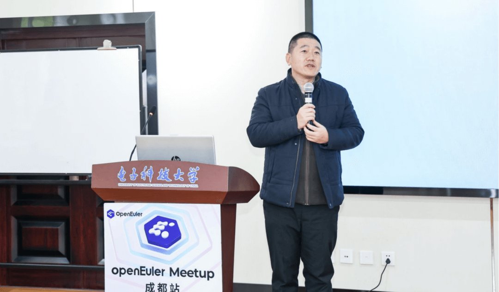
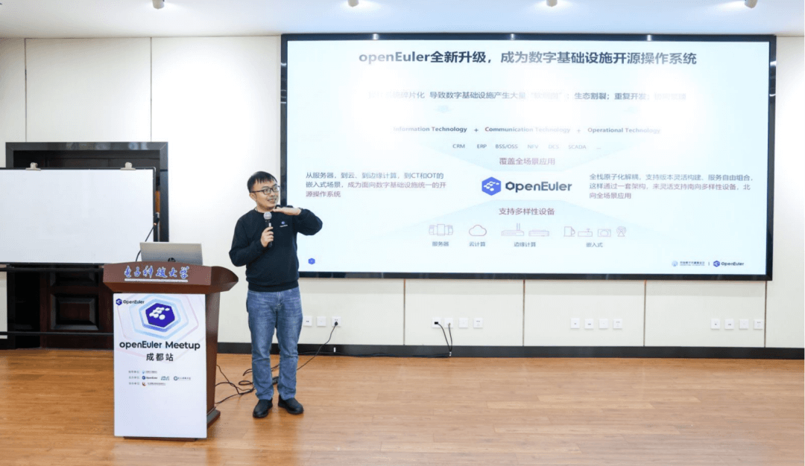
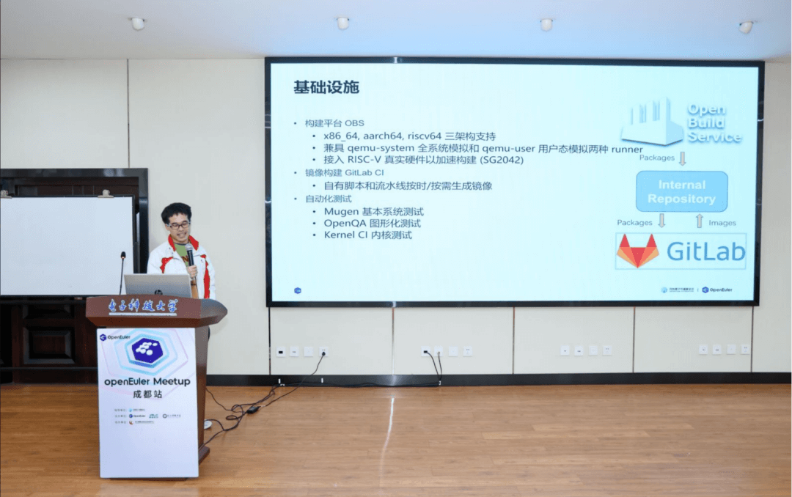

11月24日，openEuler Meetup 成都站成功举办。**本次 Meetup 由 openEuler
社区、成都菁蓉联创科技有限公司、电子科技大学主办，四川鲲鹏&欧拉创新中心协办**，汇聚产业界、学术界力量，在为期一天的活动中，通过闭门会议和公开分享的形式，交流探讨
openEuler 社区技术，以及 openEuler
与高校操作系统教学的融合发展。本次活动上正式成立了 **openEuler成都用户组**以及**电子科技大学 openEuler
技术小组**，为四川区域用户和高校学生构建持续学习交流openEuler的平台。

在上午闭门研讨会议中，**40余位来自工业制造业、物联网、芯片、装备工程研究所等行业企业与单位的技术专家，共同探讨嵌入式操作系统与产业的结合**，大家针对在各自行业的实践经验与痛点表达对国内嵌入式操作系统发展的见解，提出对openEuler嵌入式的诉求。

**下午场面向现场120余位社区用户、学习者**，进行了openEuler技术、生态建设、高校教育相关的内容公开分享。

**电子科技大学信息与软件工程学院副院长朱国斌**为本次活动致辞，他对openEuler开源活动进入高校交流表示支持，希望促进openEuler开源建设与高校教育科研之间的互动，让高校人才培养和产业需求更好地对接起来。此次Meetup成立电子科技大学openEuler高校技术小组，将进一步加强电子科技大学与openEuler的合作。

**openEuler社区运营总监郑振宇**整体介绍了openEuler社区技术、生态方面的最新进展，以及openEuler针对高校人才培养的一系列活动。openEuler社区将充分依托企业、学校、学生等各方力量，打造开放、包容、共享的优质高校平台，期待更多高校积极参与，共同培养更多具有卓越创新能力的开源人才!

**openEuler技术委员会委员任慰**为大家介绍了开放综合嵌入式软件平台openEuler
Emdedded，让大家了解了openEuler
Emdedded架构、关键特性、生态、运行模式、关键优势。

作为openEuler社区嵌入式领域的重要合作伙伴，菁蓉联创聚焦行业的嵌入式操作系统方案国产化，在嵌入式虚拟化技术领域有很深的研究。**菁蓉联创无人装备事业部部长王伟**为大家分享了嵌入式虚拟化发展以及基于openEuler与JailHouse的工业级虚拟化解决方案。

**电子科技大学信息与软件工程学院副教授陈佳老师**分享了电子科大基于openEuler的操作系统教学上的探索，介绍了以产教融合为导向，进行教学体系与模式的创新与改革的经验与成果，现场企业代表就如何培养和吸引高校操作系统人才与陈老师进行了进一步交流。

运维一直是用户比较关心的问题，openEuler在帮助用户实现高效运维上做了很多努力，**社区运维专家王磊**为大家介绍了社区丰富好用的运维工具，以及最新推出的运维专区<https://www.openeuler.org/zh/om/>，集合了openEuler开源社区及伙伴构建的一系列专、精的运维组件，以及各种统一运维工具，协助用户更好地使用openEuler操作系统。

openEuler作为一个多架构支持的操作系统，已实现对risc-v架构的全面支持，**openEuler
RISC-V SIG Maintainer 刘鑫**为大家介绍了 RISC-V SIG
在适配方面取得的多项成果以及实际应用情况。

在上个月openEuler发布了嵌入式OS兼容性测评标准，成都菁蓉联创科技有限公司成为首批获得openEuler嵌入式系统的OSV产品兼容性认证的企业，在本次活动上由openEuler兼容性测评组织-四川欧拉创新中心正式为菁蓉联创颁发了认证证书。

***成都用户组！！***

在本次活动上正式成立了openEuler成都用户组，首批招募有**30**余位企业代表和个人申请加入，四川鲲鹏&欧拉生态创新中心COO曾强担任该用户组Organizer
，成都用户组后续将作为四川地域的用户、开发者持续交流的线下阵地，欢迎更多伙伴加入共同发展openEuler用户生态。点击申请加入用户组[\>]{.underline}

***高校技术小组！！***

同时，电子科技大学openEuler高校技术小组也在本次活动上正式成立，该小组聚集对openEuler感兴趣的同学，在指导老师帮助下围绕openEuler进行学习、科研以及参与社区贡献，同时社区也为小组提供知识赋能与资源支持。

在菁蓉联创、电子科技大学、四川鲲鹏&欧拉创新中心的大力支持下，本次活动圆满结束。本次活动展现了openEuler在四川地域的生态繁荣，社区欢迎更多企业伙伴、用户、开发者加入共建！
