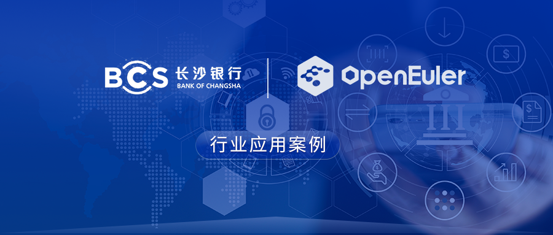
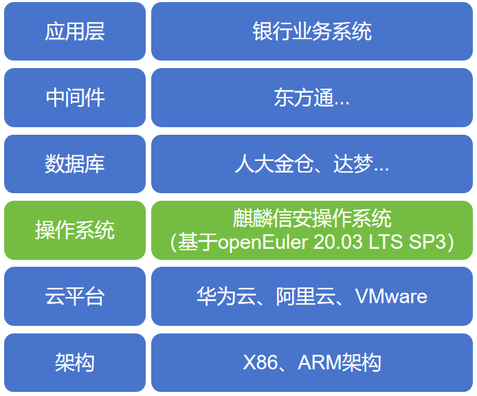

## 应用场景

长沙银行成立于1997年5月25日，是湖南省首家区域性股份制商业银行和湖南省最大的法人金融企业，始终秉承"正道⽽⾏、信泽⼤众"的发展使命，坚持深耕湖南，做"湖南⼈的主办银⾏"的定位，构建了以⼤批发为业务主体，⼤零售、⼤资管为两翼，⽹络⾦融为⼀尾的"⼀体两翼⼀尾"业务格局，着⼒打造智慧⾦融、县域⾦融、绿⾊⾦融、科技⾦融四⼤特⾊战略品牌。

随着长沙银行业务规模增长、新系统建设、存量系统迁移需求与数字化转型及云原生建设的推进，现有数据中心基础软件授权需要进一步新增或扩容，湖南麒麟信安为长沙银行提供麒麟信安服务器操作系统V3，为银行中的业务系统、中间件、数据库等提供所需的基础运行环境。

## 业务挑战

**1、兼容性**

长沙银行业务系统较多，组网复杂，需要进行不同场景适配。需要逐个对银行业务系统进行兼容性验证，在兼容适配方面是个较大的挑战，湖南欧拉创新中心为长沙银行业务系统的迁移提供兼容适配服务。

**2、可靠性**

长沙银行作为金融机构，其业务的稳定性和可靠性对客户资金安全和金融市场稳定都具有至关重要的意义。银行业务系统需要保持7\*24小时的高可靠和连续性，即使在系统升级、维护或者突发事件发生时也需要保持业务的正常进行。因此对服务器操作系统的可靠性要求极高。

**3、安全性**

银行业务系统的安全性至关重要，银行业务系统承载着大量的交易数据和储户数据，比如储户开户信息、交易信息、金融市场信息、银行内部管理信息等都需要受到严格的保护。因此对操作系统的安全性要求极高。

**4、高性能**

银行业务系统经常有大量的交易处理和查询请求，因此系统需要具备高并发处理能力，能够有效地处理大量并发的请求，而不会因为请求过多而导致系统性能下降。同时对于交易的响应速度要求非常高，需要保持低延迟，即在客户发起交易请求后，系统能够迅速响应并完成交易处理。因此要求服务器操作系统具备高性能的要求。

## 解决方案

为了满足银行业务系统的高标准要求，长沙银行服务器操作系统采用基于openEuler
20.03 LTS
SP3研发的麒麟信安服务器操作系统V3，通过对操作系统底层做深度适配调优，长沙银行构建分布式银行业务系统，完成ARM和X86异构平台双轨运行，麒麟信安服务器操作系统向上兼容人大金仓、达梦数据库和东方通中间件，并对应用层的上百个银行业务系统进行兼容适配验证，为应用程序提供了数据存储、数据交换和运行环境等功能。

麒麟信安服务器操作系统v3通过多种内核安全增强机制，特别是结构化保护级安全内核和实体一体化的强制访问控制机制，安全等级达到公安部结构化保护级和解放军某测评中心军B+级，为银行业的应用安全和网络安全提供了有效的防护手段。

同时该操作系统采用了多种优化技术，如内核优化、IO优化等，提高了系统对应用程序的响应速度和处理能力，可以在最小化资源占用的同时实现最大化的性能，满足长沙银行对高性能计算的需求。

## 客户价值

长沙银行在国产操作系统的布局，降低了银行业对国外操作系统的依赖，不仅解决了国外操作系统停服可能导致的银行安全漏洞风险，同时国内操作系统厂商提供的本土化支持服务，也能更好的满足长沙银行对售后服务及时性、高效性、稳定性的要求，更好的保障了客户的资金和个人信息安全，提高了客户对长沙银行信息安全的信任。

采用基于国内openEuler根社区研发的麒麟信安操作系统在长沙银行的成功应用，不仅消除了长沙银行对软硬件兼容适配问题的担忧，实现了银行业务系统的平滑迁移，更推动了长沙银行信息化建设的自主创新，为金融行业的基础设施建设开辟了一条新的技术路线。

## 合作伙伴

