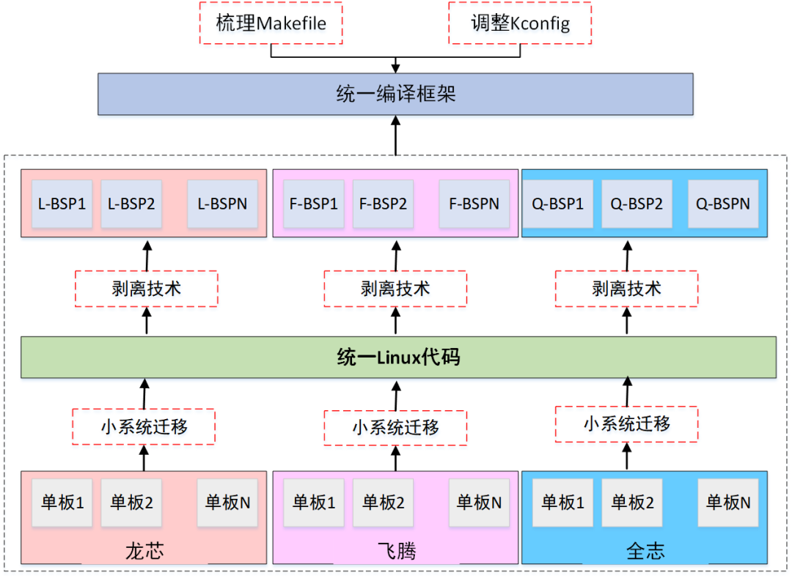

**近日，成都菁蓉联创科技有限公司（简称：菁蓉联创）携手四川鲲鹏&欧拉生态创新中心完成首个openEuler嵌入式操作系统技术测评证书**openEuler嵌入式操作系统测评是专门针对使用
openEuler
系列操作系统的软硬件解决方案进行的兼容性测试。此次认证表明菁蓉联创此类产品达到自主可控的标准，为行业客户提供更多选择。菁蓉联创欧拉版操作系统，是一款适用于多种处理器架构和硬件平台的嵌入式操作系统，可以在海思、飞腾、瑞芯微等系列芯片上运行，并提供良好的性能和功能支持。面向行业领域的嵌入式操作系统除具备操作系统基本功能之外，进行领域特色功能定制化，才能满足嵌入式场景的独特需求。

**行业案例**

以航天领域为例，随着卫星性能的提升，卫星载荷嵌入式操作系统针对实时性、安全性、可靠性以及易用性都需要针对性的研发。

在实时性方面，卫星载荷要求的中断延迟与任务调度延迟越来越苛刻，需要嵌入式操作系统提升内核的硬实时响应能力。如：任务切换时间小于10us，中断响应小于10us。菁蓉联创欧拉版操作系统在openEuler内核上通过混合部署方式，重新构建独立硬实时内核，实现非实时域与硬实时域分离，将硬实时任务分发到硬实时域，从而在继承原有宏内核生态资源的同时保障了系统的硬实时性，提高了其在航天领域的适用性。

在安全性方面，已形成星载载荷安全技术的操作系统研究方法，提供全方位的安全控制策略。通过内核空间内存和用户空间内存资源隔离，防止内核数据被非法传递到用户空间内存。操作系统同时支持异常信息采集并回传地面实时安全态势感知。在高可靠方面，内核分区设计实现单粒子防护，提供自动恢复错误分区的功能。充分考虑系统尺寸的精简性和系统资源利用的有效性，基于内核中断和异常机制，设计星载黑匣子功能，实现星载实时监控。在高易用性方面，菁蓉联创欧拉版基础软件平台包括嵌入式操作系统内核、板级支持包、基础库函数、遥测遥控等，并实现对应用软件进行安装、运行、卸载、状态监控等在轨功能。另外，为了满足更多工业场景，本版本支持高可扩展性的工程管理框架与代码框架，一方面可以在操作系统的构建上面通过BSP剥离技术实现便捷快速的新增与构建，另一方面在操作系统的驱动编码框架上提供了抽象化与模块化的编码机制，能够实现新增硬件或CPU平台的快速迁移与适配。

**关于菁蓉联创**

菁蓉联创近年来一直致力于携手openEuler社区与国内开源生态系统更加紧密地结合在一起，2023年4月菁蓉联创成为openEuler工业领域操作系统筹备委员会首批成员单位并正式发布面向企业级嵌入式场景的操作系统欧拉版，广泛应用在远程通信、工业控制、物联网、航空航天等嵌入式领域，为企业级用户构建基于openEuler的基础软件数字底座。

菁蓉联创重点突破9项嵌入式操作系统关键技术：嵌入式操作系统宏内核的低时延调度与低时延中断响应、双内核域功能兼容、实时任务透明切换功能和驱动热切换、隐私计算与可靠启动、三模冗余机制保障、轻量化的柔性编译和部署技术、软件包管理、基于微内核的硬件设备驱动技术、人工智能学习平台兼容等关键技术。\
此次菁蓉联创开发的产品与欧拉嵌入式操作系统完成兼容性互认证，将深化openEuler在工业制造领域的多产业链布局。未来，菁蓉联创将秉承初心，坚持科技自立自强，以自主创新为引擎，携手欧拉及更多生态合作伙伴，积极参与基础软件生态共建，努力成为基础软件生态发展的积极推动者和重要的贡献者，持续保持openEuler开源社区贡献建设。

