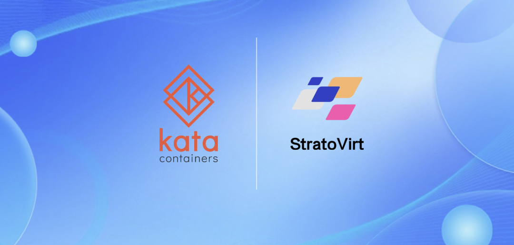
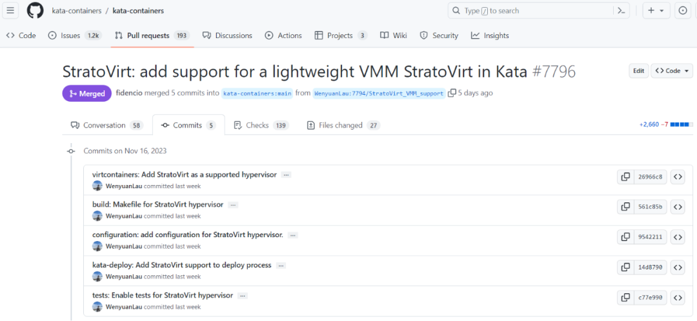
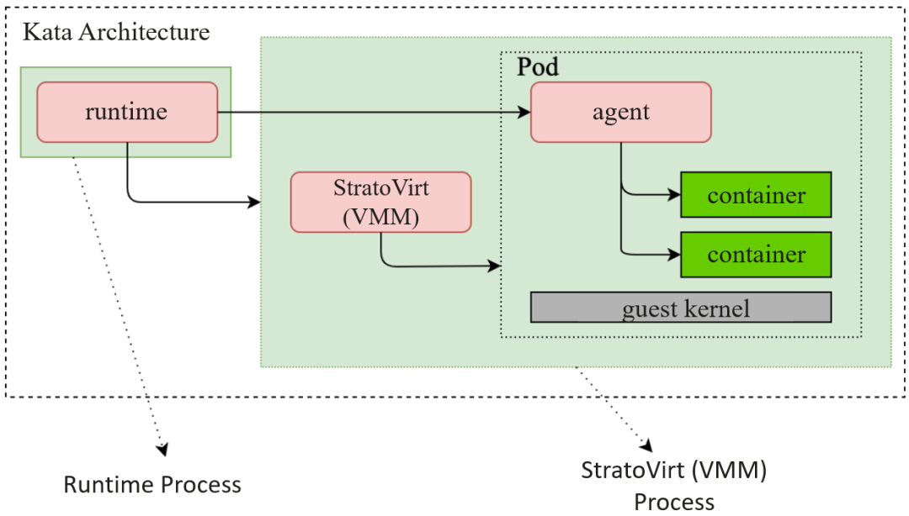
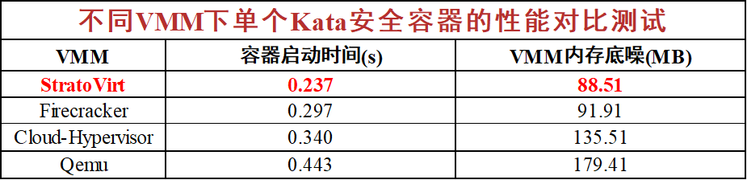

2023 年 11 月 17 日，Kata Containers 上游社区正式接纳 StratoVirt 作为原生支持的 VMM(Virtual Machine Manager) 之一，相关 API 已完成适配，StratoVirt 的容器生态得到进一步拓展。合入 Kata 上游社区简化了合作伙伴在安全容器场景下使用 StratoVirt 的流程，用户可以更方便地部署和使用 StratoVirt。



图1 StratoVirt PR 已合入 Kata 社区

## 关于Kata Containers

安全容器是一种运行时技术。相对于普通容器，安全容器可以为容器应用提供一个完整的操作系统执行环境，将应用的执行与宿主机操作系统隔离开，避免应用直接访问宿主机资源，从而可以在容器主机之间或容器之间提供额外的保护。此外，安全容器的隔离层也可以提供性能、调度、管理等方面的隔离。

Kata Containers 是一个安全容器开源项目[1]，可无缝接入 Kubernetes 等云原生生态系统，依靠轻量虚拟机提供的强隔离能力，为上层业务提供更加安全的运行环境、以及接近原生 Linux 容器的体验。目前，Kata 安全容器支持的 VM 包括 Qemu、Cloud Hypervisor、FireCracker、StratoVirt 等，在强监管业务、公有云和私有云、容器服务与边缘计算等场景中有着广泛应用。



图2 Kata 架构以及 StratoVirt 在其中的位置


## 关于StratoVirt

StratoVirt 作为 openEuler 社区的一个虚拟化开源项目[2]，是计算产业中面向云数据中心的企业级虚拟化 VMM，实现了一套架构统一支持虚拟机、容器、Serverless 三种场景。StratoVirt 提供了 openEuler 的虚拟化底座，具有强安全性与隔离性、轻量低噪、高速稳定 IO 能力、资源伸缩灵活、全场景支持、可扩展性强等关键技术竞争优势。目前，StratoVirt 正持续增强通用虚拟化和桌面虚拟化场景能力，构建下一代全场景虚拟化关键技术。

目前，StratoVirt 已经在 Kata 上游社区中实现了基于 StratoVirt 2.3.0 版本的轻量化虚拟机适配，满足各项基础功能的运行，并在启动速度和内存底噪方面具有一定的性能优势，性能对比测试结果如下。



图3 不同 VMM 下单个 Kata 安全容器的性能对比测试

上述测试环境为：

1. 硬件：CPU：Intel(R) Xeon(R) Gold 6338N CPU @ 2.20GHz，32核；内存：512GB 2666MHz DDR4。
2. Host 操作系统: openEuler 20.03 LTS SP1，Linux Kernel 4.19.90。
3. 虚拟机：VMM、kernel、rootfs 采用 kata 社区 v3.2.0 release package，rootfs 以 kata-agent 作为 GuestOS init 进程；虚拟机配置 1U2G。
4. StratoVirt 采用 v2.3.0 版本 microVM，kernel 采用 vmlinux 格式 objcopy 后得到的 vmlinux.bin。
5. 容器：镜像采用 ```docker.io/library/busybox:latest```。

未来，StratoVirt 将与 Kata 社区持续合作，在 Kata 社区中完善包括标准虚机在内的多项功能集成，保证 StratoVirt 在 Kata 社区最新版本的持续可用。同时，StratoVirt 将继续深入容器生态创新，加速行业应用，为用户和合作伙伴提供更高性能更好质量的虚拟化能力。

## 参考链接

[1] Kata Containers 社区：https://github.com/kata-containers/kata-containers

[2] StratoVirt 社区：https://gitee.com/openeuler/stratovirt