11月17日，openEuler社区携手移动云在中国移动云能力中心举办了一场以操作系统迁移为主题的Meetup活动。本次活动邀请了来自移动云、麒麟、统信、中软国际、麒麟信安的行业专家来分享及探讨操作系统迁移、虚拟机迁移、迁移实践等热门话题。

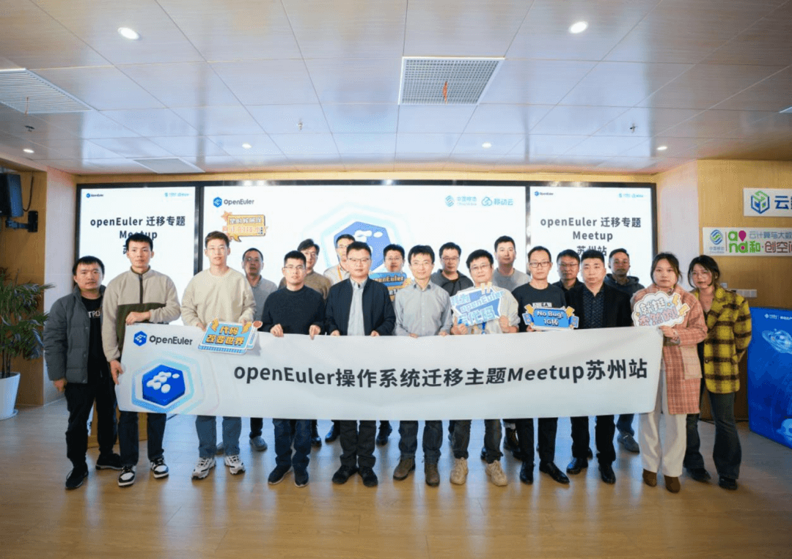

以下是本次活动是精彩回顾。

**开场致辞openEuler委员会委员/移动云计算产品部副总经理张胜举**为本次活动带来了热情洋溢的开场致辞。他着重强调了在CentOS停服的大背景下，操作系统迁移的两个重要驱动因素。并进一步指出，考虑到中国移动操作系统迁移的体量和业务复杂度，移动集团的国产化操作系统改造无疑是中国国内最大规模的迁移替换。本次meetup的主题将聚焦于国产化迁移过程中所遇到的问题，业内专家将共同交流和讨论优秀的迁移实践经验。同时，也借此机会为推动欧拉社区的繁荣与发展做出积极的贡献。

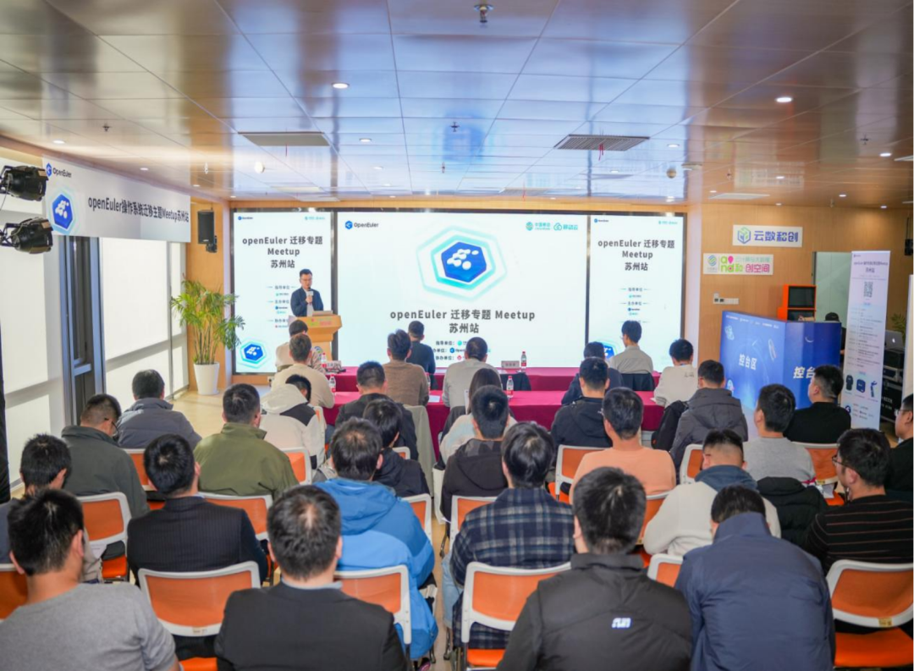

**天元"易行"迁移工具，助力全场景业务规模迁移openEuler
兼容性 SIG
Maintainer/移动云操作系统架构师严海双**，介绍了中移云能力中心自主研发的大云天元操作系统和"易行"迁移工具。他表示，"易行"迁移工具工具已经通过了数十个系统版本和上百个业务场景的测试，并在中国移动现网经过大规模迁移实践的验证，为CentOS替换工作提供了强有力的支持。同时他还表明，该工具已经覆盖了容器、虚拟化及大数据等复杂应用场景，并在移动云智维平台实现操作系统迁移自动化编排流程。

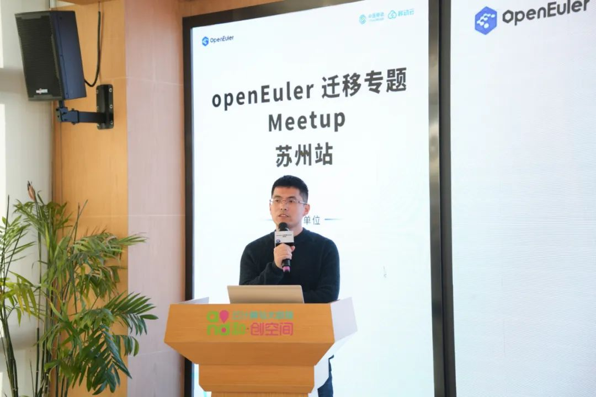

**跨操作系统云主机热迁移优化移动云虚拟化开发工程师王金磊**，分享了关于跨操作系统云主机热迁移优化的实践经验。他深入探讨了大规模虚拟机热迁移的优化手段及移动云跨OS热迁移的实践案例。他表示，面向移动云云主机场景，在计算节点操作系统迁移过程中，大规模的虚拟机热迁移是保障存量云主机业务不中断的前提。最后，他详细介绍了移动云大规模虚拟机热迁移的优化手段及移动云跨OS热迁移实践案例。

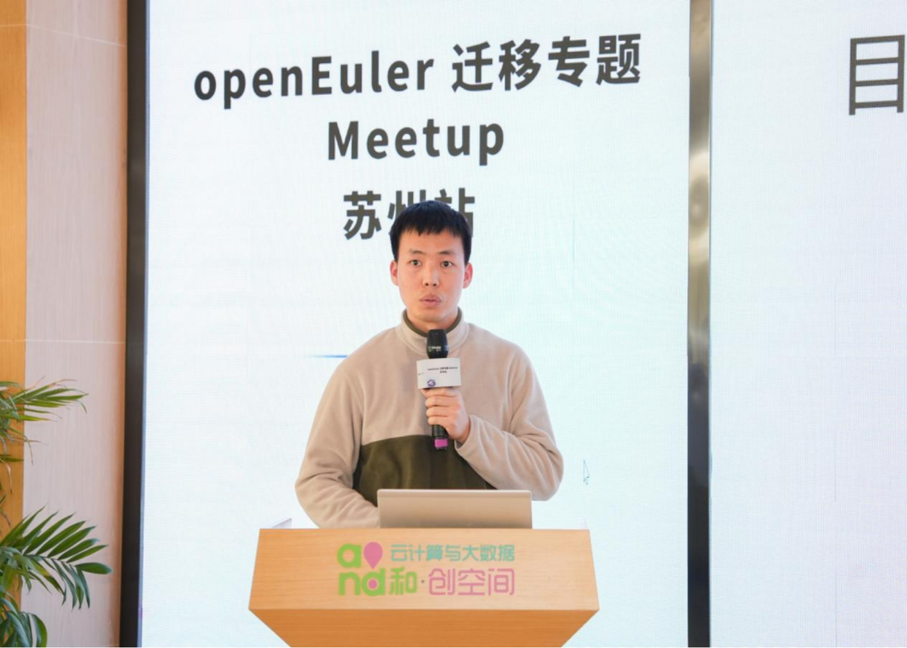

**CentOS停服与操作系统替换的产业实践openEuler南京用户组Ambassador/麒麟软件高级解决方案专家穆肖肖**，分享了麒麟软件关于CentOS停服与操作系统替换的产业实践。他表示，面对市场庞大的存量系统和复杂的业务逻辑，从操作系统层面结合信创课题，保障业务连续性，平滑迁移、平稳过渡到国产操作系统之上是当前大家不得不面对的课题。麒麟软件结合openEuler社区开源工具和20多年行业经验，为不同行业配套制定了不同的迁移解决方案。接着，他对方案的产业实践进行了整体介绍。

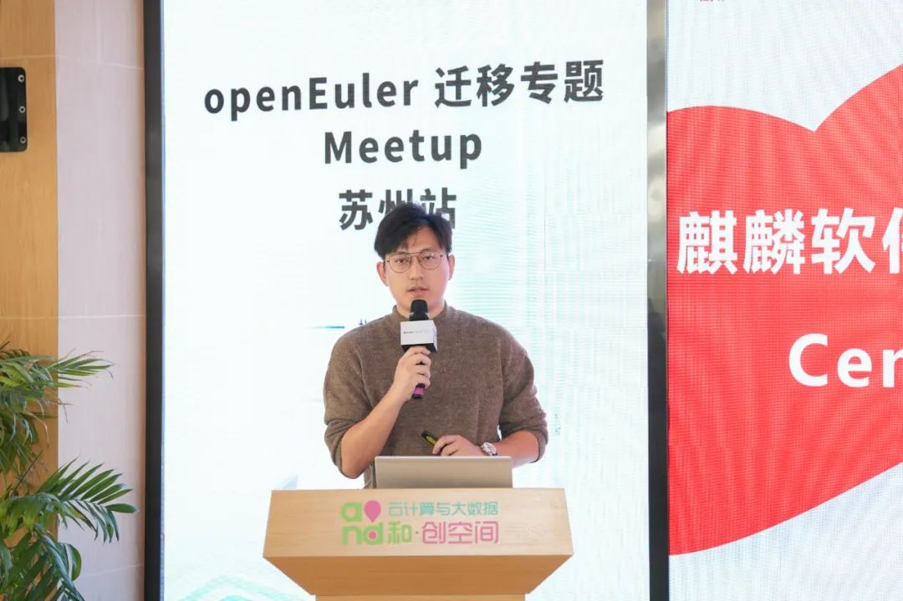

**通过"3+3+6"标准体系实现CentOS迁移改造统信解决方案专家肖振**，介绍了统信解决方案专家精心打造的迁移工具。该工具支持CentOS系统安全高效迁移、覆盖多应用场景，是CentOS替换的优秀实践。其中包括基于存量迁移、新增扩容和安全接管的3种应对手段；面向单机、集群、和云环境的3种部署环境；以及从调研到实施推广的6步迁移实施路径。

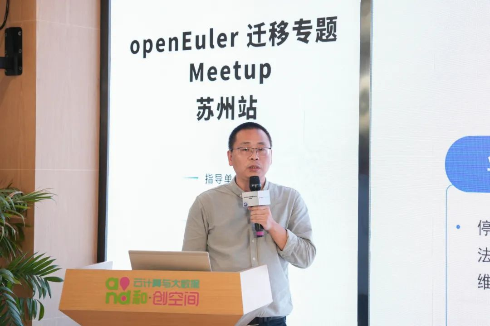

**中软国际操作系统专业服务助力客户构建安全可控数字底座，繁荣openEuler生态中软国际信创解决方案架构师门小康，**分享了中软国际操作系统专业服务助力客户构建安全可控数字底座的经验。他表示中软国际基于openEuler操作系统为企业提供全方位的技术支持和服务，拥有丰富的应用落地案例。

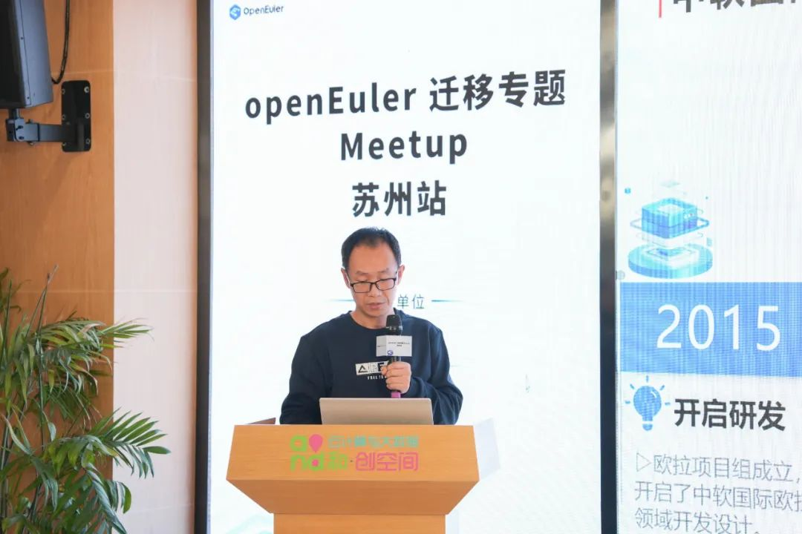

**麒麟信安C2K一站式系统迁移平台产品及案例介绍麒麟信安操作系统研发部产品经理高睿**，介绍了麒麟信安C2K一站式系统迁移平台产品及案例。他表示，麒麟信安已经为应对CentOS停服做好了充分的准备。一站式操作系统迁移平台具备全面的系统迁移能力，主要功能模块包括调研、设计、实施、测试和上线等。该平台支持多种迁移方式，同时提供整体流程指导以实现高效迁移。最后他还分享了麒麟信安在行业中的操作系统迁移成功案例以及未来对迁移工具改进和完善的工作方向。

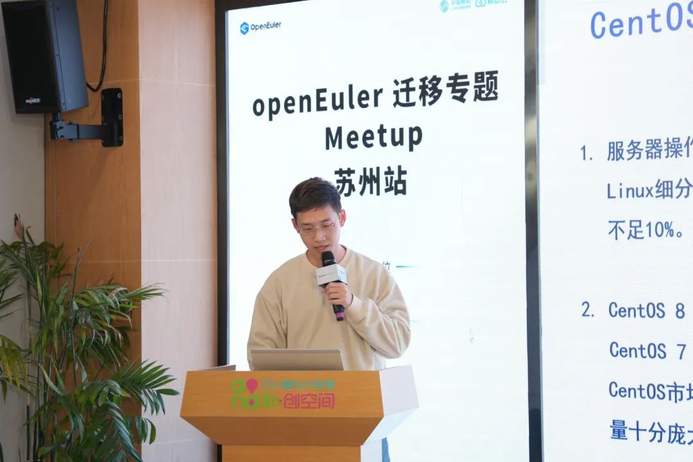

**提问环节**在提问环节中，中国移动上海产业研究院代表郝瑞、移动云区域代表张剑啸和赛迪工业和信息化研究院代表章剑分别就天元"易行"迁移工具的2024年规划、如何保证对时延敏感的云主机业务在迁移时业务不受影响和操作系统迁移存量市场等问题进行了提问。严海双、王金磊和穆肖肖三位专家就这些问题进行了深入解答。

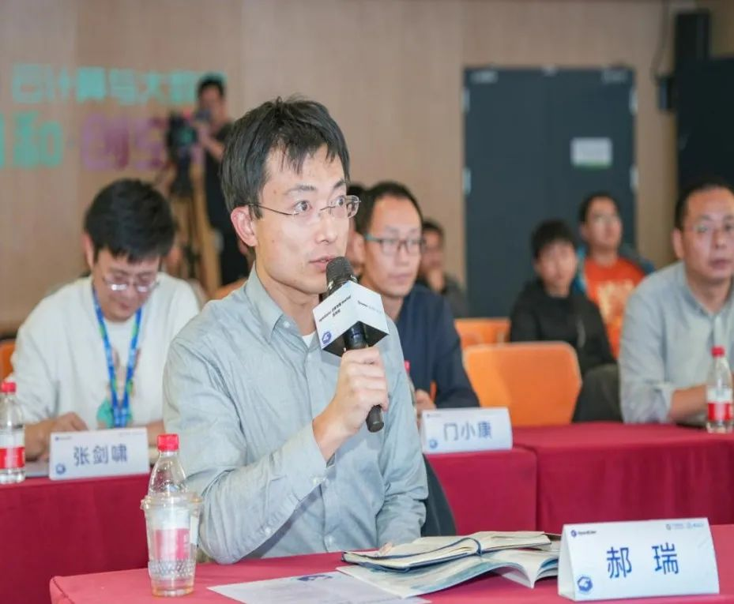

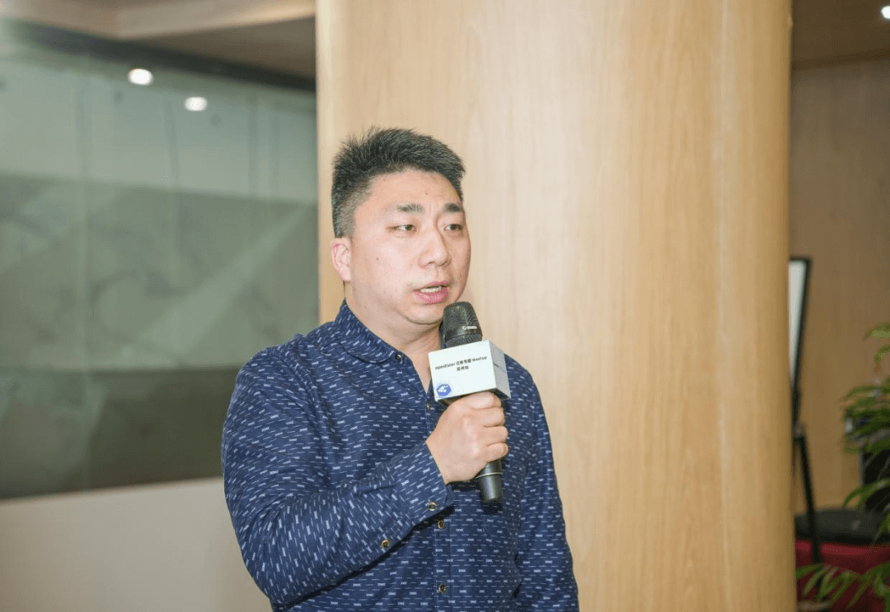

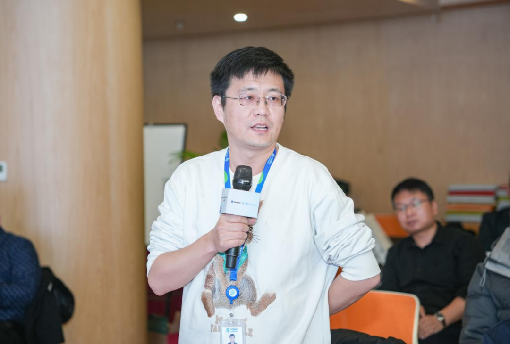

*本次活动回顾已经上传到openEuler B站，欢迎收看：*

<https://space.bilibili.com/527064077/channel/collectiondetail?sid=1903666>

*添加小助手，回复【迁移Meetup】，即可领取本次活动PPT。*

