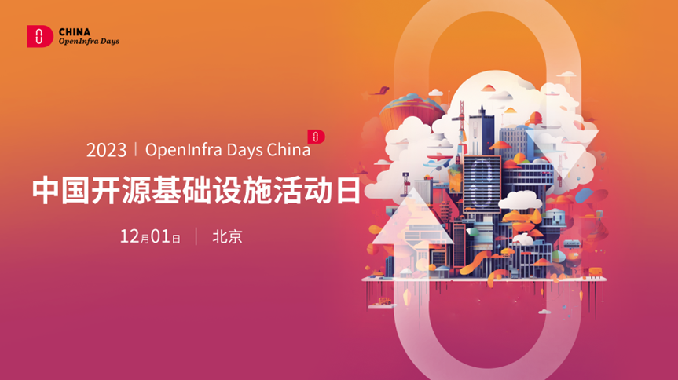
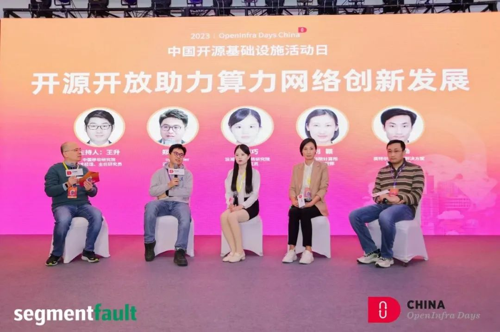
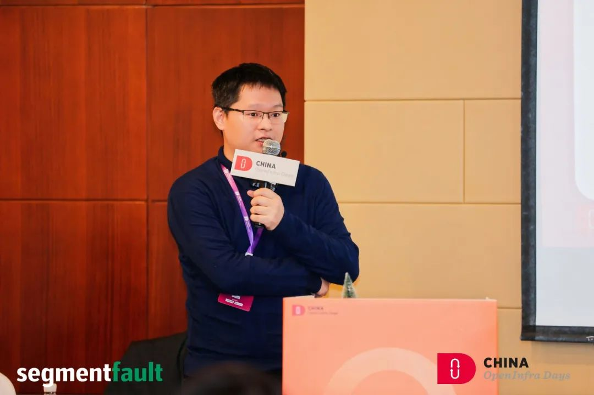
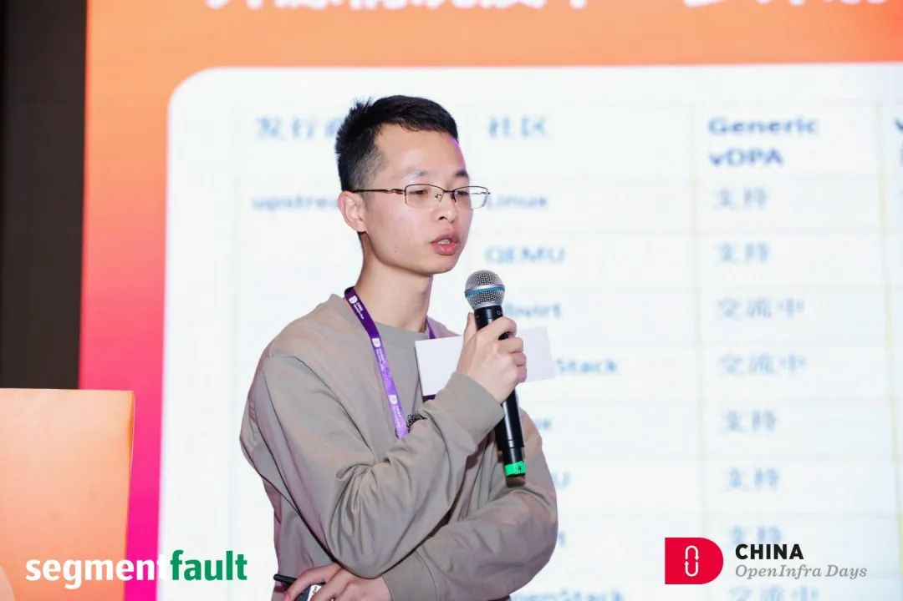
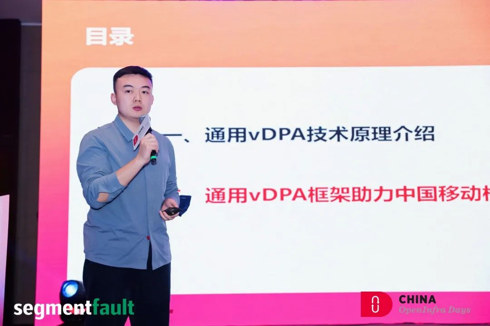
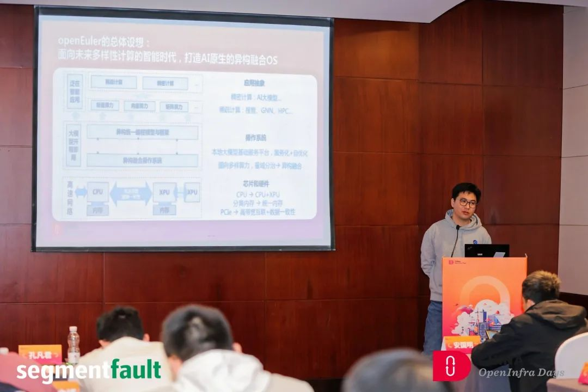

12 月 1 日OpenInfra Days China 2023
在北京海航万豪酒店成功举行。OpenInfra Days China 2023由 OpenInfra
基金会授权，社区志愿者团队共同筹划组织。**openEuler社区专家出席大会并进行议题分享，就开源基础设施的前沿探索与实践，展开讨论与分享。**

**openEuler相关议题：**

在主论坛圆桌会议上，**openEuler社区Maintainer郑振宇**介绍了openEuler DPU
SIG与OpenInfra算力网络工作组的合作情况以及阶段性成果，强调了以操作系统为代表的基础软件在多样性算力释放中的核心作用；面向未来，openEuler还将在提供通用、易定制的DPU
OS、统一调度API等方向开展联合创新，为DPU厂商与用户提供可靠的基础设施。同时，也欢迎广大开源开发者与爱好者积极参与openEuler及算力网络工作组的各类开发活动。

在LOKI专题上，**openEuler OpenStack SIG
Maintainer王玺源和统信高级研发工程师韩光宇以《统信有栈基于openEuler的LOKI实践与思考》**为主题进行联合演讲，分享了统信开源贡献的经验与总结、OpenStack私有云落地中的一些实践与思考。并畅想一下未来LOKI的可能演进方向与开源社区如openEuler等的技术落点。

在算力网络 （Computing Force
Network）专题上，**王锦涛，姜冬旭以《打造通用vdpa加速框架，助力构建统一算力底座》为主题**进行分享，Virito是一种业界主流的I/O半虚拟化技术，实现guest
OS与hypervisor虚拟化设备之间的通信，vDPA作为DPU场景下主流的virito卸载加速框架，在网络、存储不同场景下有用户态和内核态等多种实现方式。在本次分享中老师提出了一种通用的vDPA框架，统一框架模型和接口，推动DPU更快实现多类型vDPA加速技术，满足网络、块存储和文件存储等多种场景需求，构建统一的算力平台底座。

在可持续计算&AI基础设施专题上**，openEuler社区Maintainer郑振宇以《大模型时代的基础设施：LOKI
for AI》**为主题进行分享，LOKI(Linux OpenStack K8S
Infrastructure)作为最成熟的开源基础设施解决方案，是实现大模型时代开源基础设施方案的最佳选择，但目前面临XPU资源管理、分布式训练适配、端边云协同推理等技术挑战。郑振宇老师从OS、云基础设施、云原生平台等维度，结合当前openEuler社区在OS
for AI领域的规划与实践带来相关分享。

这次大会展现出openEuler社区在开源基础设施领域的最新成果，提升了openEuler在基础设施领域的影响力，也为openEuler基础设施在未来发展和应用打下来坚实基础。
