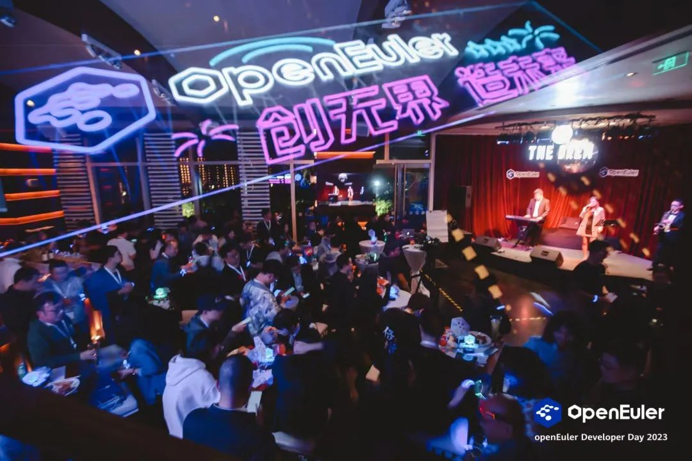
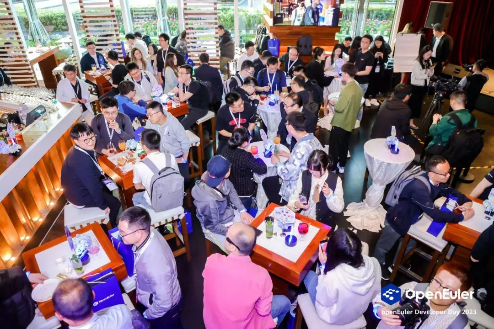
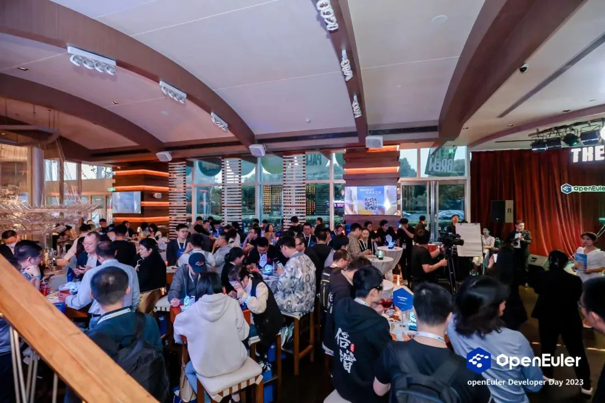
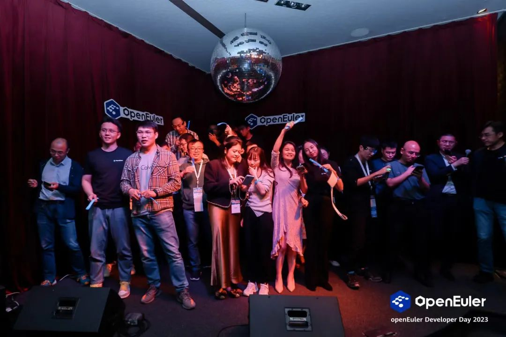
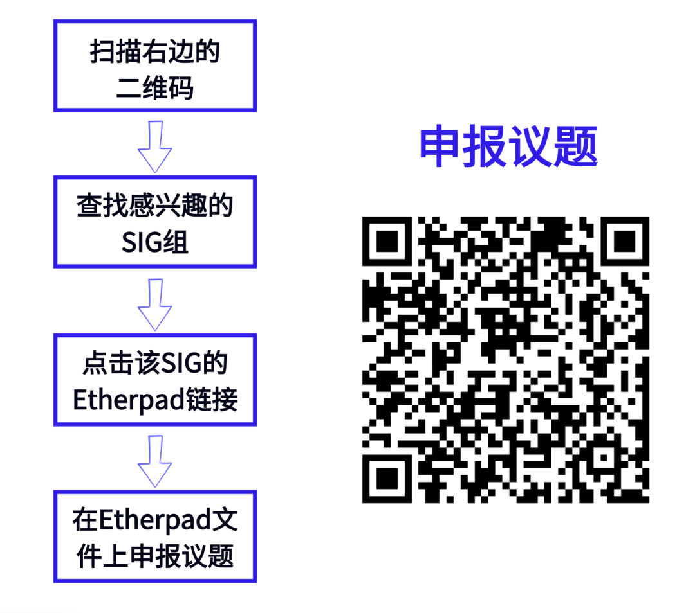

想参与SIG组未来半年的规划与工作？

想与开发者们近距离探讨需求与解决方案？

想将您的需求合入到openEuler的下个版本？

SIG组开放工作会议来了！

SIG组开放工作会议是openEuler Summit
2023的重要一环，聚集了社区40+个SIG组与开发者，现场讨论用户需求、未来技术发展、**尤其是对openEuler社区下个版本的探讨。(下个版本是openEuler社区长周期版本，将于2024年发布，后续将提供4年社区支持。期待各位开发者在SIG开放会议上提出和下个LTS版本相关的规划，让你的代码奔跑在百万服务器之上。）**

当前，SIG组议题申报、大会现场报名通道已开启。感兴趣的朋友可以提交SIG组的议题与需求，报名参与现场工作会议。

**参会信息**

参会时间：12月16日 16：00-18：00

参会地点：北京 国家会议中心

**会议亮点**

**1. 超强阵容，40+ SIG组，汇聚各行各业的开发者**

作为openEuler Summit
2023大会的其中一环，SIG组工作会议参与人数最多，涉及话题最广。40+SIG组围绕不同的技术方向同期举行会议，汇聚各行各业上千位开发者，有高校学者，业内技术专家，开源大牛等等，阵容强大。您可以与开发者一起交流，一起协作，参与社区工作。

**2. 话题多样，总有一款是您喜欢的**

本次工作会议，SIG组成员将围绕SIG接下来的技术规划与运营工作，探索技术发展的更多可能性，包含行业场景应用、社区联合创新案例、云原生、云计算、产品技术与社区生态等多个话题，包括Kernel、CloudNative、OPS等SIG组。

**3. 跨界交流，更深入地讨论**

在SIG组开放工作会议期间，各个SIG技术专家将齐聚一堂，对于某些技术领域，SIG专家们采取了跨SIG工作会议的模式，让你一次性与多个SIG讨论，一次性聊到畅快，满足您的需求。

**4. 线下讨论，拒绝信息差**

每次工作例会都是线上举行？信息传达不方便？存在信息差？

本次SIG组开放会议将在线下举办，志同道合的开发者可以畅所欲言地交流。如果您在讨论中有任何疑惑，可以现场提出，拒绝信息差。

**5. 我参与，我做主**

SIG组开放工作会议，任何人均可以是参与者，组织者，也可以是需求发起人。如果您有任何话题或需求想在SIG版本规划工作会议中分享讨论，可以找到对应的SIG组申报议题。

**开发者之夜**

SIG组开放工作会议结束后，不妨来参加开发者之夜吧，最有趣最好玩！属于开发者的狂欢party！

还有机会获得精美礼品哦\~

**报名方式**

**「申报议题」**：找到您感兴趣的SIG组，在其Etherpad文件中的Topics环节申报议题，SIG组织者将在SIG工作会议上根据该Topic内容进行交流，共同探讨，寻求解决方案。

**「报名参会」**：扫描下方二维码即可报名参会

12月16日，openEuler与你不见不散\~
