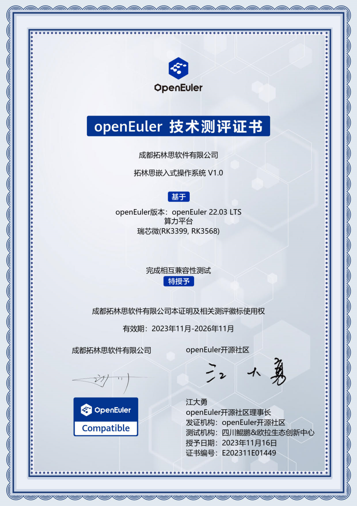
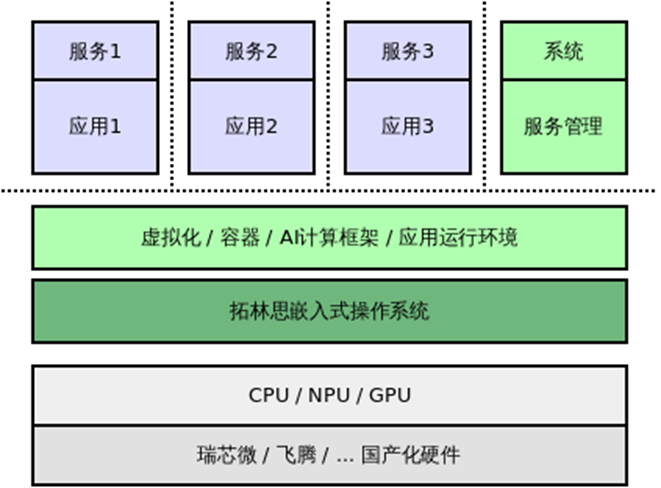

========================================================

近日，创意信息旗下成都拓林思软件有限公司（以下简称"成都拓林思"）自主研发的嵌入式操作系统TurboLinux
Embedded携手四川鲲鹏&欧拉生态创新中心正式通过openEuler社区嵌入式系统技术兼容性测评，获得社区针对嵌入式系统的OSV产品兼容性认证，成都拓林思也成为业内首批通过该测评的企业。

**产品介绍**

拓林思嵌入式操作系统（TurboLinux
Embedded）是一款针对多种硬件架构的嵌入式操作系统，可以在瑞芯微、飞腾等多款芯片上运行，支持多款AI计算框架，支持多种运行环境，提供良好的性能和功能支持。

拓林思嵌入式操作系统使用场景

**产品优势**

拓林思嵌入式操作系统具备安全可靠、简单易用、AI支持等产品特性，以及如下优势：\
1.支持强制访问控制2.标准的服务管理3.支持进程隔离4.支持安全防火墙5.密码算法支持SM2/3/46.完善的软件仓库和软件包管理7.支持多种运行环境8.支持多种型号的GPU、NPU9.驱动模块化，按需安装加载10.适配多种AI计算框架11.结合漏洞管理平台实现对系统漏洞的无感修复及软件升级

**关于拓林思**

自2022年落地成都以来，成都拓林思立足丰富的Linux商业化的能力及技术支撑体系，积极参与开源生态建设，提供多种场景定制化的国产化操作系统产品与技术服务。其业务聚焦于国产操作系统，能够提供云、边、端系列操作系统产品和基于国产开源操作系统的相关技术服务。公司设有安全服务中心和行业应用中心，可以承担openEuler系列操作系统的漏洞安全服务体系建设以及面向行业的全栈国产操作系统产品研发和应用推广。\
本次通过测评，是行业对拓林思在技术实力和创新能力的认可。未来，创意信息及成都拓林思将继续秉持初心，坚持科技自立自强，不断夯实技术基础。同时，我们将携手欧拉等行业伙伴，不断创新，力争输出高质量的软件产品和解决方案，助力行业发展腾飞！
