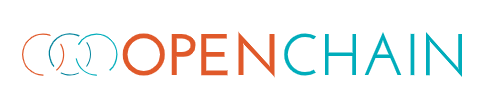

openEuler Summit - openEuler 社区年度旗舰会议，是开放原子开源基金会旗下 openEuler 社区发起的年度开源操作系统峰会。openEuler 专注核心技术和全场景能力创新，构建多样性计算、智能计算支持的基础软件能力。通过开源开放，不断探索科技创新的边界，驱动物理世界与数字世界的深度融合。

本次大会，openEuler社区非常荣幸能够邀请到OpenChain，并在现场设置OpenChain展台。未来openEuler将与OpenChain展开进一步的合作，通过简化开源合规性并提高效率共同促进开源生态发展。

## 关于OpenChain

OpenChain 项目由Linux 基金会发起，旨在简化开源合规性，确定高质量开源合规计划的关键要求。OpenChain 项目通过使开源许可合规工作更简单一致，推动相关各方建立对开源的信任。OpenChain 规范明确了每个质量合规性计划必须满足的一系列关键要求。由此，开源许可合规工作对软件供应链的参与者来说变得更可预测、更易理解、更加高效。

## 关于openEuler

openEuler 是一个面向数字基础设施的操作系统，支持服务器、云计算、边缘计算、嵌入式等应用场景，支持多样性计算，致力于提供安全、稳定、易用的操作系统。通过为应用提供确定性保障能力，支持 OT 领域应用及 OT 与 ICT 的融合。

## 参会信息

时间：2023年12月15-16日

地点：北京-国家会议中心

如果您想现场参观OpenChain展台，扫描下方二维码即可报名。

