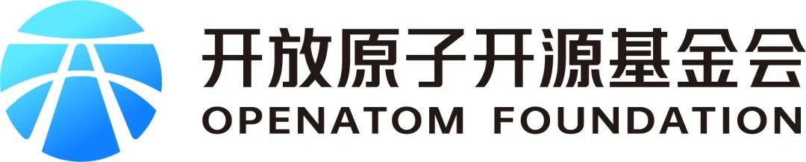

openEuler Summit - openEuler 社区年度旗舰会议，是开放原子开源基金会旗下 openEuler 社区发起的年度开源操作系统峰会。openEuler 专注核心技术和全场景能力创新，构建多样性计算、智能计算支持的基础软件能力。通过开源开放，不断探索科技创新的边界，驱动物理世界与数字世界的深度融合。

openEuler 是由开放原子开源基金会（OpenAtom Foundation）孵化及运营的开源项目。本次大会，openEuler社区非常荣幸能够邀请到开放原子开源基金会，并在现场设置开放原子开源基金会展台。

## 关于开放原子开源基金会展台

开放原子开源基金会是致力于推动全球开源事业发展的非营利机构，于2020 年 6 月在北京成立，由华为、阿里巴巴、百度、浪潮、360、腾讯、招商银行等多家龙头科技企业联合发起。

开放原子开源基金会本着以开发者为本的开源项目孵化平台、科技公益性服务机构的定位，遵循共建、共治、共享原则，系统性打造开源开放框架，搭建国际开源社区，提升行业协作效率，赋能千行百业。

目前开放原子开源基金会业务范围主要包括募集资金、专项资助、宣传推广、教育、培训、学术交流、国际合作、开源生态建设、咨询服务等业务。

开放原子开源基金会专注于开源项目的推广传播、法务协助、资金支持、技术支撑及开放治理等公益性事业，促进、保护、推广开源软件的发展与应用；致力于推进开源项目、开源生态的繁荣和可持续发展，提升我国对全球开源事业的贡献。

## 关于openEuler

openEuler 是一个面向数字基础设施的操作系统，支持服务器、云计算、边缘计算、嵌入式等应用场景，支持多样性计算，致力于提供安全、稳定、易用的操作系统。通过为应用提供确定性保障能力，支持 OT 领域应用及 OT 与 ICT 的融合。

## 参会信息

时间：2023年12月15-16日

地点：北京-国家会议中心

如果您想现场参观开放原子开源基金会展台，扫描下方二维码即可报名。

