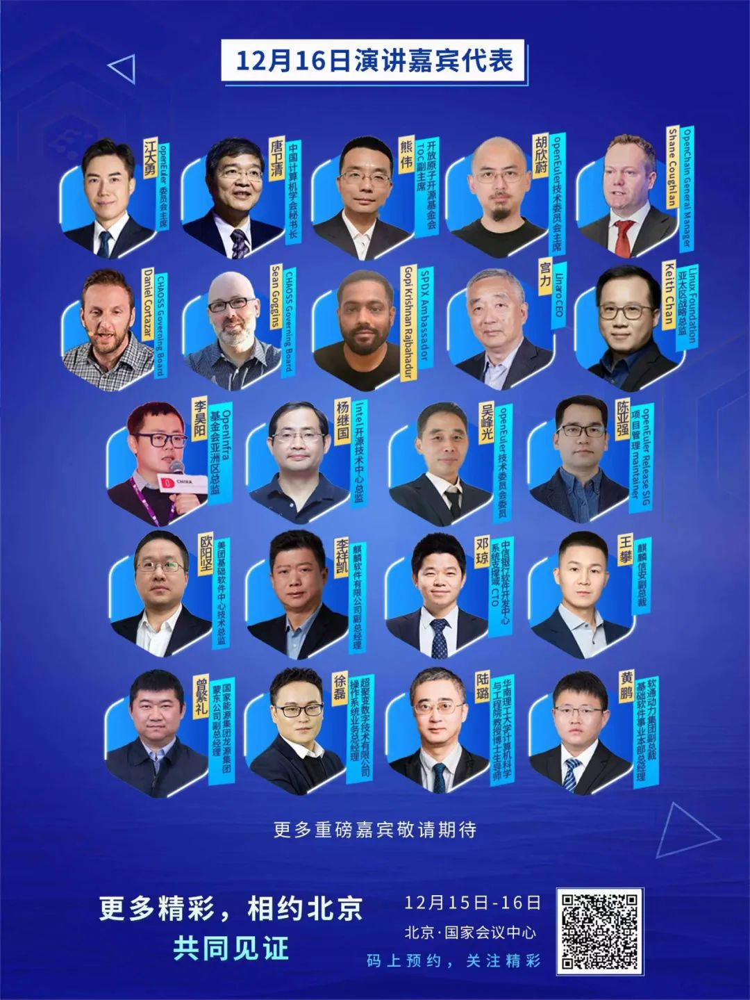

30+位操作系统产业界大咖组团驾到，竟是因为……
2023年12月15日，“崛起数字时代，引领数智未来”操作系统大会 & openEuler Summit 2023将于北京拉开序幕。

本次大会邀请院士、产业组织及全球开源基金会代表、学术领袖、领先行业代表、技术专家等1000+位海内外嘉宾，共探操作系统产业发展方向和未来机遇。

在这里，你将听到：

- 操作系统宏观战略

- 操作系统前沿展望

- 海外基金会嘉宾开源软件和开放硬件标准分享

- 产业伙伴携手用户分享行业商用实践案例

……

更多嘉宾和精彩内容，12月15日-16日，等你来见证！

