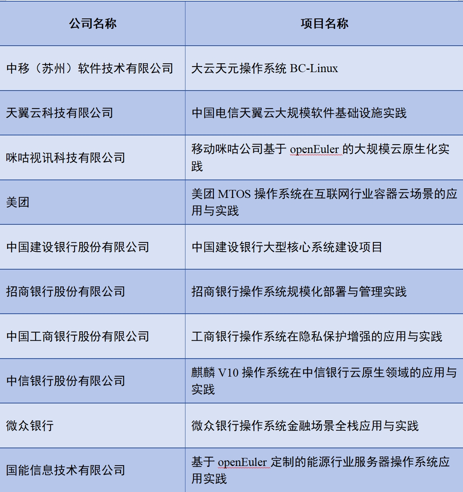
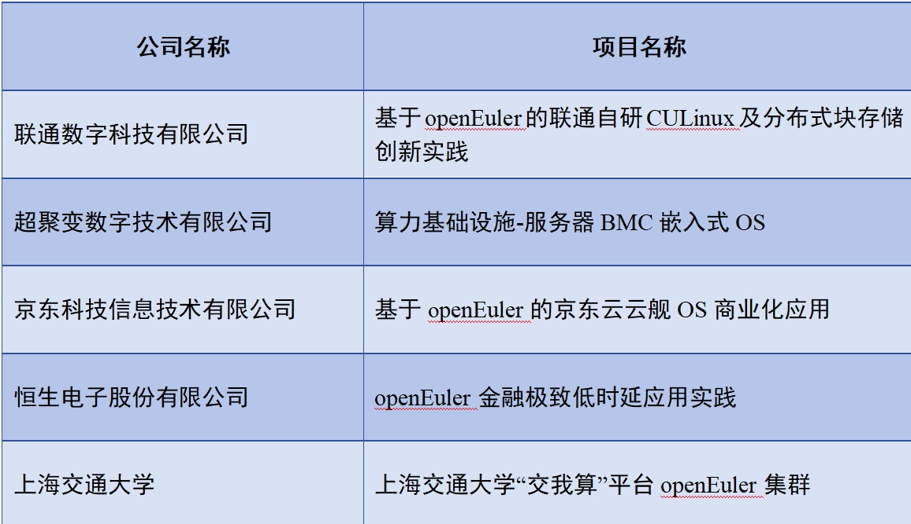

操作系统是数字基础设施“定魂筑基”的关键，是制造强国、网络强国建设的关键支撑。为更好地推动操作系统产业技术创新，树立行业示范案例，促进形成规模化应用，国家工业信息安全发展研究中心、OpenAtom openEuler社区联合发起“2023年度openEuler领先商业实践遴选活动”。

经由院士、资深学者、业界专家共10人组成的评审委员会，围绕技术创新性、示范推广价值、应用规模、运维服务能力、社区贡献等维度，对公开征集的近40个商业实践成果进行多轮遴选和评审，最终决定对“大云天元操作系统BC-Linux”等10个实践案例授予“2023年度openEuler领先商业实践（规模型）”称号，对“基于openEuler的联通自研CULinux及分布式块存储创新实践”等5个实践案例授予“2023年度openEuler领先商业实践（创新型）”称号。

现将评选结果予以公示：

## 十大规模型“2023年度openEuler领先商业实践”名单

## 五大创新型“2023年度openEuler领先商业实践”名单

## 联系人及联系方式：

薛老师  18896720813
赵老师  18811753199

