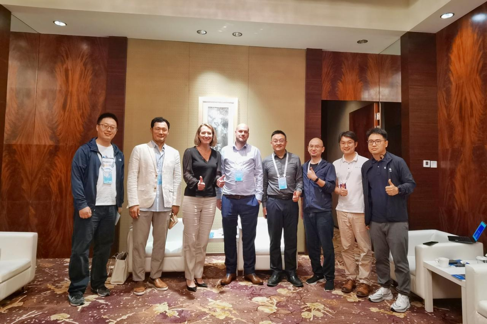
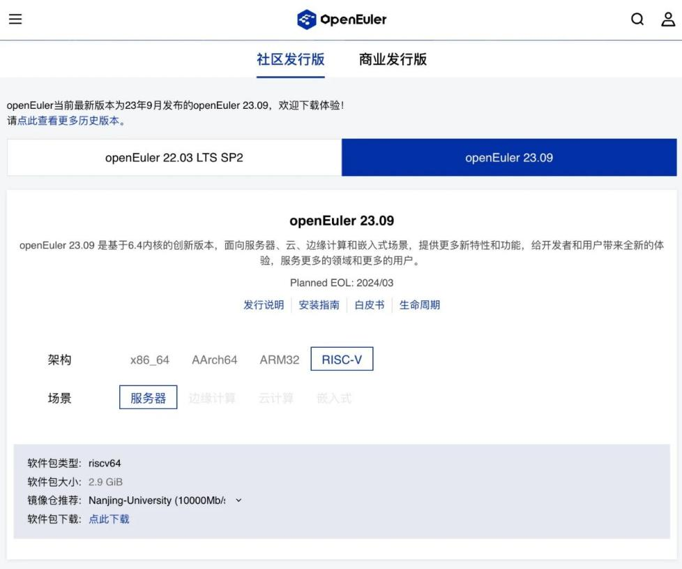

openEuler Summit - openEuler 社区年度旗舰会议，是开放原子开源基金会旗下 openEuler 社区发起的年度开源操作系统峰会，将于12月16日在北京国际会议中心举行。

本次大会，openEuler社区非常荣幸能够邀请到RISC-V国际基金会。在现场设置RISC-V国际基金会展台和openEuler RISC-V SIG 工作会议环节，开发者将分享和RISC-V相关议题。为此，RISC-V国际基金会CEO Calista Redmond发来视频贺电。

<video width="100%" controls>
    <source type="video/mp4"  
    src="https://openeuler-website-beijing.obs.cn-north-4.myhuaweicloud.com/4207acfd189b2288c71d1a2a593914b1.mp4">
</video>

RISC-V国际基金会是一个非营利性组织，负责管理开放标准 RISC-V 指令集架构 (ISA)、相关规范和相关方社区，致力于推广RISC-V架构的开源生态系统。RISC-V国际基金会利用其在国际开源社区的影响力，在推动openEuler走向全球，国际化进程方面和openEuler展开了一系列的深入合作。

## openEuler 与 RISC-V生态合作的进展

2023年3月8日，openEuler加入RISC-V Landscape。也是首个亮相RISC-V Landscape OS领域的源自中国的开源操作系统。意味着openEuler在对RISC-V架构的生态适配得到了RISC-V基金会的认可，相关技术已与RISC-V生态完成适配。

2023年8月23日-25日，第三届 RISC-V中国峰会在北京成功召开。openEuler进行议题分享，并与RISC-V国际基金会CEO Calista Redmond、Board, Software Committee Chair Philipp Tomsich、TSC Peter Chun 等进行了深入交流。双方就openEuler 与 RISC-V生态合作的进展和规划充分的交换了意见，未来两个社区将在技术、生态、开发者、用户等进一步深化合作，共同推动RISC-V生态的快速发展。

2023年10月openEuler 以 Community Organization Member 的身份加入了 RISC-V International，同时 RISC-V 正式成为 openEuler 的官方支持架构。RISC-V SIG 领头完成了 openEuler RISC-V 23.09 的主线集成工作，该项目涵盖了主线代码回合、官方工程整合及正式的镜像的发布。自 23.09 版本起，RISC-V 进入 openEuler T1 架构级别，这一进展标志着 openEuler RISC-V 发展的一个重要里程碑。

## 携手 openEuler 社区，共建RISC-V生态

openEuler非常重视在RISC-V架构上的适配和优化，2020 年4月 openEuler 社区成立了 RISC-V SIG 组，旨在提供openEuler RISC-V版本，并指导openEuler RISC-V的软件包和体系建设，促进对RISC-V感兴趣的开发者参与开源系统的开发。目前 openEuler 已经推出了多个基于 openEuler 开发的 RISC-V 架构的发行版。未来，openEuler将继续探索在 RISC-V 架构处理器上的更多可能。

