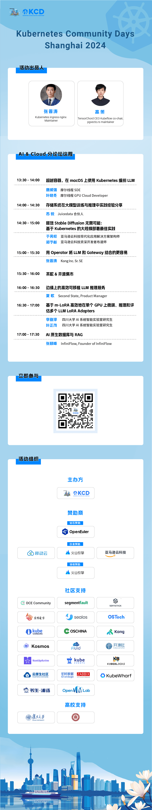

Kubernetes Community Days（KCD） 上海2024

现已开放报名通道！

这是一场大型的面向开发者的技术交流会

在现场，你可以

与各路技术社区达人交流 battle

共同探讨云原生技术的最新进展

现场感受AI/操作系统领域的创新与应用

共话「开源新手/开源教育」命题

**4 月 20 日**

KCD 2024 上海站等你来！

**活动详情**

时间： 2024年4月20日

地点：上海市徐汇区古美路1520号漕河泾中心 D 栋

规模：300人

会场：云原生主会场 和 AI&Cloud、云原生基础设施 & 操作系统、云原生新手 & 开源教育三大分会场

**活动报名**

**KCD上海站已开放报名，活动将免费面向云原生技术爱好者们**。在这个春日里，让我们放下繁忙的工作，来到KCD上海活动现场，与全球云原生社区的大牛们面对面交流，分享最新的技术见解，探讨创新的可能性。感受玉兰花散发的清香，让思绪随着春风飘荡，共同畅谈云原生技术的发展方向。

**欢迎扫码进入报名通道**

**活动议程**

经过近一个月的议题征集和评审，KCD上海2024的议程已新鲜出炉，快来为Speaker天团们打call吧！

**赞助伙伴**

**合作社区**

**合作高校**

**关于KCD**

Kubernetes Community
Days（KCD）由云原⽣计算基⾦会（CNCF）发起，由全球各国当地的 CNCF
⼤使、CNCF 员⼯ 以及 CNCF 会员单位联合组织。⽬前 KCD
正在全球各个国家活跃地组织进⾏中，KCD
聚集了来⾃云原⽣领域开源社区的最终用户、贡献者和技术专家，这⼀系列的活动有助于提⾼
Kubernetes
社区的活跃度并完善其发展潜⼒，使更多⽤⼾能接触到云原⽣信息，也推动云原⽣技术在不同⾏业中更⼴泛的传播。
