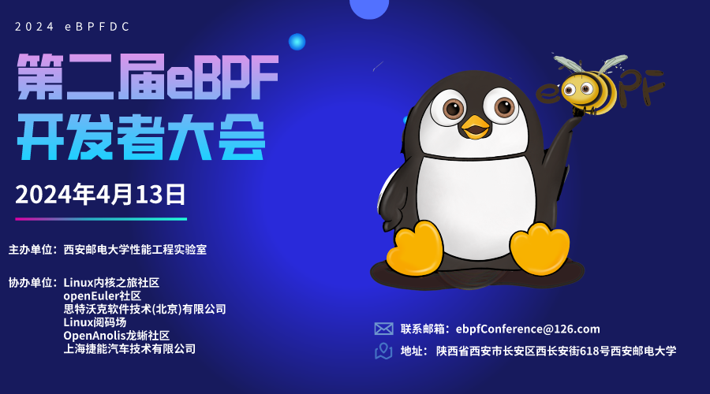
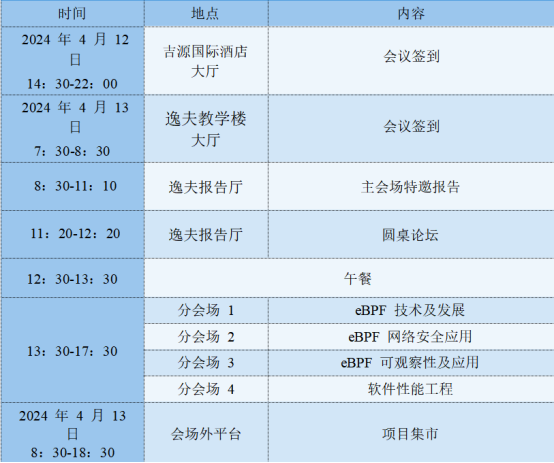
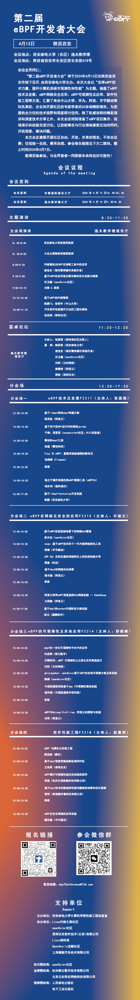

第二届eBPF开发者大会将于4月13日在陕西西安举行，这是一个汇聚顶尖专家和热爱者的盛会，旨在探讨和推动eBPF技术的创新和应用。在此次大会上，您将聆听到来自世界各地的演讲嘉宾的精彩演讲，他们将分享他们在eBPF领域的研究成果、实践经验和成功案例。欢迎报名，参加这个激动人心的盛会！**openEuler作为本次活动的钻石级别赞助，将带来主会场Keynote以及多场分论坛演讲，欢迎大家报名参会，共同探讨openEuler相关议题。**同时，openEuler
B 站将还同步本次活动的线上直播，去不了活动现场的同学可以关注openEuler B
站，届时线上参会\~

扫码观看直播

**一、会议主题**

**发挥eBPF技术力量，提升计算机系统可观测性和性能**

**二、日程安排**

**三、openEuler相关议题**

**主会场
\--基于eBPF的应用层负载均衡的优化实践与探索**9：20-9:50任玉鑫(openEuler社区 oEVP)**圆桌论坛11：20-12:20**任玉鑫(openEuler社区 oEVP)\
**分会场二
\--基于eBPF实现混部场景下的网络QoS管理13：30-14:00**吴长冶(openEuler社区
eBPF SIG Maintainer，华为Kmesh项目发起人)\
**分会场三\-- gala-gopher:
openEuler基于eBPF的全栈可观测方案及其实践14：30-15:00**陈臻(openEuler社区 eBPF SIG
Maintainer)

**四、详细会议日程**

