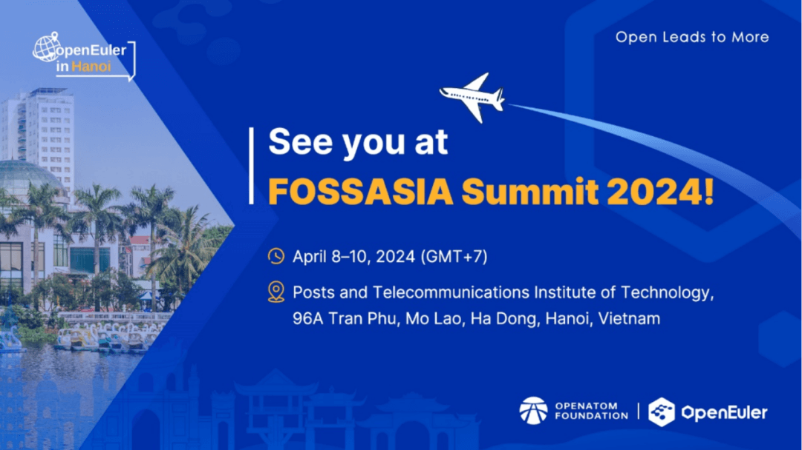
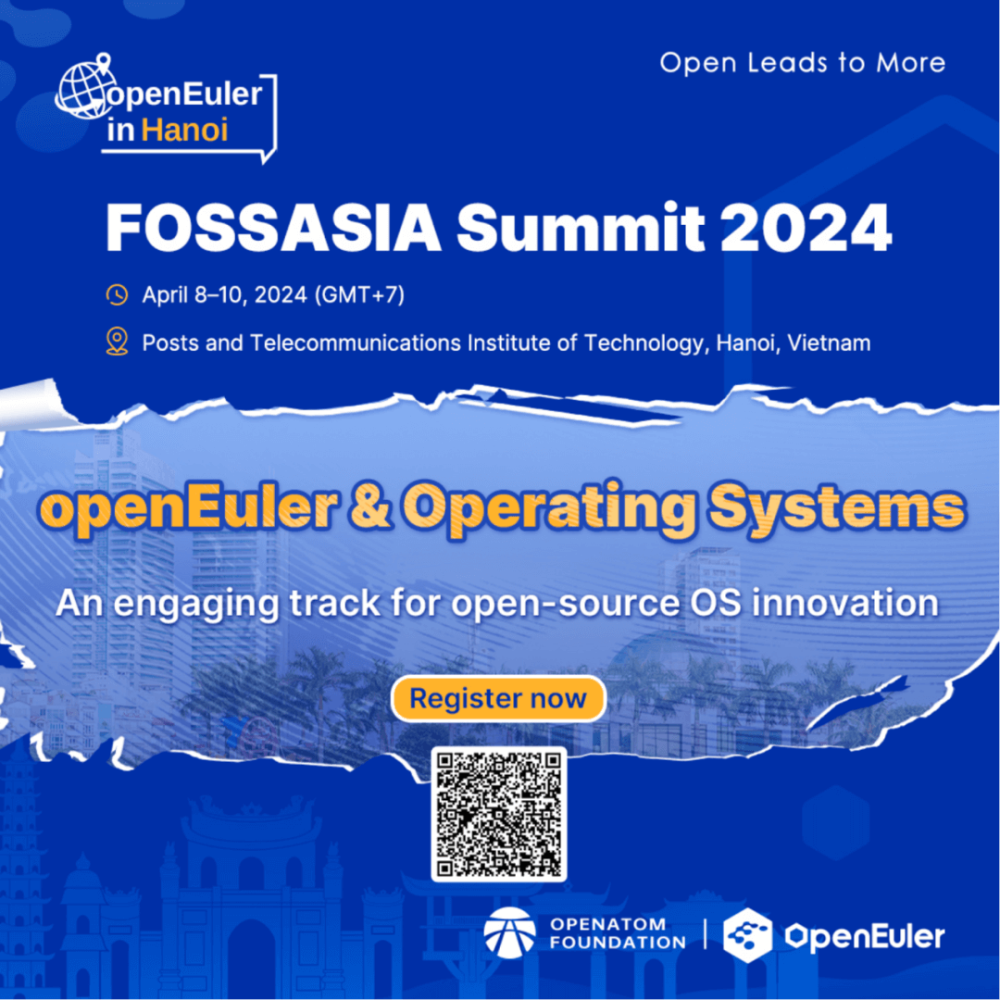
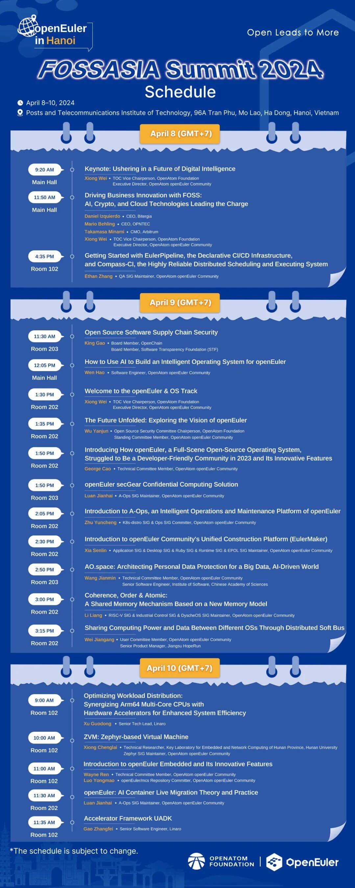
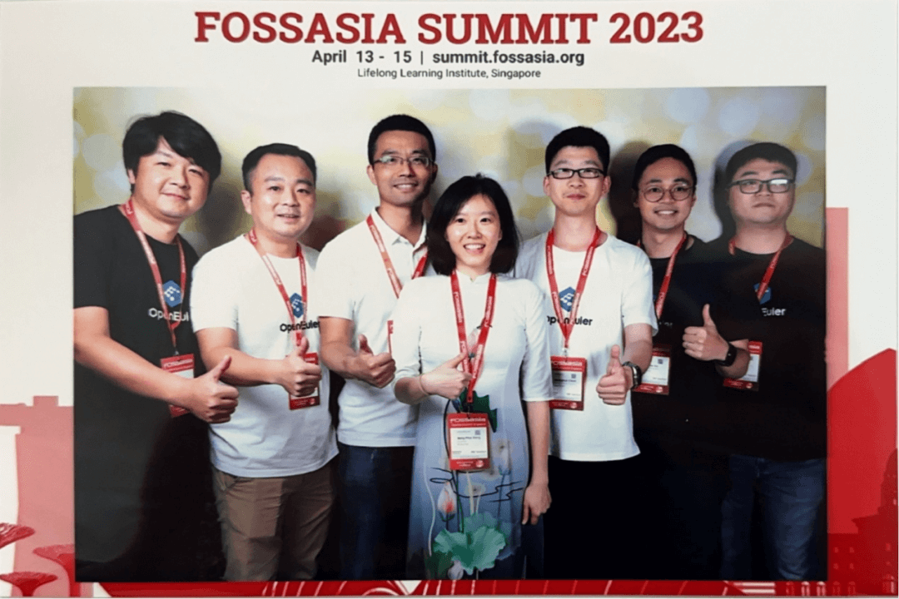

国际开源盛会 FOSSASIA Summit 2024将于2024年4月8日在越南河内举行。作为一个支持多样性算力的Linux发行版，OpenAtom
openEuler（简称\"openEuler\"）将给来自东南亚的金融、互联网等行业用户带来openEuler在多样性算力支持方面的优势，并寻找当地的OS提供商和服务提供商，共同探索服务客户之道。

**活动信息**
------------

**日期：**2024年4月8日至10日（GMT+7）

**地点：**越南河内市Posts and Telecommunications Institute of Technology

**地址：**96A Tran Phu, Mo Lao, Ha Dong, Hanoi, Vietnam

**注册链接：**

https://eventyay.com/e/55d2a466

**2024年精彩看点**
------------

在 FOSSASIA 2024 峰会上，openEuler
将为与会者提供一系列激动人心的活动，旨在激发灵感并赋予力量：

**主题演讲**

随着人工智能革命席卷我们生活的方方面面，openEuler 利用 AI
的力量重新定义开源操作系统。专注于适用各种计算场景的多功能能力，openEuler
推动创新，如  GMEM，将 AI
无缝集成到传统操作系统中，推动操作系统变革达到新的高度。让我们一起聆听熊伟分享
openEuler 未来的引人洞察。

**openEuler 和操作系统专题**

本专题将深入探讨 openEuler 和开源操作系统领域。这个专题适合开发人员、IT
专业人员和热衷于探索最新发展和最佳实践的技术爱好者，将为你带来一段充满专家演讲、案例研究和与志同道合的人交流的信息之旅。

**openEuler 展台**

FOSSASIA 2024 峰会上的 openEuler
展台将会是创新的中心，展示各个领域的最佳实践。从嵌入式系统到多样化的计算、AI
集成和 CentOS 替代方案，与会者将有机会探索 openEuler
的全部能力。此外，我们的合作伙伴，包括华为、麒麟软件、Linaro、EasyStack、统信、湖南大学、江苏润和以及中国科学院软件研究所，将为我们展示他们在
openEuler 的最新成就。开发人员可以与 openEuler
团队和合作伙伴互动，亲身体验系统，并探索创新项目。

**活动议程**

**2023年参会回顾**
------------

2023年4月15日，openEuler 与 FOSSASIA 的纽带开始形成。在 FOSSASIA
2023峰会上，openEuler
技术委员会委员熊伟和王建民作为社区代表参会，来自openEuler社区的参会嘉宾共同呈现了六场富有洞察力的演讲，涵盖了社区建设、产品展示和技术进展等方面。与会者对
openEuler 表达了极大的兴趣。

FOSSASIA
Summit，一个致力于开源方案及专案的技术型聚会，自2009年以来已持续举办十多年。本届峰会主题涵盖云计算、人工智能、区块链、开源文化、开源硬件、Linux
内核、网络安全、开放科学等多个领域。

今年，我们期待继续在 FOSSASIA 2024
峰会上与您相聚，共同探讨开源、创新和协作的未来。

让我们共同赴越南河内，一起探索 FOSSASIA 2024
峰会带来的创新火花吧！这将是一个聚集创意、激发灵感、促进合作的盛会，而
openEuler
将为您带来关于开源、创新和协作的最新动态。无论您是开发人员、技术爱好者还是
IT 专业人士，FOSSASIA 2024
都将为您带来丰富的内容和宝贵的交流机会。我们期待在越南河内与您相见，共同开启开源操作系统的新篇章！
