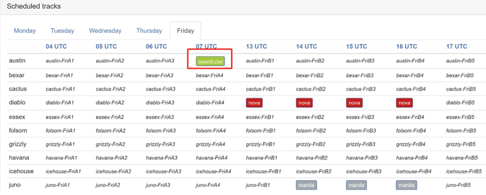

OpenInfra基金会项目小组集会（PTG）4月组会即将在线举行，可访问PTG主页查看所有OpenInfra项目团队的会议安排及Etherpad会议概要：https://ptg.opendev.org/ptg.html在会议列表中点击相应时段项目名即可参加会议。

OpenInfra项目团队安排了多场会议，其中**openEuler社区参与并主持4月8日的PTG会议，与全球社区成员们深度聊OpenStack相关技术**。**以下为openEuler社区在本次PTG中的会议安排：**

**会议时间（北京时间）**：4月8日（周一）15:00-16:00

**参会链接：**

https://meetpad.opendev.org/apr2024-ptg-openeuler

**议题概要：**

OpenStack如何适应中国云计算发展

openEuler作为一款专为数字基础设施打造的操作系统，原生支持OpenStack多个版本的部署，展现出其在云计算领域的深厚实力与前瞻性视野。然而，随着云计算技术的迅猛发展，OpenStack面临着功能增强、性能优化、安全加固等多重挑战与机遇。如何在国内更好地适应上游社区技术的快速更新，同时满足国内云计算市场的本土化需求，成为了OpenStack亟待解决的问题。**本议题将围绕openEuler与OpenStack的融合、OpenStack在国内的发展，展开讨论。**

**参会须知：**

**PTG主要面向：**

● 项目贡献者

OpenInfra项目团队的活跃贡献者将参加PTG，建议与会者提前了解各个团队的会议安排，制定个人参会日程。一些项目团队日程安排紧凑，如果是某个项目的新手，建议提早与该项目团队确认本次PTG是否开设入门培训，与会者对项目有一定的了解可有效提升PTG会议的沟通效率。

● 运维人员/终端用户

欢迎那些部署软件的运维人/直接与软件进行交互的终端用户参与PTG，与项目的上游贡献者进行交流，分享使用体验、部署计划或提供意见反馈，还可与其他运维人员进行合作，讨论软件部署与运维中的痛点及最佳实践。

● 团队领袖

欢迎那些在本次PTG中无会议安排的项目团队、特别兴趣小组（SIGs）、工作组的团队领袖参与其他团队的会议，代表所在项目团队发表看法。

PTG主要面向那些参与OpenInfra基金会或关联社区开源项目的社区成员，包括工作组、开发团队、外联开源项目（如Ceph、Kubernetes、特别兴趣小组等）。如果是项目新手，建议先参加OpenInfra峰会，了解与该项目相关的演讲介绍、论坛会议（旨在获得更广泛的社区反馈）以及入门培训等。

PTG仅供社区进行技术交流，请勿进行商业推广/产品销售，欢迎招聘经理或产品供应商参加OpenInfra峰会。通常，PTG不适合项目新手，不过在PTG中设有项目入门培训选项，项目团队可自行决定是否开展入门培训，但并非所有项目团队都会安排入门培训。
