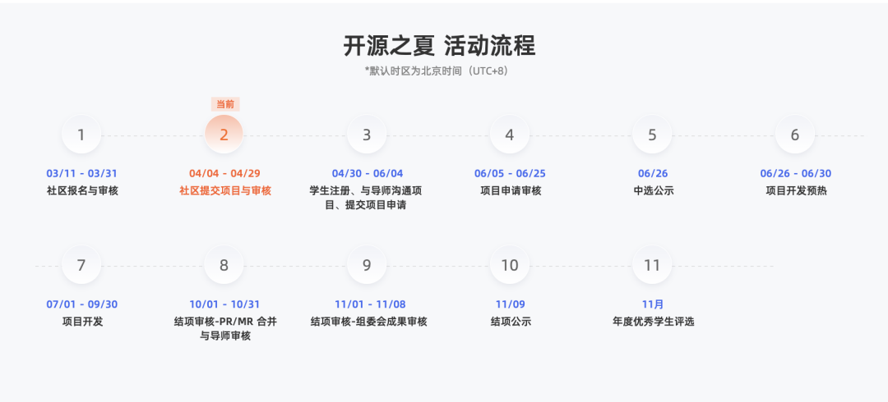

开源之夏是中国科学院软件研究所发起的"开源软件供应链点亮计划"系列暑期活动，旨在鼓励高校学生积极参与开源软件的开发维护，促进优秀开源软件社区的蓬勃发展。活动联合各大开源社区，针对重要开源软件的开发与维护提供项目开发任务，并向全球高校学生开放报名。

2023 年OpenAtom
openEuler（简称\"openEuler\"）社区共上线96个项目，其中89个项目中选，收到309份申请书，提交结项报告71份，最终通过组委会审核公示66个项目。

新的一年，我们将继续携手各位导师，为社区持续提供新生力量。

**Part 1**
-----
**2024 开源之夏活动流程**

**Part 2**
-----
**导师招募**

目前活动正在项目征集阶段，盛情邀请社区开发者成为本次【开源之夏】项目导师。

**导师出题**：导师可结合openEuler社区的开发与维护设计mini任务，开放给全球高校学生报名申请。项目任务可以为openEuler的功能性完善，或者基于openEuler
做创新性开发等，结项标准以PR合入社区仓库为目标。

**导师招募对象：**

● 在openEuler社区有贡献经验的社区开发者

● 高校老师

● 往届开源之夏优秀学生

**导师激励：**活动组委会将为成功带领学生完成项目任务并将成果贡献至社区的导师提供项目奖金（税前3000元人民币）与荣誉证书。

具体详情可参考官网导师指南：

https://summer-ospp.ac.cn/help/mentor/

**注意：**

一个导师仅能出一个项目任务；

导师报名&项目任务提交截止时间：2024年4月27日12:00

**导师报名通道：**

https://docs.qq.com/form/page/DUnB4Z0NXcnpoZklC

（复制链接到浏览器或点击文末阅读原文即可报名）

**导师验证：**

报完名待社区审核导师信息后需点击系统邀请邮件中的链接登录系统、填写个人信息、完成身份验证。

**导师验证截止日期为 4 月 28 日 24:00 UTC+8**，未完成导师身份验证的项目无法在官网发布。

导师不得同时以学生开发者身份参加本活动，如在活动过程中发现此情况，组委会将取消其参与资格、导师奖金及学生奖金。

**Part 3**
-----
**学生相关**

学生可自由选择项目，与社区导师沟通实现方案并撰写项目计划书。被选中的学生将在社区导师指导下，按计划完成工作，并将成果贡献给社区。社区评估学生的完成度，主办方根据评估结果发放资助金额给到学生。

**学生可获得的奖金：**

进阶：奖金人民币 12000 元

基础：奖金人民币 8000 元

难度分级由社区根据项目任务决定。

对openEuler开源之夏项目感兴趣的同学可扫码入群。

若群已满，可私戳小助手号备注"开源之夏"进入交流群。

活动官网：

https://summer-ospp.ac.cn/
