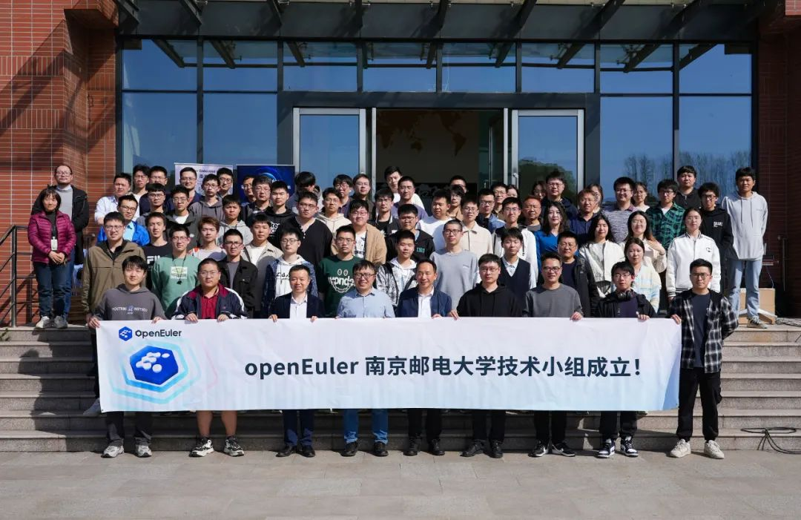
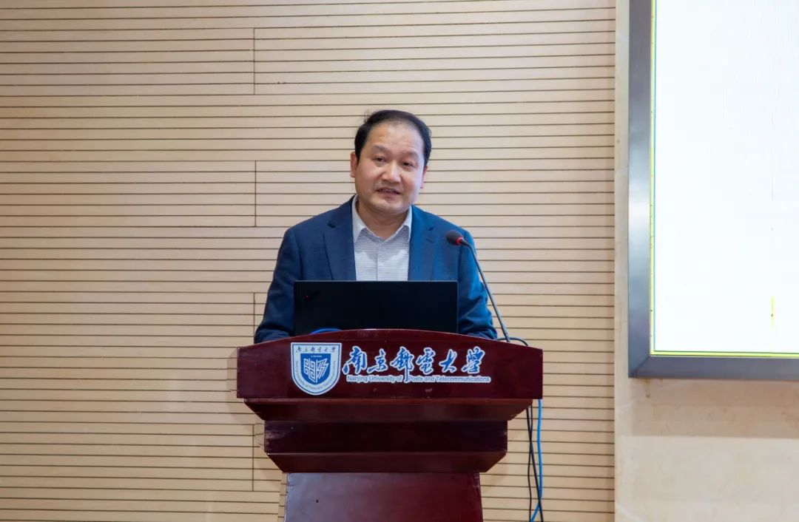
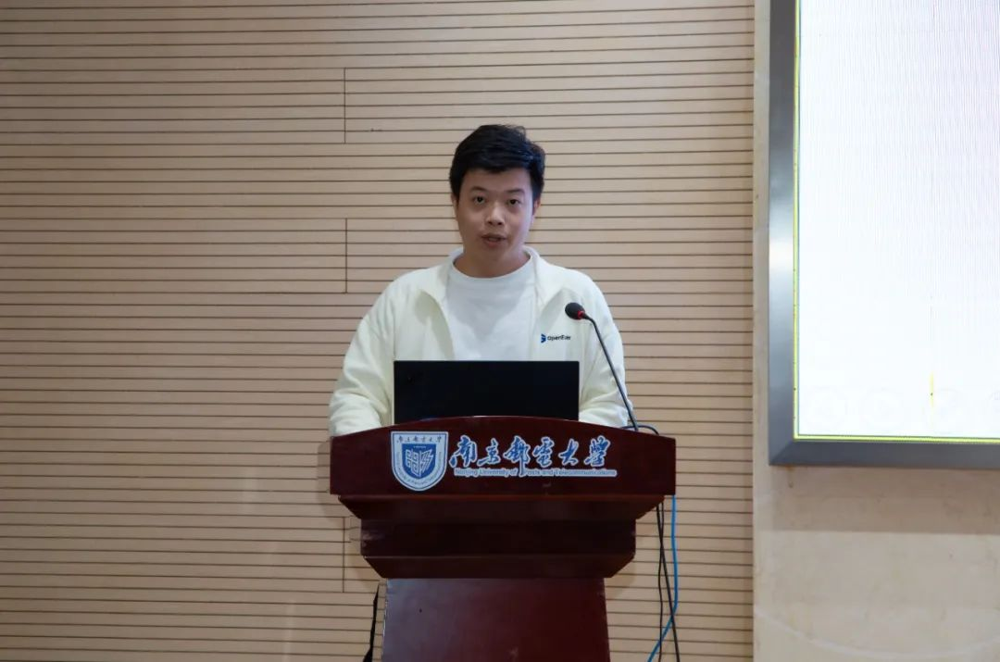
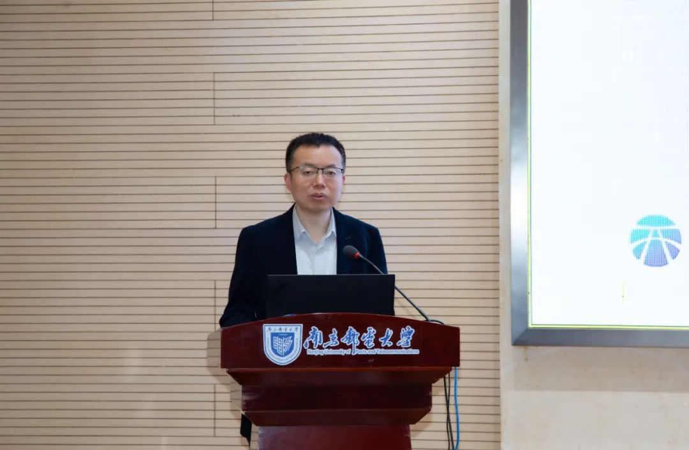
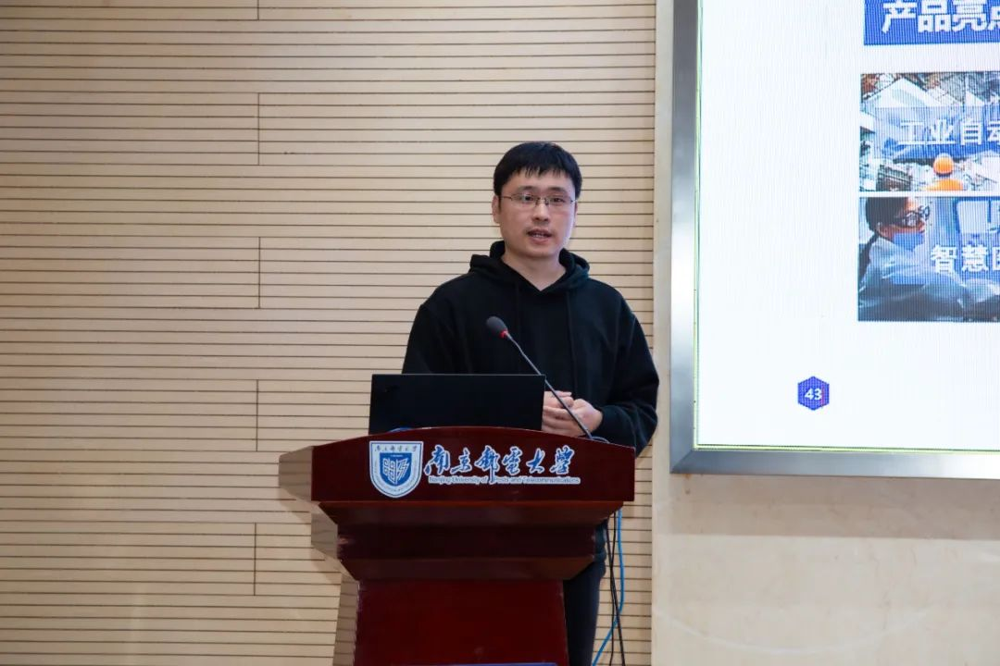
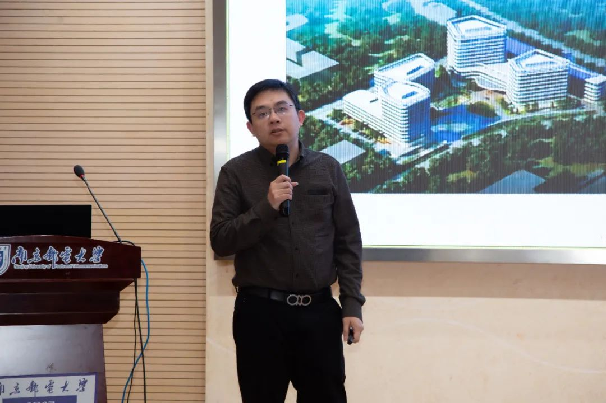
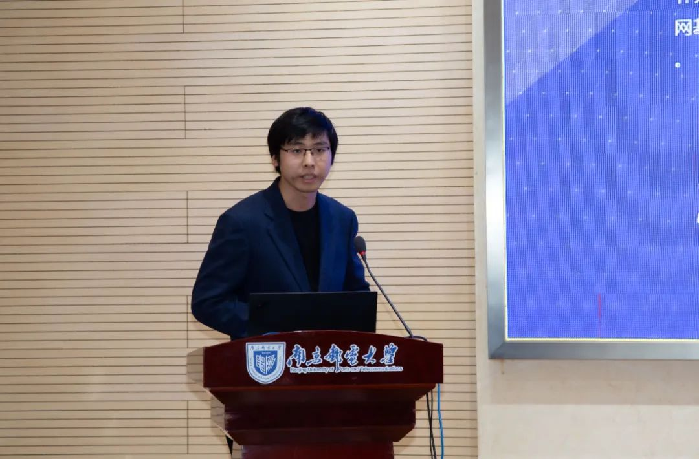
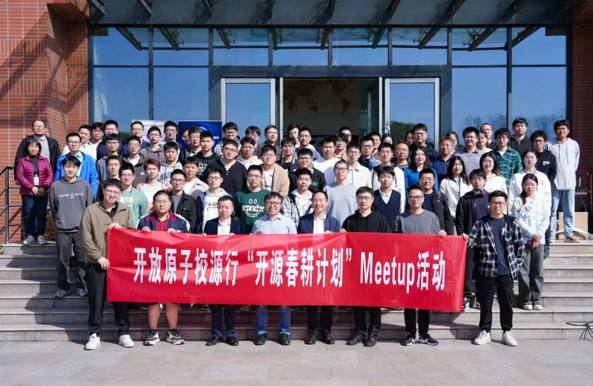

2024年3月29日，OpenAtom
openEuler（简称\"openEuler\"）举办了一场别开生面的开源技术盛宴\--开放原子校源行"开源春耕计划"之
openEuler Embedded Meetup南京站。本次Meetup由openEuler社区Embedded
SIG发起，联合南京邮电大学主办，易百纳技术社区、江苏鲲鹏·昇腾生态创新中心协办。为了探讨嵌入式系统在openEuler领域的最新进展与创新应用，多位特邀嘉宾围绕嵌入式前沿技术、应用案例、创新方向、芯片开发板优秀实践几个方面进行分享，在活动上还成立南京邮电大学
openEuler
技术小组，进一步加强的校企合作和产学研结合。

下面就让我们来回顾本次Meetup南京站的精彩内容（**文末有彩蛋**）！
----

**南京邮电大学openEuler技术小组正式成立！南京邮电大学openEuler技术小组是openEuler社区、易百纳技术社区、浙江省鲲鹏生态创新中心与南京邮电大学大学联合组建的高校交流平台**。通过成立南京邮电大学大学openEuler技术小组，社区进一步加强了校企合作和产学研结合，该小组不仅涵盖了技术方向的合作，同时融入了多样化的高校人才项目，其中包括开放原子开源大赛、开源之夏、开源实习等一系列活动，以提高学生的技术水平，促进开源文化的传播和发展。南京邮电大学大学openEuler技术小组将持续推动openEuler生态在南京的技术研究和应用。

**开场致辞南京邮电大学副校长**为本次活动发表致辞，他表示南京邮电大学与openEuler社区的合作，集双方之所长，强强联合，融入了多样化的高校人才项目。在本次活动之前，南京邮电大学与openEuler已经建立起非常良好的教学科研一体化合作的体制，南京邮电大学师生参与openEuler社区包括开放原子开源大赛、开源之夏、开源实习等一系列活动。此次Meetup活动成立南京邮电大学openEuler技术小组，是双方的又一实践活动落地，将进一步加南京邮电大学与openEuler的合作，为提高我国人才自主培养质量贡献一份力量。未来，南京邮电大学将与openEuler社区展开进一步合作，共同促进高质量创新人才培养及openEuler生态在南京的技术研究和应用。

**走进openEuler Embedded南北向openEuler Embedded
Maintainer方林旭**介绍了openEuler
Embedded的定位以及在南北向合作与高校联创方面的成果。openEuler
Embedded作为综合嵌入式系统软件平台，致力于整合碎片化的嵌入式领域。在南北向上，展示了与多家企业合作案例，如启诺和海思的海鸥派开发板解决方案，体现了openEuler在体积和实时能力上的优势。同时，openEuler
Embedded积极与高校合作，如与北航和湖南大学联合打造工业解决方案和实时嵌入式虚拟机，推动了嵌入式技术的创新与发展。未来，openEuler
Embedded将继续加强南北向合作与高校联创，推动openEuler嵌入式在更多领域的应用与发展。

**基于openEuler的机器人&工业视觉解决方案海思技术有限公司机器人领域产品总监陈建**介绍海思基于
openEuler Embedded
开发的机器人及工业视觉解决方案，该方案在业界首次实现了将
dToF、视觉在内的多传感器拼接与融合，同时结合海思领先的分布式异构计算、全场景联接、精准执行/表达/交互等技术，推出了具备卓越性能的机器人和工业视觉开发平台，并协同合作伙伴一起构建了
HiEuler
开放社区，通过该社区平台可以赋能高校师生、开发者和客户，开发具备高性价比的创新性产品。

**基于openEuler &
海鸥派实战应用案例解析南京启诺信息技术有限公司总经理、易百纳技术社区的创始人杜辉**，为大家深入解析了欧拉派（海鸥派）在实战应用中的卓越表现。欧拉派作为openEuler在嵌入式领域的赋能平台，已实现应用于4路dToF避障、四目AI视觉、无人机巢数据分析等多个领域，同时在EulerCar机器小车和机器臂的工业自动化、智能控制行业中也发挥着重要作用。同时，易百纳助力南京邮电大学openEuler技术小组，捐赠欧拉派和EulerCar机器小车，为学生在openEuler的学习、开发提供硬件平台。此外，易百纳技术社区与南京邮电大学成立的联合实验室，让高校学生有机会接触前沿行业知识，拓展视野，提升技能，为未来的职业发展奠定坚实基础。

**星闪技术在openEuler
Embedded上应用实践润和软件研发总监石磊**介绍了星闪技术的发展历程，星闪技术作为近距离无线连接技术，具有更低功耗、更快速度、更低时延、更稳连接、更广覆盖、更大组网等优势，将为智能终端、智能家居、智能汽车、智能制造等场景带来体验变革。润和软件基于海思星闪芯片，推出相应的模组和开发板，
已经适配openEuler 和OpenHarmony
操作系统，并取得相关认证证书。石磊同时介绍了星闪技术软件架构，并通过两个实际案例，演示在openEuler
和OpenHarmony之间通过星闪技术进行数据交互的开发实践。

**openEuler与Redcap在通信领域的开源协同：构建高效智能通信新生态利尔达5G专家杨雪松**分享了openEuler是一个致力于打造"数字化基础设施操作系统"的开源项目，它主要面向有高可靠、高性能等需求的服务器、边缘计算、云和嵌入式设备。为了促进与不同生态的合作与互通，openEuler在嵌入式领域引入了分布式软总线技术，该技术为设备之间的互通互联提供统一的分布式协同能力，实现设备无感发现和高效传输。而Redcap作为一种通信技术，也在通信领域发挥着重要作用。Redcap在物联网领域具有广泛的应用前景，能够满足许多低功耗、低成本、大连接的通信需求。当openEuler与Redcap在通信领域实现开源协同，可以预见的是，双方将能够充分利用各自的优势，共同构建高效智能通信新生态。

"开放原子校源行"项目自启动以来，已经引起巨大反响。它覆盖了全国超过134所高校，建立了67个开源社团，编制了超过100学时的开源课程，并培育了400余名开源大使。此次"2024开源春耕计划"之openEuler南京Meetup的成功举办，标志着openEuler社区将进一步提升社区高校开源生态，培养更多具备创新精神和实践能力的优秀人才。openEuler社区将充分利用这一平台，推动开源技术在校园内的普及与实践。

**彩蛋**本次 Meetup 现场嘉宾分享材料已上传至
openEuler社区。如果您对分享材料感兴趣，可以通过链接直接获取。

PPT获取链接：<https://gitee.com/openeuler/presentations/tree/master/meetup/20240330-embedded>

本次
Meetup 直播回放已上传至 B站 openEuler
官方账号。如果您错过了本次线下活动，可前往 B
站关注查看，期待您的下次参与！

视频回看链接：<https://space.bilibili.com/527064077/channel/collectiondetail?sid=2644819>
