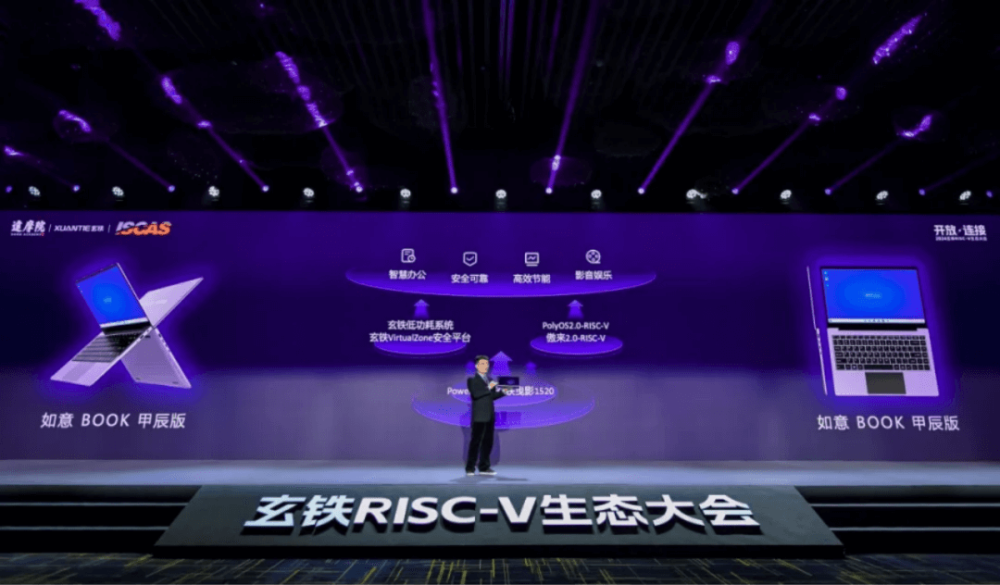

3 月 14
日，中国科学院软件研究所作为达摩院的合作伙伴，受邀参加了以"开放·连接"为主题的第二届玄铁
RISC-V 生态大会。会上，软件所发布了基于 RISC-V
的笔记本电脑"如意BOOK甲辰版"。**该笔记本内置了玄铁C910 处理器和OpenAtom openEuler（简称\"openEuler\"） RISC-V
操作系统，在 openEuler 操作系统上可流畅运行钉钉、Libre Office
等大型办公软件**，首次打通了从底层芯片到操作系统到商用软件的 RISC-V
全链路。 

在大会展区现场，中国科学院软件研究所成员展示了"如意BOOK甲辰版"笔记本的功能和使用，吸引了众多专家、业内人士、开发者的关注。他们纷纷体验了产品的各项功能，展现出了对产品的浓厚兴趣。倪光南院士莅临展台，亲身体验"如意BOOK甲辰版"笔记本，并给予高度评价。

"如意BOOK甲辰版"笔记本内置傲空间（AO.space）个人数据资产安全系统和"如意SDK"。为
RISC-V 生态内的软件开发者提供了"一站式"的 RISC-V
软硬件适配服务，进一步完善了开源软件生态。 

AO.space 是软件所团队研发并捐献到 openEuler 社区的开源项目，该项目承载在
openEuler SBC SIG 组。

"如意SDK"是软件所与平头哥联合打造的 RISC-V 开源开发工具集。

**贡献开源、共享开源**
---

中国科学院软件研究所主导的openEuler RISC-V SIG
联合社区众多开发者，共同打造并发布了 openEuler RISC-V
版本，成为"如意BOOK甲辰版"笔记本的基础。团队在研发过程中持续为 openEuler
RISC-V 的适配做贡献。"如意BOOK甲辰版"的发布不仅是 RISC-V
生态对通用计算支持能力的提升，也是芯片与操作系统全栈自主货架的又一次丰富。

**未来规划**
---

openEuler 社区将进一步推动 RISC-V
生态建设发展，将在下面几个方向继续投入：

 

1.发布支持RISC-V 架构的 openEuler 24.03 LTS 长期支持版本。

2.探索openEuler 在 RISC-V 上的最优应用生态。

3.基于系统的维度，对openEuler RISC-V 不断进行软件优化与硬件优化。

 

在致力于"贡献开源、共享开源"的道路上，我们不仅在技术创新方面持续努力，更在开放合作的理念下，积极输出我们的成果。通过开源的力量，我们共同构建一个更加开放、包容和创新的科技生态，为社会发展和进步贡献我们的一份力量。
