**概述**
--------------

在 2024年3月 OpenAtom
openEuler（简称\"openEuler\"）技术委员会例会上，技术委员会委员同意 AI
SIG 更名为 AI-Infra SIG，同意对该SIG组的定位升级，以更好地支持 AI
基础设施建设，推动 openEuler 在AI领域的应用与创新发展。此外，openEuler
社区新增"branch-keeper"角色作为仓库的分支守护者，以配合Maintainer和Committer管理和维护版本分支工作。在技术进展方面，首款搭载
openEuler 的 RISC-V 机器人小车解决方案落地，可实现机器人运动控制、AI
视觉交互、SLAM 建图导航、多机同步控制等多项功能。基于 RISC-V
的笔记本电脑"如意BOOK"甲辰版发布，该笔记本搭载玄铁C910处理器，可在openEuler操作系统上可流畅运行钉钉、Libre
Office等大型办公软件。米尔电子发布了基于海思Hi3093高性能MPU的MYC-LHi3093核心板和开发板，支持
openEuler Embedded 操作系统。致力于丰富 openEuler Embedded
南向生态的"雪球计划"在近期启动，并计划在2024年底完成30款BSP开发板系统移植。在EulerMake
r构建系统的落地部署方面，已在金山云、移动苏研、超聚变、软件所、中移金科、中科曙光等多家单位已逐步开展。社区的生态持续丰富，麒麟信安LTF框架、Bisheng
Autotuner、poissonsearch-oss近实时分布式检索分析引擎等项目相继加入社区，感兴趣的朋友可以关注。继与Eclipse、Linaro、Igalia、Linux等国际主流开源组织开展[生态合作研讨会]{.underline}后，openEuler
x OpenChain
研讨会在日本举办，进一步促进开发者对社区的深入了解，推动社区生态的合作与发展。本月社区持续在各个城市活跃。Embedded、G11N、Doc等SIG开发者相继在南京、成都举办Meetup活动；2024年社区首场用户组活动在武汉进行。openEuler
武汉用户组、上海用户组成立。社区B站技术直播持续进行中，感兴趣的朋友可联系社区小助手(微信号：openeuler123)预约。openEuler
全场景镜像已在多个主流平台上发布，为此，我们对官网下载页面进行优化，以便开发者选择合适的方式体验
openEuler，欢迎大家访问：https://www.openeuler.org/zh/download/get-os/。本月报阅读时长预计18分钟。

**社区规模**
-------------

截至2024年3月30日，openEuler社区用户累计超过234万。超过1.8万名开发者在社区持续贡献。社区累计产生
160.9K个PRs、90.3K条Issues。目前，加入openEuler
社区的单位成员1507家，本月新增44家。

社区贡献看板（截至2024/03/30）

**社区事件**
------

**OpenChain x openEuler 研讨会在东京举办**

3月18日，OpenChain 基金会与 openEuler
联合主办的研讨会在日本东京举办。来自 OpenChain 和 openEuler
的行业专家，和日立、松下、SONY、东芝等的公司代表，以及 OS
爱好者齐聚东京，就开源软件安全与合规标准，深入探讨 openEuler
在开源软件供应链安全的实践经验，以及 openEuler 在
AI、云原生、嵌入式领域的创新与应用案例，促进开发者对 openEuler
了解与合作。

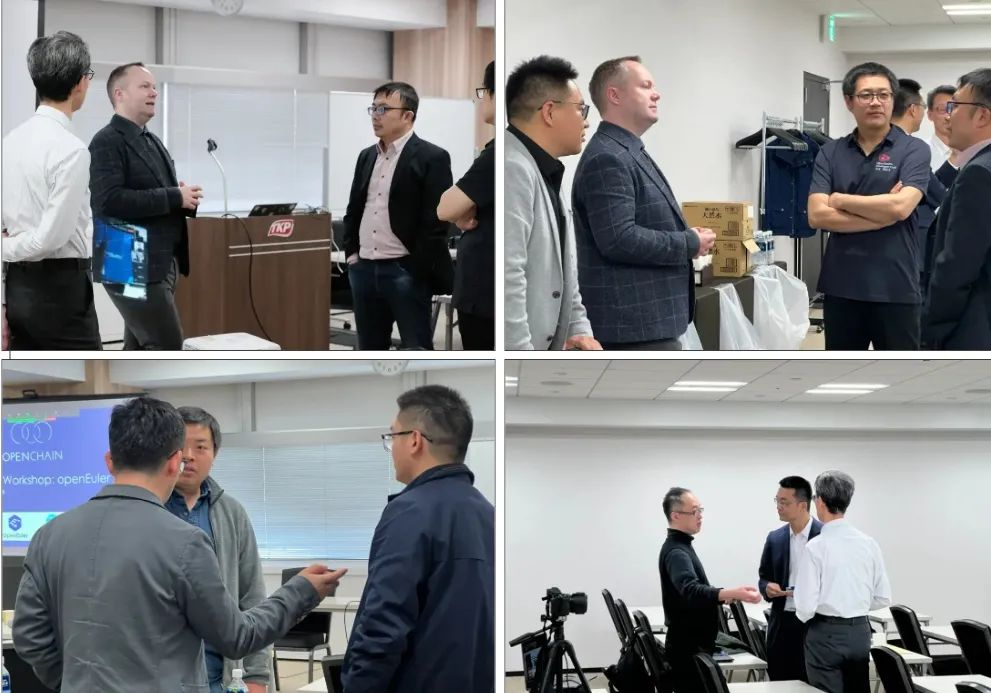

**openEuler 参加2024全球开发者先锋大会**

2024年3月23-24日，"2024全球开发者先锋大会"（GDC）在上海召开。openEuler 技术委员会委员胡峰，openEuler
社区Maintainer
郑振宇，兼容性SIG 组Maintainer 杜开田，麒麟软件运维工程师、openEuler sig-ops的contributor王钧琪，开源开发高级工程师、openEuler社区Contributor张思博、王帅参加本次活动，并就"openEuler
for AI,AI for
openEuler"为主要方向，向开发者们分享了AI与操作系统融合的创新成果与探索。

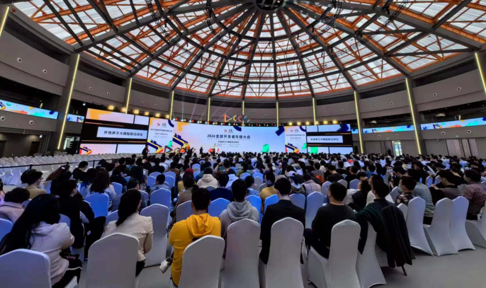

**中科院软件所受邀参加2024玄铁RISC-V生态大会**

3月14日，由达摩院主办的 2024 第二届玄铁 RISC-V
生态大会在深圳举办。中国科学院软件研究所（ISCAS）受邀参加该会议，并展示了
RISC-V 在应用层面上的新进展：

基于RISC-V的笔记本电脑"如意BOOK"甲辰版在会上发布。该款笔记本搭载玄铁C910处理器，在openEuler操作系统上可流畅运行钉钉、Libre
Office等大型办公软件，首次打通了从底层芯片到操作系统到商用软件的RISC-V全链路。

由中国科学院软件研究所、亚博智能和玄铁联合打造的 ROS
机器人小车解决方案在会上亮相。该机器人搭载玄铁 C910 处理器、openEuler
 RISC-V 操作系统和亚博公司提供的外设解决方案，可实现机器人运动控制、AI
视觉交互、SLAM 建图导航、多机同步控制等多项功能。

**openEuler Embedded Meetup 在南京举办**

3月29日，openEuler Embedded Meetup
在南京邮电大学举办。来自海思、润和软件、利达尔、易百纳技术社区openEuler
社区等技术专家，以及嵌入式OS技术的爱好者参加本次活动，并就 openEuler
在嵌入式领域的实践进行分享和交流。同时，南京邮电大学 OpenAtom openEuler
技术小组在会上成立。该小组不仅涵盖技术方向的合作，还将融入了多样化的高校人才项目，促进开源文化的传播和发展。

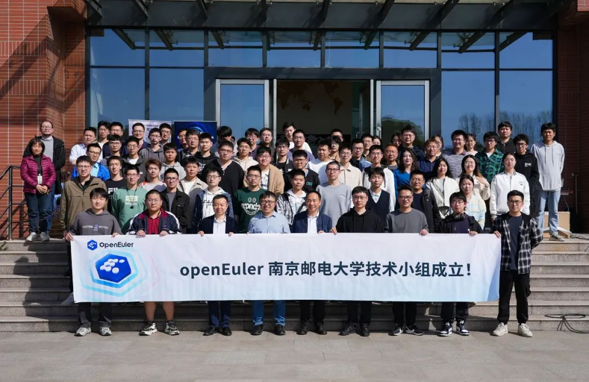

**openEuler G11N & Doc SIG Meetup 在成都举办**

3月23日，由 G11N SIG 和 Doc SIG 联合的 openEuler Meetup
在成都举办。来自华为、麒麟软件、菁蓉联创等社区伙伴的技术专家，以及
openEuler
社区资深贡献者在会上就生态信息体验、社区文档、语言翻译等方面的实践经验进行分享与交流，提升大家对文档贡献、语言体验、大模型训练等方向的了解，推动社区生态信息的发展。

Doc SIG 旨在为开发者提供 openEuler
相关的文档和知识，建立软件使用和开发者之间的联系，以获得更好的社区体验。

G11N SIG 旨在提供更流畅的语言文化体验，帮助更多的开发者了解使用
openEuler。

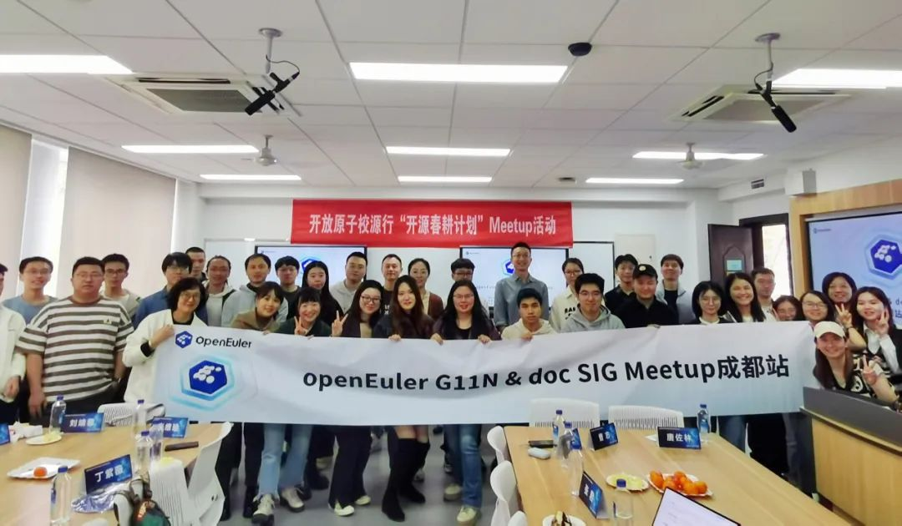

**2024 社区首场用户组 Meetup 举办，openEuler 武汉用户组成立**

3月22日，openEuler 2024 首场用户组 Meetup 在武汉举办。本次 Meetup 由
openEuler
社区、湖北省信创工委会、长江鲲鹏&欧拉生态创新中心联合主办，统信软件、麒麟软件、超聚变协办。武汉地域60余名开发者、企业用户、高校师生参会。本次活动围绕操作系统迁移和操作系统内核安全进行分享。同时，openEuler
武汉用户组在会上正式成立。如果您申请加入用户组、参与用户组活动，欢迎点此报名！

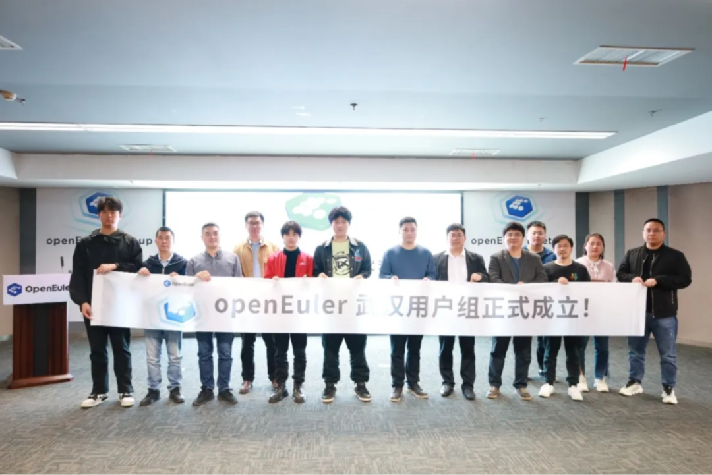

**openEuler 社区技术直播开放预约中，欢迎报名**

openEuler
社区技术直播开放预约中，如果您想分享您的技术实践、项目成果、开源经验等，与开发者们线上近距离交流，感兴趣的朋友可联系社区小助手（微信号：openeuler123）预约。

本月，社区进行了3场技术直播：

**天翼云@openEuler创新项目分享**

3月14日，中国电信集团天翼云科技有限公司操作系统研发专家、openEuler eBPF SIG 及 CloudNative SIG Maintainer王麟在线上为大家介绍天翼云@openEuler 创新项目的进展：

-   CVE-ease: 新增了排查文档自动生成器，正在推进oval和yum plugin

-  k8s-install：新增了多基线支持和升级选项，正在推进125和129基线支持

-   CTinspector：新增了OVS场景的使用案例

**基于 eBPF 的应用层网络管控**

3月21日，统信软件有限公司资深安全工程师、openEuler eBPF SIG Contributor
王佳给大家介绍一种基于eBPF 的应用层网络管控方案的具体实现方式。

**openEuler 漏洞处理流程介绍**

openEuler 社区非常重视社区版本的安全性，3 月28日，Security SIG
Maintainer
罗钰凯线上给介绍社区漏洞处理策略和流程，包括漏洞感知、漏洞确认和评估、漏洞修复以及漏洞披露等阶段。视频回顾：openEuler
社区安全漏洞治理

**社区治理**
----

**openEuler 技术委员会 3 月会议摘要**

为更好地支持 AI
基础设施建设，在2024年3月工作例会中，经讨论，技术委员会(TC)同意，AI SIG
更名为 AI-Infra SIG；同意对该SIG组的定位进行升级：

1.  适配（机器学习、深度学习） 软件栈，提供AI软件栈开箱即用能力；

1.  通用/异构算力AI栈加速，如：AI 硬件接入框架，异构融合、算力切分、XPU
虚拟化、加速框架等；

1.  AI 与云原生结合，探索构建 AI 训推基础设施解决方案。

**openEuler 新增 branch-keeper 角色作为仓库的分支守护者**

在社区 SIG 成员角色中，Committer
是SIG组内单个仓库代码质量的看护人，具备该仓库的代码审批、合入权限。根据
SIG 组成员反馈，部分体量比较大的仓库存在 Committer
较多，彼此权限出现交集，容易出现代码合入要求与版本分支管理要求不一致情况。

针对上述场景，基础设施与相关 SIG
组成员讨论后，提出对仓库分支新增配置分支守护者（branch-keeper）角色，以配合
Committer 和 Maintainer 做好版本分支管理。

详见链接：<https://www.openeuler.org/zh/oEEP/?name=oEEP-0016%20openEuler新增branch-keeper角色作为仓库的分支守护者 >

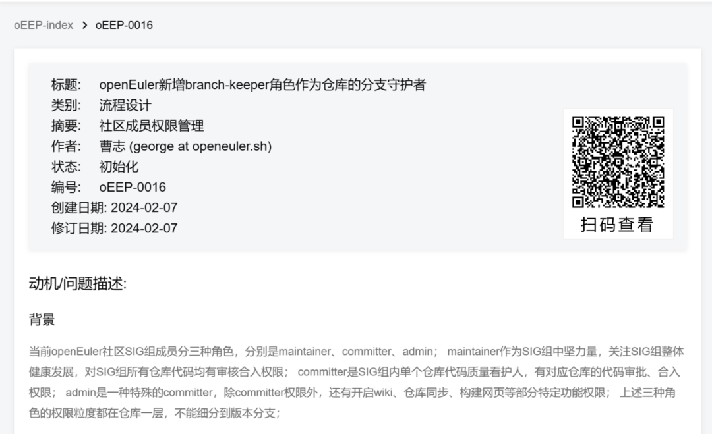

**技术进展**
----

**MYC-LHi3093核心板和开发板发布，搭载 openEuler Embedded 操作系统**

近日，米尔电子发布了基于海思Hi3093高性能MPU的MYC-LHi3093核心板和开发板,
支持 openEuler Embedded 操作系统。

MYC-LHi3093核心板及开发板，配套提供工业控制demo，方便客户评估 PLC
等应用场景实时控制性能，为追求实时性能的工控产品开发提供参考。此次适配不仅为
openEuler 提供了更多的硬件生态，同时也体现了 MYC-LHi3093
核心板及开发板对操作系统生态的支持，为行业应用发展注入了新的活力。

**首款搭载 openEuler 的 RISC-V 机器人小车解决方案落地**

由中国科学院软件研究所、亚博智能和玄铁联合推出的 ROS
机器人小车解决方案（产品名为 RISC-V MicroROS）在第二届玄铁RISC-V
生态大会上亮相。RISC-V MicroROS 是一款基于 Milk-V Meles 开发的 ROS2
智能机器人，搭载了玄铁 C910 处理器、openEuler  RISC-V
操作系统和亚博公司提供的外设解决方案，可实现机器人运动控制、AI
视觉交互、SLAM 建图导航、多机同步控制等多项功能。

中国科学院软件研究所主导的 RISC-V SIG 大力支持了 RISC-V MicroROS
智能小车的系统环境建设，提供了适配 TH1520 的 openEuler RISC-V
硬件镜像和硬件驱动，完善了 ROS2 在 RISC-V
硬件环境的软硬件生态适配。小车的成功落地也反向验证了 RISC-V SIG
在社区软件生态建设的成果。

**基于 RISC-V 的笔记本电脑"如意BOOK"甲辰版发布**

在第二届玄铁RISC-V生态大会上，中国科学院软件软件所发布了基于RISC-V的笔记本电脑"如意BOOK"甲辰版。该笔记本搭载玄铁C910处理器，可在openEuler操作系统上可流畅运行钉钉、Libre
Office等大型办公软件。

该款笔记本可选择运行两款自主操作系统的桌面版："傲来2.0-RV"和"PolyOS
2.0-RV"。其中，"傲来2.0-RV"是软件所基于 openEuler 23.09
二次开发的RISC-V原生发行版，主要面向生态开发者。

这两款操作系统均采用自研UI界面，内置傲空间（AO.space）个人数据资产安全系统，并集成了
RISC-V 的原生开发工具集如意SDK，助力开发者实现 RISC-V
原生开发与编译构建环境。"如意BOOK甲辰版"的发布不仅是RISC-V生态对通用计算支持能力的提升，也是芯片与操作系统全栈自主货架的又一次丰富。

**雪球计划启动，推动 openEuler Embedded 南向生态的发展**

雪球计划致力于丰富 openEuler Embedded
南向生态，并计划在2024年底完成30款BSP开发板系统移植。该工程主要分为三期，第一期开发板由深圳米尔科技进行赞助，贡献7款开发板，涵盖TI、NXP、ST、瑞萨以及全志等国内外知名SOC厂商。基于瑞萨RZ/G2L的瑞米派近期将完成移植。

详情请查看：https://gitee.com/openeuler/yocto-meta-openeuler/issues/I90DOU?from=project-issue

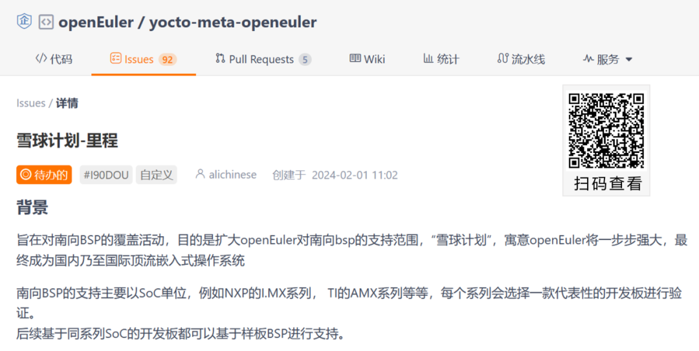

**多家单位开展 EulerMaker 部署落地工作**

近期，金山云、移动苏研、超聚变、软件所、中移金科、中科曙光等多家单位逐步开展
EulerMaker 部署工作。其中，金山云客户已完整完成了 EulerMaker
落地，实现了rpm构建（全量/增量）、镜像定制、软件包定制功能；移动苏研、超聚变、软件所实现rpm构建（全量/增量）功能。目前金山云已正常投入使用，用于日常的软件包构建及镜像定制，未来还计划将切换自研软件构建。

EulerMaker
构建系统是一款软件包构建系统，完成源码到二进制软件包的构建；支持开发者通过搭积木方式，组装和定制出适合自己需求的场景化
OS，能够提供增量 / 全量构建，分层定制与镜像定制的能力。

**BiSheng Autotuner 项目在社区建仓**

BiSheng Autotuner + llvm
自动迭代调优能够支持多种场景下编译器细粒度、自动化选项调优，帮助用户大幅度缩短调优时间，提供更多性能与
codesize 优化机会。当前，项目已在 openEuler 建仓，由 Compiler SIG
维护管理。

项目地址：https://gitee.com/openeuler/BiSheng-Autotuner

**麒麟信安LTF框架在 openEuler 开源**

LTF（Linux Test
Framework）是一款专为Linux操作系统设计的自动化测试框架，具备轻量级、低耦合、高覆盖三大特点，能够全面满足不同场景的测试需求。

目前已有的自动化测试用例已基本覆盖国内各评测大纲测试项和Linux常用模块，包括：命令、安全、性能、内核等。同时LTF提供了丰富的API接口，方便开发者快速开发自动化用例。

在兼容适配方面，LTF使用Shell
进行开发，不依赖于特定的Python版本，无需任何环境配置即可在不同体系架构不同Linux版本上运行，真正做到开箱即用，为项目和日常版本测试提供高效的测试手段。

欢迎访问并使用LTF工具，详情请访问：https://gitee.com/openeuler/LTF

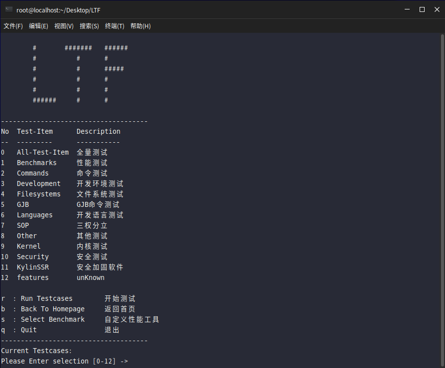

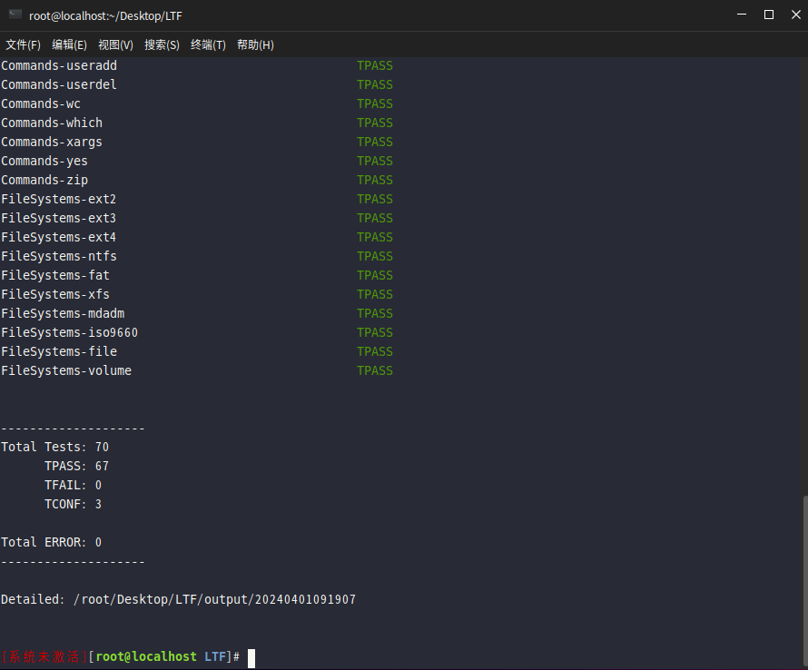

**poissonsearch-oss 近实时分布式检索分析引擎在社区建仓**

poissonsearch-oss 是基于elasticsearch-oss 7.10.2 Apache License
2.0部分的一个近实时分布式检索分析引擎，帮助用户快速构建数据检索和分析能力。目前已发布到
openEuler-22.03-LTS-SP3，并在 openEuler 建仓，由 DB SIG 维护管理。

poissonsearch-oss
裁剪Elasticsearch商业License代码，保留了elasticsearch-oss
7.10.2所有Apache License
2.0能力，兼容7.10.2社区生态组件，修复了所有7.10.2版本已知漏洞。后续我们将在兼容es
7.10.2开源生态的基础上，联合社区力量，针对检索分析功能、性能、时延稳定性、可扩展性、安全性、易用性等进行增强。

项目地址：https://gitee.com/openeuler/poissonsearch-oss

**openEuler 官网下载页更新**

openEuler
全场景镜像已在多个主流平台上发布，为此，我们对官网下载页面进行优化，以便开发者选择合适的方式体验openEuler，欢迎大家访问。

地址：https://www.openeuler.org/zh/download/get-os/

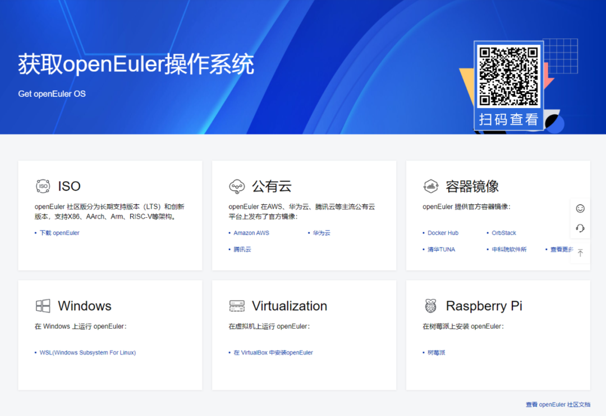

**软硬件兼容性认证**

2024年3月，兼容性方案1506个，北向1031个，南向467个，OS 136个。3月新增
北向47个，南向10个，OS 5个。

社区兼容性列表：

https://www.openeuler.org/zh/compatibility/

**安全公告**

2024年3月，社区共发布安全公告 14个，修复漏洞 97个（其中 Critical
3个，High 48个，其它 46个）。

-   **重点漏洞提醒**

如下漏洞评估影响较大，请重点关注：

1.  使用Heimdal的Samba AD
DC可以签发rc4-hmac加密的Kerberos凭据，rc4-hmac加密很弱，可能会让HMAC的保护将被绕过（CVE-2022-45141）
CVSS评分为 9.8 分

1.  可能存在在某些 imap
序列以逗号结尾的情况下会进行超出范围的读取（CVE-2021-32055）
CVSS评分为 9.1 分

1.  影响范围：openEuler-20.03-LTS-SP1

1.  可能存在使用pickle
Python模块时被远程攻击者通过序列化对象执行任意代码（CVE-2019-6446）

CVSS评分为 9.8 分

-   **漏洞防护**

openEuler社区针对在维版本例行修复漏洞，发布安全补丁。建议用户关注openEuler官网安全公告，及时安装漏洞补丁进行防护。

openEuler 安全公告：

https://www.openeuler.org/zh/security/security-bulletins/

**感谢每一位朋友、开发者的支持**

因为大家的辛勤贡献，openEuler的每一天都发生着好的事情。小编限于视野和能力，难免有所遗漏，在此表示歉意。同时，衷心感谢社区朋友、开发者们以及openEuler
SIG组成员的贡献：

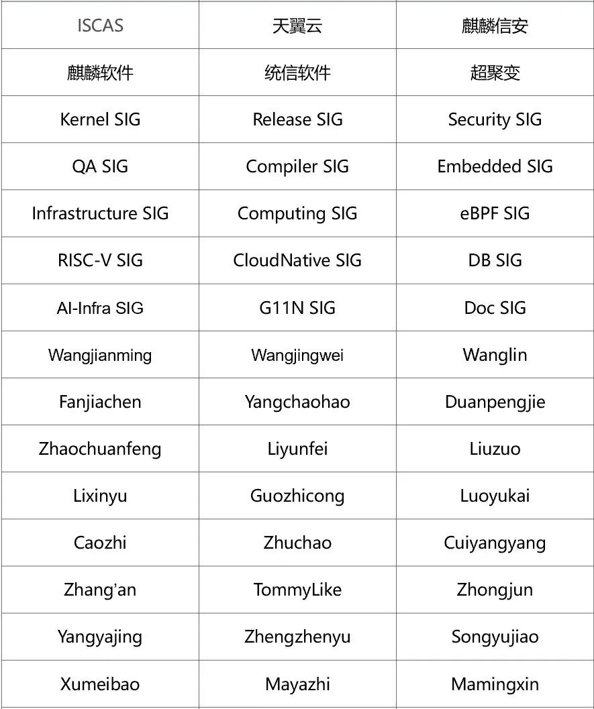

\* 以上不分先后顺序

如果您希望在月报中增加您的工作内容，或对内容有任何改进建议，请联系wengqiaozhen@openeuler.sh。
