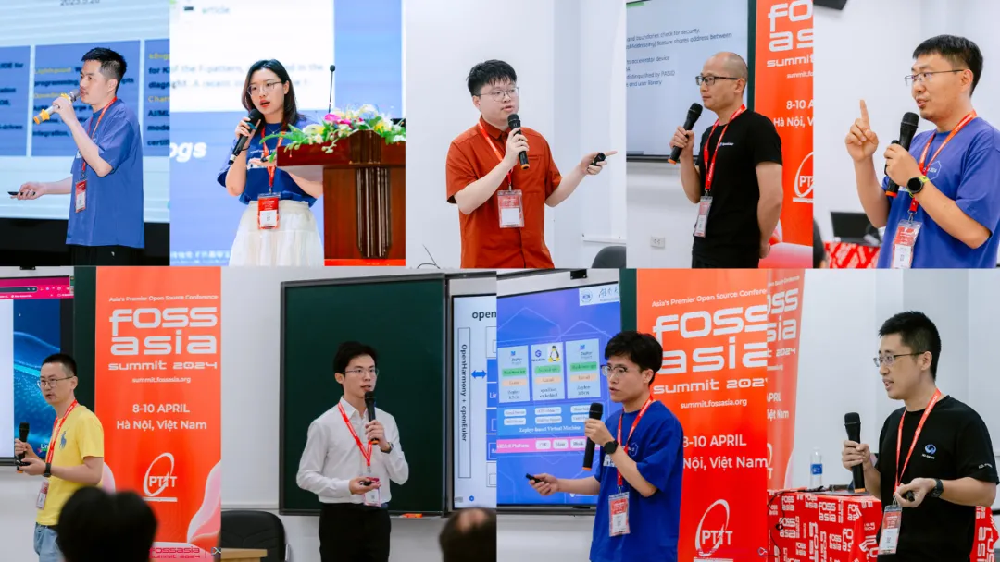

国际开源盛会 FOSSASIA Summit 2024
于4月8日在越南河内举行。作为一个支持多样性算力的Linux发行版，OpenAtom
openEuler（简称\"openEuler\"）与中科院软件所、华为、麒麟软件、Linaro、润和软件、统信、EasyStack、湖南大学等合作伙伴共同参展，吸引众多开源爱好者和专业人士，给来自东南亚的金融、互联网等行业用户带来openEuler在多样性算力支持方面的优势，并与世界各地前来参展和观展的IT、软件企业、OS提供商和服务提供商进行了深度交流。

**精彩回顾**

此次FOSSASIA
Summit，openEuler社区执行总监&技术委员会委员熊伟发表了题为"Ushering in a
Future of Digital
Intelligence"的主旨演讲。熊博指出，人工智能时代的到来改变了各行各业，包括操作系统领域。作为一个面向全场景多样化计算的操作系统，openEuler也在积极探索人工智能方面的突破。openEuler开发了EulerCopilot和GMEM等AI技术，不仅改变了传统操作系统的使用和交互方式，还推动了操作系统转型，加速了人工智能训练和推理过程。

熊博在演讲中还提到了openEuler即将发布的24.03 LTS版本和22.03
SP4版本。他表示这两个版本将为用户带来更稳定可靠的操作系统环境，为开发者提供更多创新和优化的功能。他鼓励开发者积极参与openEuler社区，共同推动开源技术的发展，助力数智时代的到来。

openEuler & Operating Systems
Track成为本次大会的一大亮点。展示了openEuler在AI、云原生、嵌入式、DevOps等领域的创新项目。与会者们通过这次Track深切感受到了openEuler社区的蓬勃高速发展，并对其未来充满期待。

在其他分会场，openEuler还带来了9场精彩的演讲，让现场开发者更加深入了解openEuler。演讲结束后，不少开发者和用户前来openEuler展台咨询、体验交流。

畅聊！畅谈！畅合作！

openEuler展台空前火爆，来自SoftSage、OnlyOffice、Microsoft
Azure、SUSE、Linux Professional
Institute、3mdeb、VGGATE、VFOSSA、PTIT、河内工业大学、IMIP、Hyperlogy
Project、RizinOrg等企业或项目成员参观openEuler展台，并与openEuler团队一起探讨了未来与openEuler社区的合作，以及openEuler社区在国际化进程中的发展方向。

openEuler与中科院软件所、华为、麒麟软件、Linaro、润和软件、统信、EasyStack、湖南大学等合作伙伴在openEuler展台共同展示openEuler最新技术特点。

润和软件所展示的分布式协同方案与分布式计算器项目吸引了大批与会者积极了解与体验。该项目展示了基于数学表达式的复杂度并结合openEuler与OpenHarmony系统的特点，将不同的计算任务调度到合适的算力平台之上并实现计算结果同步的效果。

中国科学院软件研究所带来了openEuler
RISC-V版本的最新进展，包括下个月即将发布的长期发行版，以及上个月开发的笔记本，展示了RISC-V生态的快速进步和最新软件适配的成果。ISCAS还向大家展示了AO.space这一创新项目，此项目已于去年捐赠给openEuler。

Linaro介绍了如何在大数据场景中更好地利用ARM多核特性和硬件加速器。徐国栋提到了ARM平台的关键特性，包括支持多核和硬件加速器的集成。他重点讨论了如何平衡多核和硬件加速器的使用，并介绍了通过增强OpenSSL
3.0和实现新的负载均衡提供程序来实现高效利用。

麒麟软件介绍了在openEuler OS的基础之上开发的Nest
OS云底座操作系统。NestOS集成了rpm-ostree支持、ignition配置等技术，采用双根文件系统、原子化更新的设计思路，使用nestos-assembler快速集成构建。并针对K8S、openStack等平台进行适配，优化容器运行底噪，使系统具备十分便捷的集群组件能力，可以更安全的运行大规模的容器化工作负载。

作为openEuler社区的早期参与者，易捷行云EasyStack的云平台是在openEuler生态系统上构建的。EasyStack国际化业务拓展总监Adrian向与会者介绍，EasyStack云平台采用平台与云服务的分离式架构设计，搭载轻量级的数字原生引擎EOS，并与多样化的云服务相结合，能够灵活满足从中小规模到超大规模云的私有化部署需求。无论是虚拟化、裸金属算力，还是云原生、AI算力需求，都能得到无缝扩展和响应，适用于许多人工智能和视频GPU数据处理应用，为客户提供云基础设施。

openEuler始终遵循\"上游优先\"的策略，紧密跟随全球主流生态。这使得openEuler能够在全球范围内保持技术竞争力。

在FOSSASIA现场，我们的调查问卷显示，超过70%的参会者听过openEuler，并且近一半的人愿意尝试使用openEuler。这表明openEuler在开源社区中的知名度和影响力不断增强，得到了广泛认可与支持。FOSSASIA创始人Mario和Hong在接受openEuler团队采访时，高度评价了openEuler两年来在国际化进程中所取得的成就，并祝愿openEuler社区未来更加繁荣发展。

在FOSSASIA Summit
2024的光芒下，openEuler与合作伙伴共同闪耀，为开源技术的发展做出了重要贡献。未来，openEuler将继续秉承开源精神，与全球开发者共同探索技术创新的无限可能。
