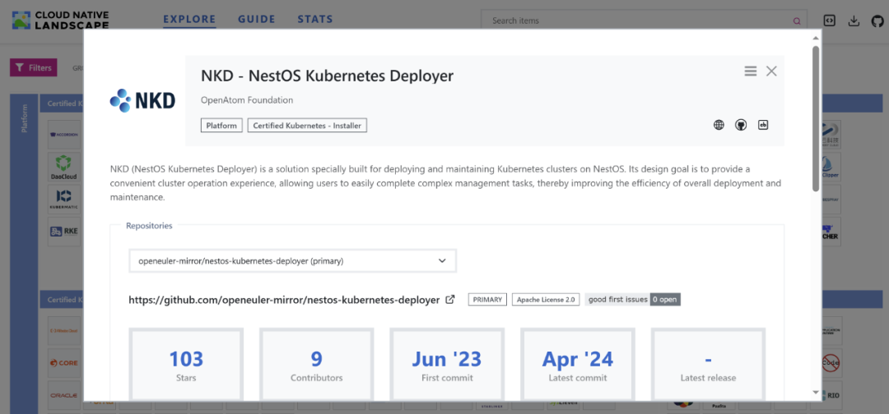
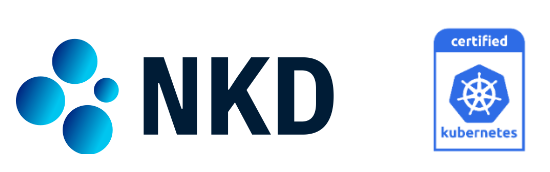
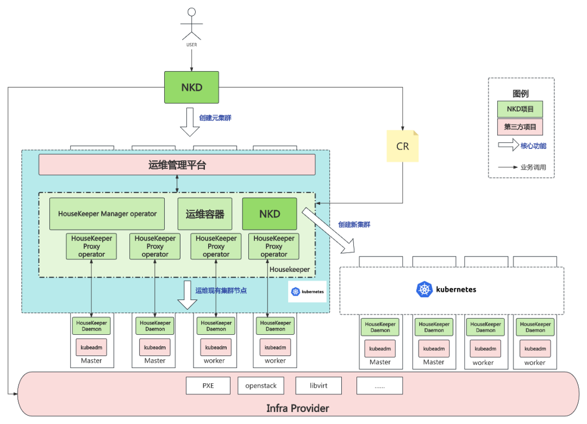

近日，OpenAtom openEuler（简称\"openEuler\"）孵化项目NestOS Kubernetes
Deployer（以下简称NKD）通过CNCF（云原生计算基金会Cloud Native Computing
Foundation）K8s一致性认证（Certified Kubernetes
Conformance），成功加入CNCF Landscape，从属于Certified Kubernetes --
Installer分类：

https://landscape.cncf.io/?group=certified-partners-and-providers&view-mode=grid&item=platform\--certified-kubernetes-installer\--nkd-nestos-kubernetes-deployer

NKD是由麒麟软件发起并在openEuler社区开源孵化，是专为在NestOS（https://nestos.openeuler.org/）上部署和维护K8S集群而打造的解决方案。现代码行数12.5K，涉及libvirt平台基础设施部署以及openstack平台基础设施部署、集群证书创建、集群部署、集群节点扩展、Kubernetes版本升级、集群节点操作系统版本升级等八个功能点，简化了集群部署和升级流程。

**NKD 简介**

NKD作为NestOS专属容器云部署运维工具，旨在通过在集群外提供一系列服务，涵盖了基础设施和Kubernetes核心组件的部署、更新和配置管理等，使部署和升级流程更加便捷，为用户提供更出色的操作体验，提高整体部署和维护的效率。其主要特点包括：

● 能够自动化完成集群的部署，并且支持根据需求灵活地扩展节点，以适应不同规模的工作负载；

● 利用Ignition点火机制，可以动态传入集群配置信息，轻松批量构建集群节点；

● 支持openstack、libvirt等多种虚拟化基础设施平台，为用户提供了灵活的部署选择；

● 通过结合operator技术，具备管理和升级操作系统版本以及Kubernetes组件版本的能力，使用户能够轻松地管理系统和组件的更新，确保系统的安全性和稳定性。

NKD功能演示部署图

**生态合作**

NKD自加入openEuler社区孵化以来，力求突破与创新，成为openEuler云原生场景最佳实践的重要一环。麒麟软件深入理解云原生技术背景，主导NKD项目开发，打磨其技术核心，助力NestOS云底座操作系统场景落地，并在机密计算，安全容器，轻量化容器解决方案当中丰富和加强落地场景和价值。

此次加入 CNCF
Landscape，极大促进openEuler孵化项目NKD的推广及合作，吸引广大云原生企业用户深度参与，NKD将持续在容器领域发挥越来越重要的作用，openEuler
也将在云原生领域持续耕耘、持续引领创新、繁荣生态，助力各行业走向快速智能发展之路。未来openEuler将持续参与社区云原生项目孵化，丰富整个云原生开源社区生态。

openEuler
社区既是技术孵化器，也将是发行版的平台，通过每半年发布一个创新版，让技术可以快速创新落地并成为可交付的商业版软件和应用。社区孵化的创新技术可以引入发行版，发行版通过用户反馈进而继续牵引被孵化的技术演进方向。激发社区创新活力，从而不断孵化创新技术。发行版平台和技术孵化器互相促进、互相推动、牵引项目孵化持续演进。欢迎更多项目到openEuler社区中孵化。

**NKD 未来规划**

增强易用性与用户体验：NKD会进一步简化Kubernetes集群的部署和管理过程，提供更加直观和用户友好的前端配置界面。这有助于降低使用门槛，使更多的开发者能够轻松地使用和部署Kubernetes集群。

更多cpu架构和os的支持：NKD通过对更多cpu架构和os的支持，并与之集成，这将有助于用户在不同cpu架构和os上无缝部署和管理Kubernetes集群。

安全性增强：NKD一直强调对安全的重视，计划引入零信任安全模型，来杜绝源于内部的安全隐患。这将有助于保护用户的数据和集群安全，减少潜在的安全风险。

社区生态与开源合作：NKD作为一个开源项目，可以源源不断的汲取社区先进的理念和先进的技术,进一步扩大其社区规模和影响力，吸引更多的开发者参与进来，共同推动项目的发展。同时，它也会积极与其他开源项目进行合作，共同构建更加完善的云原生生态。

NKD的未来发展方向将围绕易用性、云服务集成、智能化资源管理、安全性以及社区生态等多个方面展开，为用户提供更加高效、安全、便捷的Kubernetes部署和管理体验。openEuler也将在云原生领域持续耕耘、持续引领创新、繁荣生态，欢迎云原生领域开源项目到openEuler社区孵化发展，助力各行业走向快速智能发展之路。

**CNCF Landscape 是什么**

CNCF基金会成立于2015年，是Linux基金会旗下最大的开源子基金会，也是目前
Linux
基金会下最受关注和发展最快的基金会。在"云"已经成为大众基础设施的今天，云原生被认为是云计算技术的
2.0 标准，而 CNCF
正是引领云原生技术发展的风向标，在业内具有举足轻重的地位。

为了更好的管理和推广云原生生态，CNCF 成立 Landscape 项目，旨在成为**云原生技术**未知领域的**全景图和路线图**，尝试对云原生相关项目和产品进行**分类**。进而为云原生应用开发、部署，提供一条较优的**路线图**。
