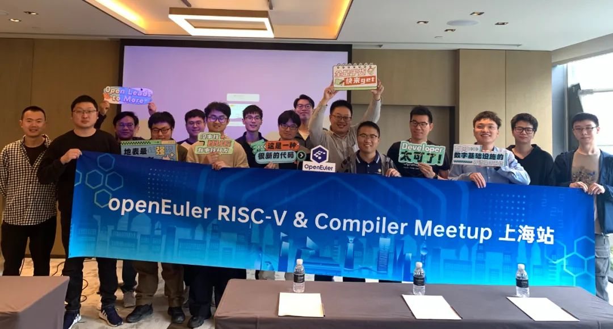
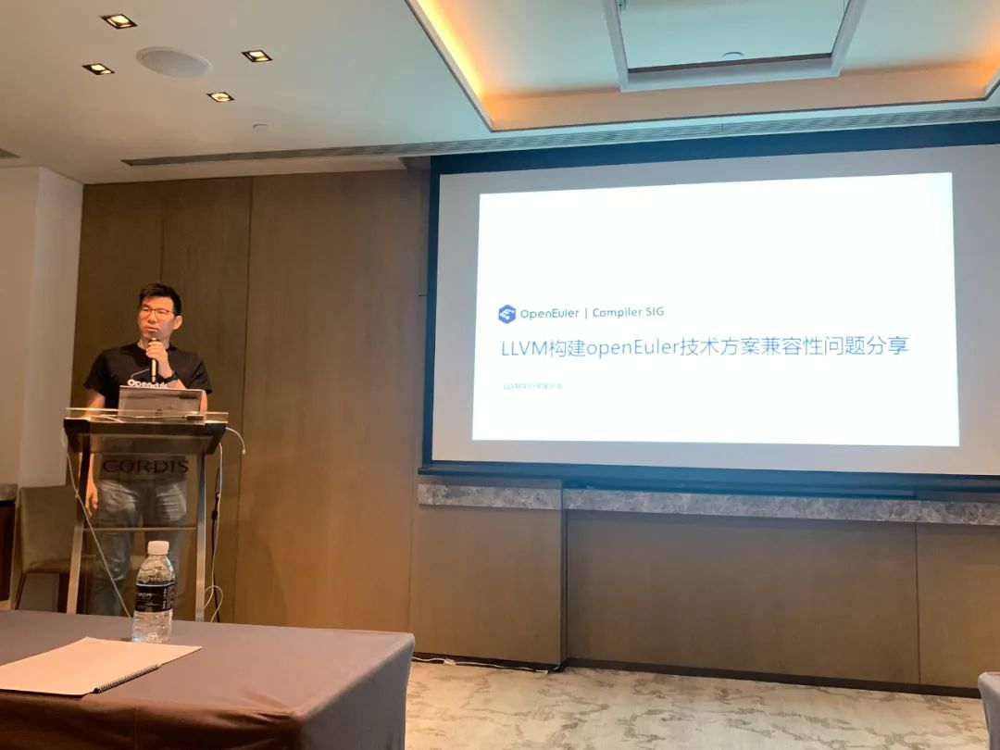
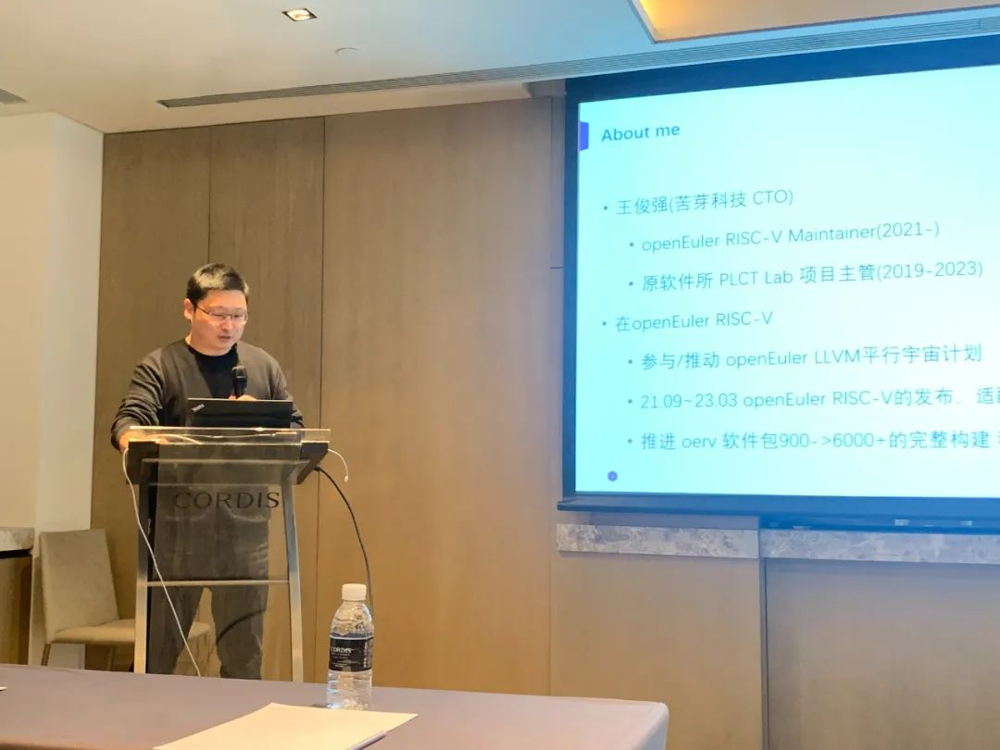
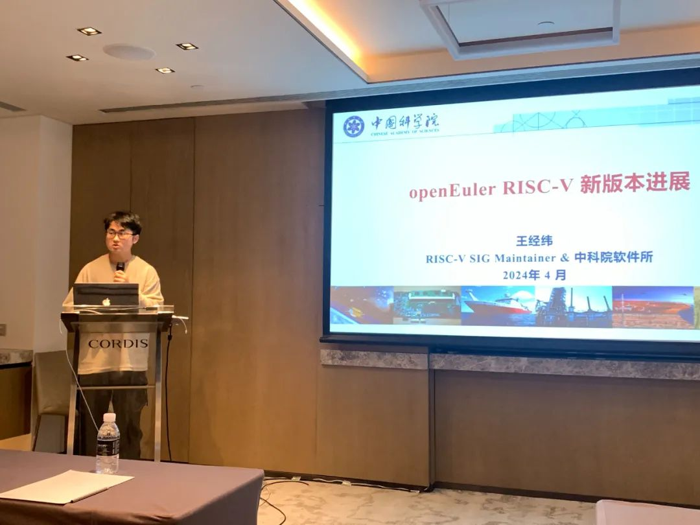
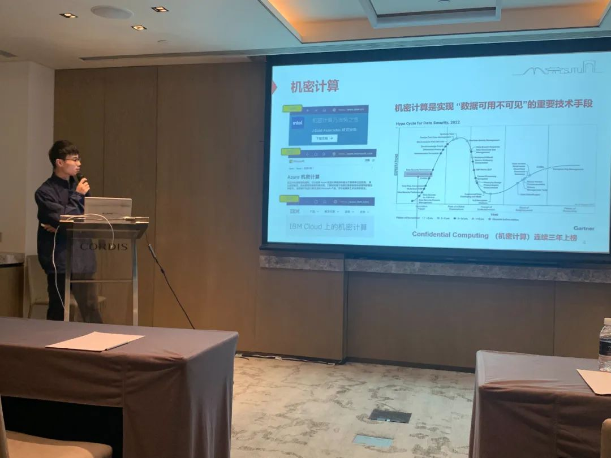
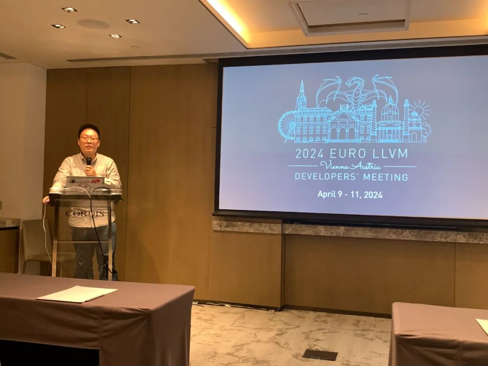

openEuler 24.03
新版本发布在即，为促进开发者和社区用户之间的交流，2024年4月21日，
OpenAtom openEuler (简称\"openEuler\")  RISC-V SIG 和 Compiler SIG
联合苦芽科技在上海联合举办了一场Meetup活动。

活动现场，来自 openEuler 社区、苦芽科技的
30 多名专家及参会者面对面交流，共同探讨openEuler的新技术特性、版本进展、RISC-V
架构、编译器、虚拟机最新进展，并重点讨论「LLVM平行宇宙计划」的路线图实施情况。

**下面就让我们来回顾本次 Meetup 的精彩内容**

**openEuler TC 委员、Compiler SIG Maintainer赵川峰分享《 LLVM 构建
openEuler 技术方案及兼容性问题分享》演讲。**

赵川峰在分享关于 LLVM
平行宇宙计划时，深入阐述了他们采取版本与长效机制结合、社区化推进的策略，以构建
openEuler 系统及其中的兼容性问题。

他首先聚焦于基于 Clang
组装构建一个完整的工具链的过程，深入剖析了工具链的各个环节和关键要素。接着，赵川峰介绍了
LLVM 构建 openEuler
的中间态技术方案。这一方案不仅覆盖了嵌入式版本和服务器版本，还涉及内核态和用户态程序的广泛覆盖，从而确保了在不同环境和场景下都能实现高效、稳定的编译。

在分享的最后部分，赵川峰以举例的形式，详细描述了构建过程中遇到的问题及解决方案。例如，在构建
perl-Compress-Raw-Bzip2 时，遇到了配置系统写死绑定 GCC
编译器导致的问题。他通过深入分析问题的根源，提出了针对性的解决方案，并分享了在实际操作中的经验和教训。

通过赵川峰的分享，我们对 LLVM 构建 openEuler
的过程有了更深入的认识，也让我们更期待 LLVM 平行宇宙计划构建完整的
openEuler 系统。

**openEuler RISC-V SIG
Maintainer、苦芽科技CTO王俊强分享《LLVM平行宇宙计划具体进展报告》的演讲。**

王俊强阐述了平行宇宙计划的诞生背景。这一计划之所以得名，源于 GNU
工具链与 Clang/LLVM 工具链能够在特定时间段内实现系统的并行共存。由于
LLVM
具备出色的架构设计、友好的协议环境以及高度的活跃度，使得当前的发行版生态适配得以充分展现，计划的实施可行性极高，并展现出了强大的潜在性能竞争力。

他进一步深入讲解「LLVM平行宇宙计划」的运作机制，确保在保持代码同源的基础上，能够灵活自如地切换
LLVM/Clang 编译器，而不会对现有的 GCC
构建方案造成任何干扰。这一设计思路不仅体现了技术创新的智慧，也彰显了对于现有系统稳定性的尊重。

最后，王俊强还分享了「LLVM平行宇宙计划」的当前进展。据悉，该计划已经完成了
94% 以上的成功包构建和预览版镜像构建，按照计划，预计将在5月30日正式发布。

他热切地呼吁有志青年加入这一计划，共同推进「LLVM平行宇宙计划」的顺利实施，为技术的发展和进步贡献自己的力量。

**openEuler RISC-V SIG
Maintainer、中科院软件所王经纬发表题为了《openEuler RISC-V
新版本进展》的演讲。**

在这次演讲中，王经纬简明扼要地总结了 openEuler RISC-V SIG
的阶段性进展。演讲伊始，王经纬结合 OERV
的发布历史与软硬件适配的路线图，详细解析了当前工作所处的状态。openEuler
RISC-V SIG 一直致力于推动 RISC-V 架构在openEuler
系统中的适配与优化，目前已经取得了显著的进展。

接着，王经纬深入介绍了 24.03LTS
版本的发布计划、工程进展以及各子系统的最新动态。他特别提到了内核同源计划、蓬莱
TEE 方案以及热补丁能力等关键领域的进展，这些技术的创新与优化将进一步提升
openEuler RISC-V 的性能和稳定性。

在演讲的第三部分，王经纬简要介绍了 RISC-V 在 ROS 智能小车和如意
Book等实际应用场景中的落地情况。这些案例不仅展示了 RISC-V
架构的广泛适用性和强大潜力，也为 openEuler 社区提供了宝贵的实践经验。

最后，王经纬详细介绍了 OERV 的实习生计划，并热忱欢迎对 RISC-V
和openEuler 感兴趣的同学加入这一非常有意义的工作。

**上海交通大学博士生、蓬莱 TEE 项目 Maintainer 冯二虎带来了《蓬莱
TEE：openEuler RISC-V 下的安全底座》演讲。**

冯二虎首先介绍了 RISC-V
开源指令架构的优势，并指出其对机密计算带来的新挑战与机会。接着，冯二虎详细介绍了蓬莱
TEE（RISC-V 架构下的开源可信执行环境）。

蓬莱 TEE 作为 RISC-V 官方三大 TEE 系统之一，具备强大的安全能力，为
openEuler RISC-V 系统提供了坚实的安全底座。

在演讲中，冯二虎还重点讨论了以下几个方面：

首先，他介绍了蓬莱 TEE 与 openEuler secGear 的总体设计方案，并以
TLS服务器为例，详细分享了如何实现全流程安全。

其次，冯二虎阐述了蓬莱 TEE 在 RISC-V openEuler
下实现可信机器学习框架的重要性。通过利用蓬莱 TEE
的安全特性，机器学习框架能够在可信的执行环境中运行，有效解决机器学习过程中的典型攻击问题，提高模型的安全性和可靠性。

最后，他还介绍了 RISC-V
社区对裸金属动态隔离域机制的支持及应用情况。这一机制使得 RISC-V
能够在硬件层面上实现不同任务之间的隔离，进一步提高系统的安全性和稳定性。

**openEuler RISC-V SIG Maintainer、LLVM 基金会理事吴伟分享了《EuroLLVM
2024》的见闻。**

EuroLLVM 作为 LLVM
欧洲开发者们的传统会议，已经连续举办多年，是欧洲乃至全球 LLVM
社区的重要交流平台。吴伟以风趣幽默的语言，将这次盛大聚会的精彩瞬间呈现给了大家。

据吴伟介绍，这次会议的内容非常丰富，短短两天的时间里举办了 30
多场会议，涵盖了 LLVM 的各个方面。此外，会议还穿插了多场 Quick
Talks，为与会者提供了更多交流和学习的机会，使其能够充分交流和分享最新的研究成果。

除了会议内容，吴伟还分享了一些国内会议不常见的小巧思。例如，在登记时，参会者可以在
app
上选择自己感兴趣的话题作为标记，这样便于组织者了解参会者的需求，为后续的交流和合作提供便利。此外，参会者还可以把自己的名字和分享内容写在指定的牌子上，自己组圆桌会议，这种自由组合的方式不仅增加了会议的灵活性，也促进了与会者之间的深度交流。

通过吴伟的分享，大家不仅了解到了 EuroLLVM 2024
的盛况，也感受到了国际技术交流的重要性和魅力。这些新奇的方式和思路，无疑为国内会议提供了很好的借鉴和启示。相信在不久的将来，国内的技术交流会议也会越来越精彩，为社区成员和关注者带来更多的收获和成长。

**圆桌讨论：LLVM 平行宇宙计划的下一步**

本次会议的压轴环节，是一个小时的圆桌讨论。旨在让与会者围绕分享的主题展开深入、自由的交流，共同探索更多可能性。

从讨论一开始，会场就洋溢着热烈而积极的氛围。随着时间的推移，讨论的氛围越发融洽。大家不再拘泥于原本的议题，而是将话题不断延伸，探索更广泛的领域。在这个过程中，大家不仅分享了各自的经验和见解，还建立了深厚的友谊和联系。

一个小时的时间转瞬即逝，但讨论的热情却丝毫未减。许多人仍然停留在会场，继续着之前的深入交流。

**彩蛋**

本次 Meetup 分享材料已上传至 openEuler
Gitee仓库。如果您需要本次活动的PDF，可前往 下方链接获取，期待您的下次参与！

https://gitee.com/openeuler/presentations/tree/master/meetup/20240421-RISC-V%20SIG%20&%20Compiler%20SIG%20Meetup
