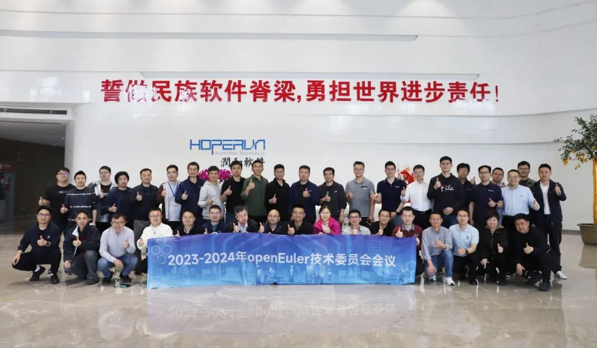
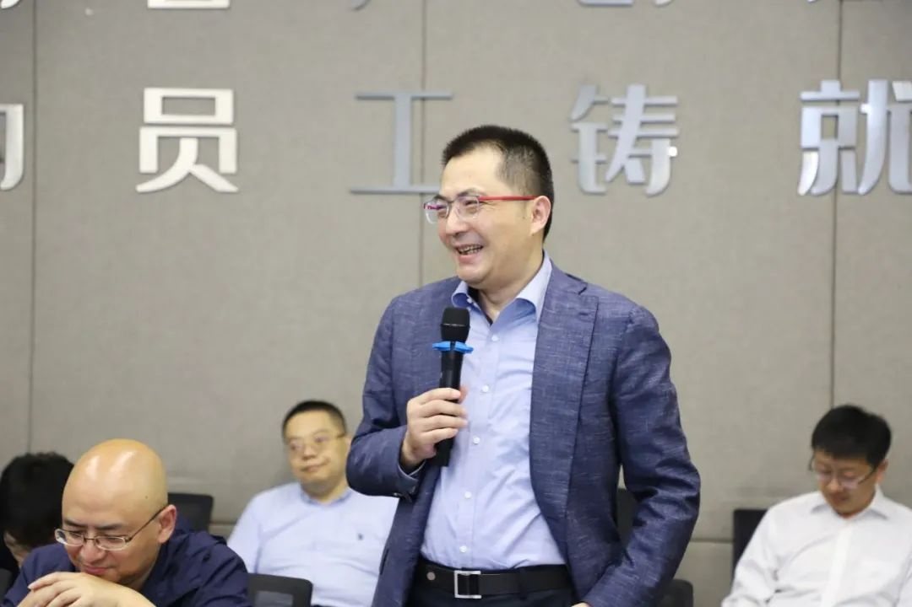
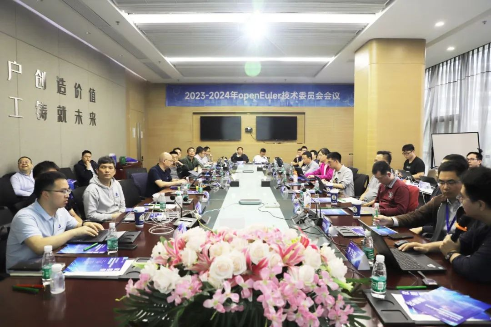
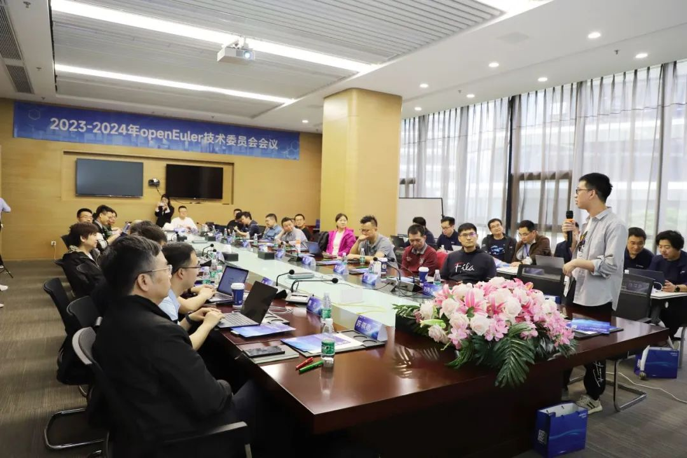

4月19日，2023-2024年 OpenAtom
openEuler（简称\"openEuler\"）技术委员会第五次线下会议在南京圆满召开。

本次会议由江苏润和软件股份有限公司（以下简称"润和软件"）承办，润和软件董事长兼总裁周红卫、高级副总裁钟毅、润和软件副总裁于萍出席了本次会议。openEuler委员会执行总监熊伟、openEuler技术委员会主席胡欣蔚、开放原子开源基金会TOC项目导师张烨和多位技术委员会委员参会，另外还有来自OceanBase以及美团、快手、B站、360多家互联网企业代表参会，共同针对社区重要的版本计划、关键核心特性、技术业务规划等内容进行了深入沟通与讨论。

润和软件董事长兼总裁周红卫为本次会议发表致辞。他表示润和软件作为openEuler黄金捐赠人，坚持创新开源技术、推动开源落地、繁荣开源生态，在openEuler社区的贡献一直位于前列，始终致力于基于openEuler的创新解决方案的产品开发与市场推广，以openEuler的创新价值为全产业赋能。2023年交付重大行业项目的核心业务系统过万套，实现高可靠、高性能运转。2024年，又在操作系统优势基础上提出"All
in
AI"战略，为客户提供智能化边端的大模型解决方案服务。润和软件openEuler业务研发总监张剑就"润和软件openEuler产研进展"做了汇报，他分享了润和软件基于openEuler打造的企业级操作系统（HopeOS）在技术上的创新发展和产业生态进展。

润和软件董事长兼总裁周红卫发表致辞 

在本次会议上，经全体技术委员会委员讨论决议，同意OceanBase加入社区的申请，并在社区创建OceanBase
SIG；同意后续规划成立SBOM
SIG帮助openEuler社区及OSV进一步完善SBOM的能力，保障供应链安全。

同时全体委员对openEuler
24.03版本发布计划、openEuler基础设施2024年度规划、openEuler Developer
Day 2024等多项社区工作规划进行了审视并提出完善建议。

2023-2024年openEuler技术委员会会议现场

另外全体参会者就openEuler在AI方向的探索与发展、openEuler
LTS版本双内核支持、openEuler社区协作开发模式等问题进行了分享和深入探讨。

2023-2024年openEuler技术委员会会议现场

本次会议为期一天，来自各行业企业参会人员畅所欲言、各抒己见，群策群力推动openEuler技术创新和和技术生态蓬勃发展！

注：openEuler技术委员会是openEuler项目群的技术领导机构，技术委员会委员通过日常线上TC例会及定期开展线下会议共同决策社区技术发展方向事宜。
