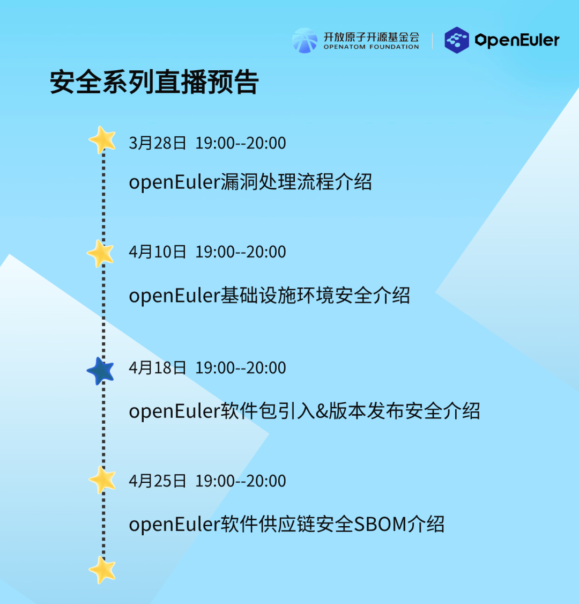

OpenAtom
openEuler（简称\"openEuler\"）社区非常重视社区版本的安全性，社区安全委员会制定了一套社区漏洞处理策略和流程，包括漏洞感知、漏洞确认和评估、漏洞修复以及漏洞披露等阶段。

为了应对日益增长的网络安全风险，保护企业信息系统和核心资产的安全，实现操作系统安全配置的规范化、标准化、例行化，提升社区安全的一致性和管理的便捷性，openEuler
推出了安全知识系列线上直播栏目。

嘉宾来自openEuler社区安全委员会、基础设施SIG、Release
SIG、SBOM工具链负责人。分享openEuler社区安全漏洞处理、基础设施环境安全介绍等更多精彩内容。

划重点：从 2024 年 3 月28号开始，每周晚
19:00-20:00，让我们一起锁定「openEuler」B 站，一起来参加安全知识培训吧。

## 本期直播

**直播主题：**openEuler软件包引入&版本发布安全介绍

**直播时间：**2024年4月18日

**内容简介**：

如何在不违反license、进出口管制或其他相关法律的前提下，参与openEuler社区贡献？如何确保社区选型引入的开源软件的安全？

本期直播将介绍openEuler社区的版本发布网络安全质量要求，以及社区如何对发布件的安全与合规进行验收。

**彩蛋：**观看技术直播，在议题结束后提问且被老师抽中回答的用户，即可获得openEuler社区定制月球灯一个，共有5个名额，快冲！

## 直播预告

「openEuler」安全系列线上直播预告抢先看

「openEuler」非常欢迎更多对操作系统领域有见解且有分享欲的你们加入分享嘉宾的行列～如果你想在openEuler上进行技术分享，欢迎通过以下申请通道或点击阅读原文提交资料，openEuler小助手将在
3 个工作日内与您取得联系。

**【申请通道】：**<https://shimo.im/forms/8Nk6eEY9zysEQyqL/fill>

「技术直播」是知识的传播，更是思维的碰撞。让我们携手共探，一起见证OS发展与变革。

扫码申请

联系方式：

微信号：openeuler123

邮箱：mamingxin@openeuler.sh
