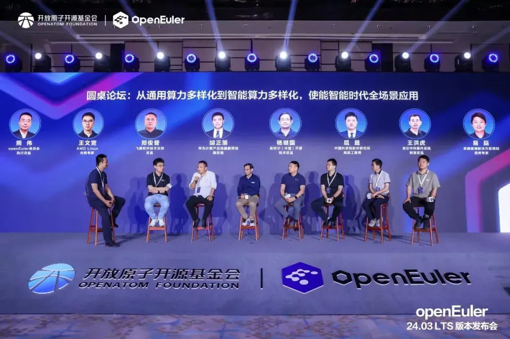
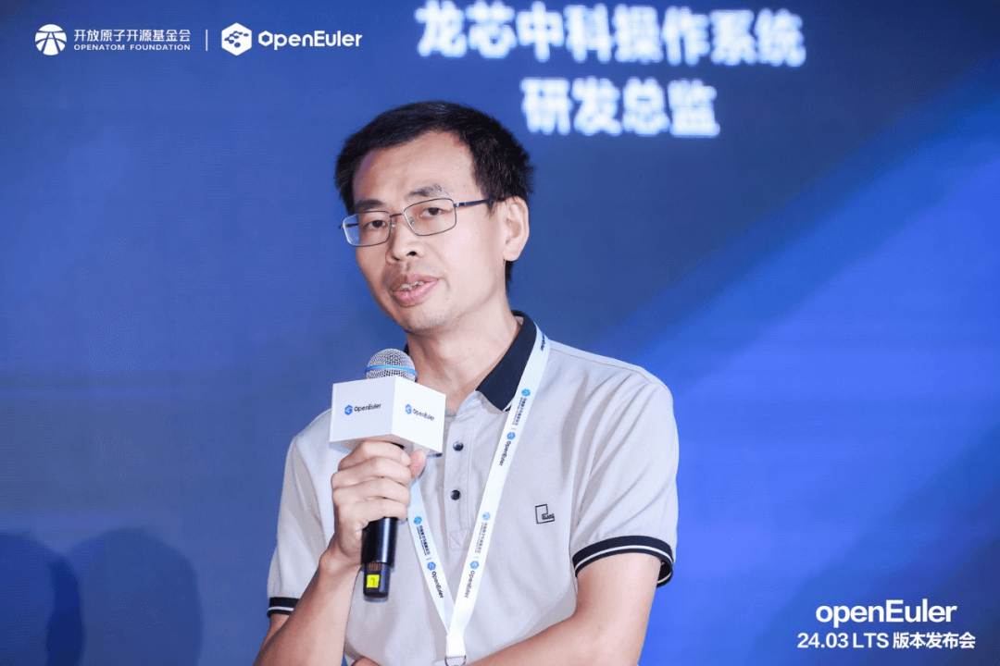
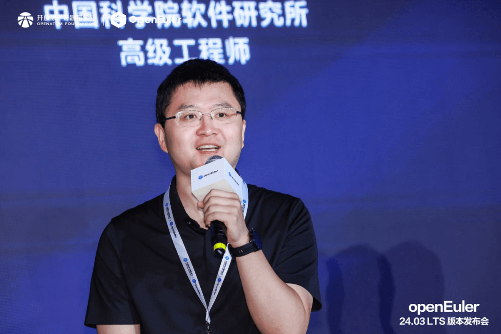
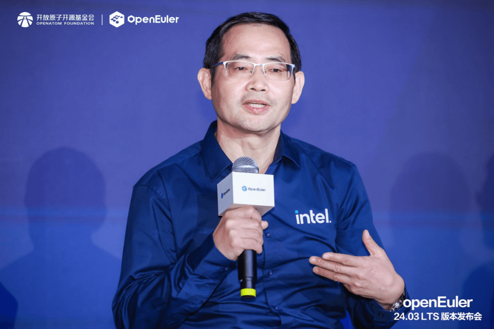
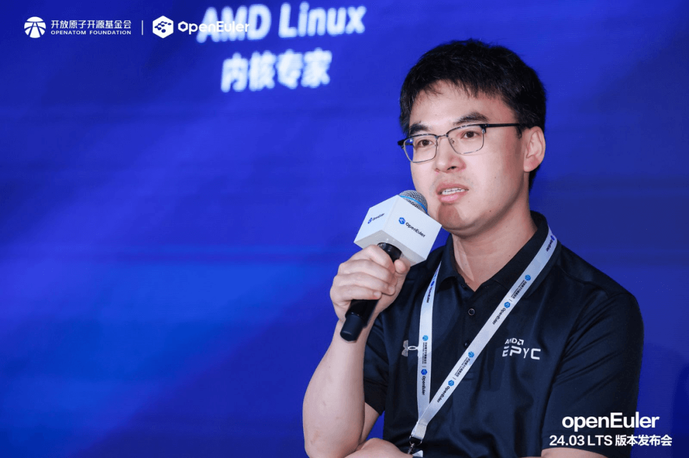
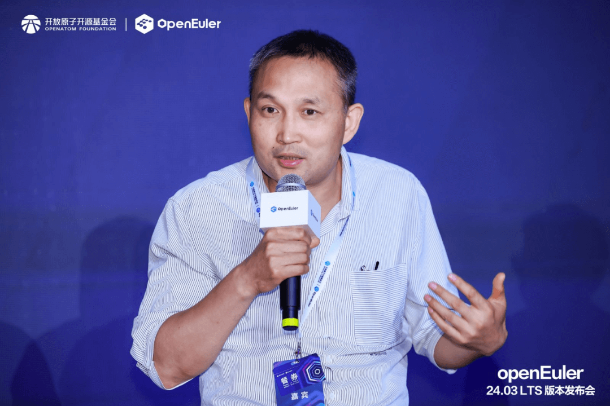
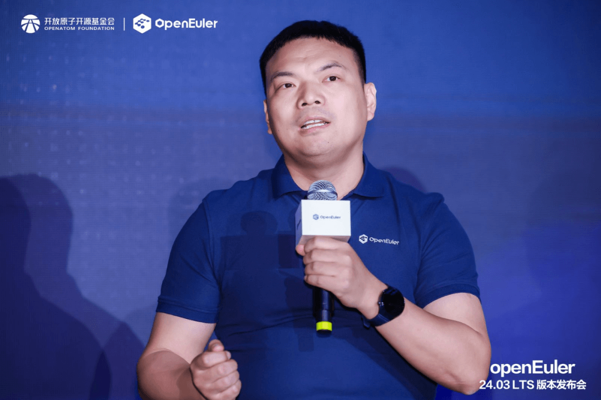
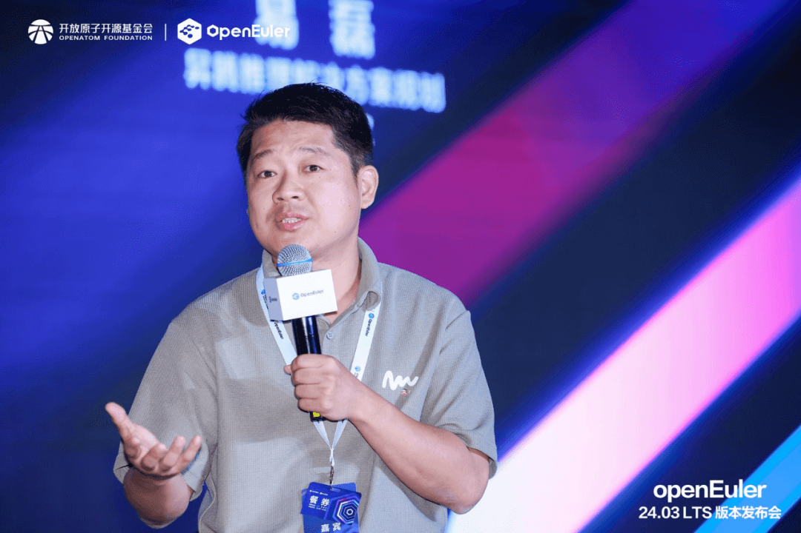

随着云计算、大数据和人工智能技术的飞速发展，计算领域的边界正在不断扩展，从传统的云端计算到边缘计算，再到物联网的万物互联，一个全新的多样性计算时代正在来临。在这个时代，软硬件协同、云边端协同的发展脉络日渐清晰，而操作系统与硬件作为这一体系中的核心要素，其关系愈发紧密，共同推动着技术的进步和生态的繁荣。操作系统的成功，离不开南向硬件的广泛支持，
OpenAtom
openEuler（简称\"openEuler\"）在驱动支持、多样性资源社区接入、构建系统等多方面进行了改进和优化。openEuler
24.03
LTS版本新增了RISC-V与龙芯两个架构作为官方支持架构，同时x86的主要厂商Intel，AMD等厂商也投入openEuler社区进行贡献。

从通用算力多样化到智能算力多样化，使能智能时代全场景应用圆桌论坛

在openEuler 24.03 LTS
版本发布会上，来自AMD、飞腾软件、龙芯中科、华为、英特尔、中科院软件所的专家，围绕"从通用算力多样化到智能算力多样化，使能智能时代全场景应用"展开讨论，分析openEuler在硬件上最新的适配进展和未来发展方向。

龙芯中科的王洪虎指出，openEuler 24.03
LTS版本是龙芯架构**首次**在openEuler社区中**同源同步发布**，这一过程中龙芯中科在openEuler社区中添加了大量补丁，以完善上游支持。这一变化不仅体现了openEuler对多样性硬件架构的开放态度，也展示了龙芯中科在推动操作系统与芯片协同发展方面的积极努力。

中科院软件所的屈晟则强调了RISC-V厂商之间合作的重要性，希望所有RISC-V厂商能够合作起来，将主要版本同源到openEuler版本中。这一观点凸显了openEuler在推动RISC-V生态发展方面的关键作用，也反映了RISC-V作为一种新兴架构在多样性计算时代中的巨大潜力。同时，他表示openEuler
24.03 LTS 版本是**第一个支持RISC-V可信执行环境的OS**。

Intel的杨继国分享了Intel与openEuler社区的紧密合作。自2021年底加入以来，Intel致力于将最新软硬件技术贡献给openEuler，并已成为社区黄金会员和加入社区委员会。Intel成功实现了**openEuler与Intel最新产品的同步**，如第六代至强平台。此外，Intel还集成了**OneAPI编程框架**，为开发者提供开放异构编程平台，增强openEuler的AI开发能力。未来，Intel将继续与openEuler社区紧密合作，推动其发展。

AMD的王文宽介绍了openEuler 24.03
LTS对AMD产品的**全面支持**，对AMD产品上的所有特性，包括虚拟化加速，包括资源隔离，所有的功能都做了支持。对于AMD最新一代产品，openEuler是**第一个做完全功能验证**的。AMD计划持续与openEuler社区合作，增强产品特性验证，并将所有特性的补丁开源，全力支持openEuler发展。

飞腾软件的郑俊普展示了openEuler对飞腾新一代服务器芯片S5C的**完美支持**，并推出了针对飞腾的定制版openEuler开发调测版本。这一举措不仅展示了openEuler对国产芯片的积极支持，也为其在智能时代全场景应用中的部署提供了有力保障。

华为的胡正策表述，针对openEuler 24.03
LTS版本，华为在鲲鹏架构上重点优化了CPU与内存管理，亮点有三：一是实现业务场景下的**CPU动态负载均衡**；二是支持虚拟机VCPU**动态增减**，提升ARM生态灵活性；三是**内存管理创新**，包括动态大页与内存超分，增强核心应用场景下的适配性与灵活性。这些改进为鲲鹏平台带来显著性能提升与操作便捷性。

华为的易磊展望了openEuler**在AI部署效率、运维效率和易用性、稳定性**等方面的提升，这些提升将推动openEuler在智能时代的应用和发展。

openEuler 24.03
LTS版本的发布标志着其在多样性计算时代中的技术革新和生态发展方面取得了重要进展。通过广泛支持各种硬件架构、吸引各大厂商参与贡献、优化系统性能和创新AI部署等方面的工作，openEuler正在引领多样性计算时代的技术革新和发展方向。未来，随着更多厂商和社区的加入以及技术的不断进步，openEuler有望在智能时代全场景应用中发挥更加重要的作用。
