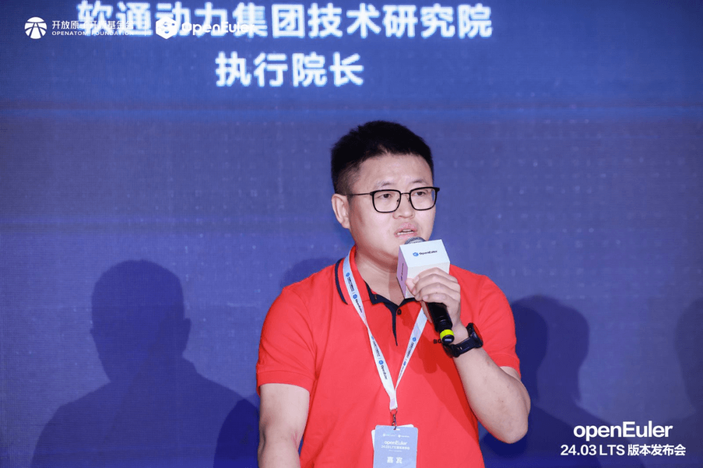

随着信息技术的快速发展和全球市场的深度融合，软件产品的国际化已成为不可逆转的趋势。OpenAtom
openEuler（简称\"openEuler\"）作为面向未来的开源操作系统，其国际化不仅是技术发展的需要，更是市场扩张和产业成功的必由之路。国际化意味着openEuler能够跨越地域限制，吸引全球范围内的开发者、用户和合作伙伴共同参与其生态建设和技术创新，从而形成一个更加开放、多元、强大的生态系统。

openEuler在全球化战略的实践上取得了显著成效。从最初的国内推广到现在的全球布局，openEuler不仅在国内市场赢得了广泛认可，还在海外市场积极拓展生态和合作伙伴。这一过程中，openEuler通过举办国际会议、技术研讨会等活动，加强与国际开源社区的交流与合作；同时，它还积极与全球知名企业、研究机构和高校建立战略合作关系，共同推动开源技术的发展和应用。

从通用算力多样化到智能算力多样化，使能智能时代全场景应用圆桌论坛在openEuler
24.03
LTS版本发布会上，来自超聚变、软通动力、润和软件、OpenInfra基金会的专家齐聚一堂，围绕"从通用算力多样化到智能算力多样化，使能智能时代全场景应用"的主题展开深入讨论。这些专家的观点不仅为openEuler的全球化发展提供了宝贵的方向和建议，也彰显了openEuler在智能时代全场景应用中的巨大潜力和价值。以下为嘉宾观点合辑：OpenInfra基金会的李昊阳表示openEuler与OpenInfra渊源深厚，早期即在社区内设立SIG组，专注于openEuler版本与OpenStack的兼容及适配。双方不仅在社区层面深化合作，如openEuler参与OpenInfra的PTG，共谋技术发展与融合；还通过提供虚拟资源支持OpenStack兼容性测试，确保稳定生产环境。今年，双方合作推进Linux+OpenStack白皮书项目，旨在响应市场需求，利用openEuler作为顶尖Linux底座的优势，为厂商提供设计基础。通过OpenInfra亚洲峰会及全球白皮书发布，期望提升openEuler在Linux领域的认知度，促进其在全球范围内的应用与普及。

超聚变的王晧表示面向海外市场，超聚变肩负着推动openEuler生态扩展的重任。超聚变计划通过两大策略实现这一目标：一是增强openEuler的品牌认知度，通过分享最新技术成果与企业应用案例，让海外非技术背景的客户群体也了解并熟悉openEuler；二是建立海外客户对openEuler的信任，通过技术创新，如与Intel合作优化最新CPU支持绿色低碳与强大算力，并扩展产品线以满足不同计算需求。同时，超聚变将依托其海外服务网络，提供全方位的技术支持，确保客户能高效、无忧地使用openEuler。超聚变坚信，凭借openEuler在中国市场的成功实践与高质量保障，结合其优质服务，将能赢得海外客户的广泛信赖与采用。

软通动力的黄鹏表示针对openEuler，软通在商业化上强化其管理工具，助力行业客户实现规划、迁移与运维；同时，在人形机器人领域投资并推动OS研发。海外方面，软通依托四大交付中心及新建营销中心，聚焦公有云与央企合作，将openEuler融入云原生及数据方案，推动其在海外大型行业客户中的应用，加速数字化基础设施的全球布局。

润和软件的于萍强调openEuler在其整体战略中的关键地位；润和软件作为国际化的IT解决方案提供商，现已在全球多地布局，包括日本、新加坡及美国，构建了广泛的客户网络和生态体系。2024年初，公司推出"1+2+3+8"战略，其中openEuler成为关键技术支撑与创新源泉。该战略旨在通过两大开源操作系统（openEuler与OpenHarmoney）、三大平台及八大行业客户覆盖，强化全球竞争力。

这些观点不仅体现了行业专家对openEuler技术实力和市场竞争力的认可，也预示着openEuler在未来将继续深化全球化战略，加强与国际开源社区的合作与交流，共同推动开源技术的发展和应用。同时，openEuler还将不断创新和优化自身技术架构和生态体系，以适应智能时代多样化、复杂化的算力需求和应用场景挑战。
