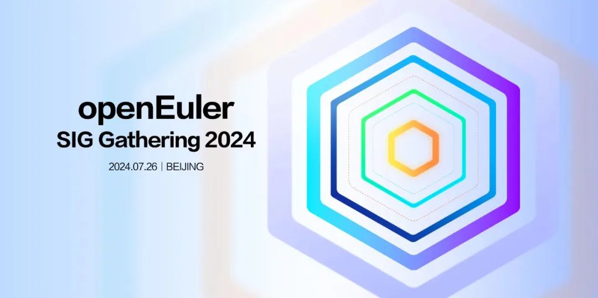

亲爱的开发者们，

激动人心的时刻到了！openEuler SIG Gathering
2024将于**2024年7月26日**在北京香格里拉饭店盛大启幕！这是一场专属于开发者的盛宴，一场智慧与激情的碰撞，更是OpenAtom
openEuler（简称\"openEuler\"）社区108个SIG组齐聚一堂的盛会！现在启动议题申报，欢迎感兴趣的开发者报议题。

**活动亮点**
--------

**● 我参与，我做主：**六大专题研讨，涵盖**多样性算力、全场景应用、AI原生支持、openEuler原生开发、上游原生支持、用户体验研究**，总有一款是你的菜！

**● 全天线下会议**：深入交流，直面挑战，共谋openEuler 24.03
LTS后续重要规划及下半年技术蓝图。

**● 精彩纷呈的流程**：从专题研讨到快闪总结，从轻松健身操到开发者之夜，让你的每一分钟都充满能量！

**活动详情**
--------

**时间**：2024年7月26日

**地点**：北京香格里拉饭店

**日程安排**
--------

**10:00-10:20** 开场

**10:20-12:00** 六大专题研讨

**12:00-13:00**  豪华午餐，味蕾与思维的双重享受

**13:30-13:50**  轻松健身操，让身体也加入这场技术狂欢

**13:50-16:00** 专题探讨继续，灵感火花四溅

**16:00-18:00** 快闪总结，各组代表登台分享，见证智慧结晶

**18:00-18:05** SIG Gathering大合照，定格美好瞬间

**18:30-20:30**开发者之夜，自由交流，未来可期

**专题介绍**
--------

本次活动设置了六大专题研讨：**多样性算力、全场景应用、AI原生支持、openEuler原生开发、上游原生支持、用户体验研究**，欢迎各SIG选择感兴趣的专题，报名议题，一起线下共同探索，寻求解决方案。

 ***专题一：多样性算力***

专题简介：

多样性算力支持是openEuler领先性的核心竞争力之一。openEuler不仅吸引了国际上类似于Intel，AMD，ARM和Linaro等主流平台厂商的深度参与，也为国内众多架构体系和厂商如LongArch，申威和华为等众多ARM或者RISC-v厂商的生态发展汇聚了大量的开发资源和软硬件生态。openEuler的多样性发展策略必将为操作系统全架构基础底座奠定最坚实的基础。本专题将以多样性算力为主题，探讨异构计算架构、多平台支持、CPU/GPU/NPU/加速器协同等话题，并共同协商和规划openEuler的全架构发展计划。

链接：

https://etherpad.openeuler.org/p/%E5%A4%9A%E6%A0%B7%E6%80%A7%E7%AE%97%E5%8A%9B

 ***专题二：全场景应用***

专题简介：

openEuler自开源之初就以支撑全场景应用为核心特点，解决不同场景的软烟囱问题。openEuler的最新版本中在性能、可靠性、安全性、易用性等方面有了进一步提升，以支持服务器、云计算、边缘计算和嵌入式等场景的全面应用和创新，本专题将结合技术演进和实际案例探讨openEuler在全场景应用方面的发展和规划以及面向AI生态的结合。

链接：

https://etherpad.openeuler.org/p/%E5%85%A8%E5%9C%BA%E6%99%AF%E5%BA%94%E7%94%A8

***专题三：AI原生支持***

专题简介：

openEuler在2023年提出了"AI for openEuler, openEuler For
AI"的发展方向，在2024年发布了首个AI原生LTS版本24.03
LTS，通过各类创新技术实现了openEuler从通用算力的多样化，到智能算力的多样化三层AI使能架构，本专题将围绕AI原生支持对以下具体方向展开讨论：\
1、基于LLM的智能交互平台，颠覆传统shell
命令交付的模式，改进传统学习，开发，调优，运维体验，智能新语义支持应用智能化升级，共建AI生态。\
2、CPU/GPU/NPU 算力融合，面向训练高可用/推理低成本方向，降本增效。\
3、AI 主流软件栈4层栈全栈兼容及封装，主流推理框架加速，开箱即用。\
4、云原生智能容器探讨。

链接：

https://etherpad.openeuler.org/p/AI%E5%8E%9F%E7%94%9F%E6%94%AF%E6%8C%81

 ***专题四：openEuler原生开发***
专题简介：

操作系统作为应用与技术创新的底座，其软件生态和原生开发体验是对于应用和创新效率提升至关重要的关键因素，目前openEuler已有超过680万装机量，社区汇聚近2万名开发者，如何使能这些开发者更好的基于openEuler进行原生开发，进一步提升开发效率是openEuler社区的关键工作之一，本专题将对以下方面进行讨论：\
openEuler本地开发环境、加包与更新维护、社区开发与协作基础设施、社区构建测试服务。

链接：

https://etherpad.openeuler.org/p/openEulerAI%E5%8E%9F%E7%94%9F%E5%BC%80%E5%8F%91

***专题五：上游原生支持*** 

专题简介：

openEuler始终遵循"上游优先"的策略，帮助上游开源软件原生支持openEuler，让用户可以在开发、集成、使用这些软件时获得便利。\
本方向主要涉及：openEuler上游原生支持技术讨论及进展同步，讨论如何做好从上游原生支持到openEuler原生发布的关键环节，包含上游协同，监测，维护管理等。

链接：

https://etherpad.openeuler.org/p/%E4%B8%8A%E6%B8%B8%E5%8E%9F%E7%94%9F%E6%94%AF%E6%8C%81

 ***专题六：用户体验研究***

专题简介：

1.深化知识共享：提供高质量的中英文文档，作为知识共享的基石。

2.推动技术融合：通过软硬件兼容性测试与认证，促进openEuler生态的健康发展。

3.人才培养与发展：通过设计和实施有效的人才认证和培养计划，为人才提供成长和发展的机会；

4.设计语言的统一与创新：通过构建一致性的设计语言，定义社区视觉规范。

链接：

https://etherpad.openeuler.org/p/%E7%94%A8%E6%88%B7%E4%BD%93%E9%AA%8C%E7%A0%94%E7%A9%B6

**议题申报截止时间为7月18日18:00，欢迎搜索相关链接，申报议题\~**
