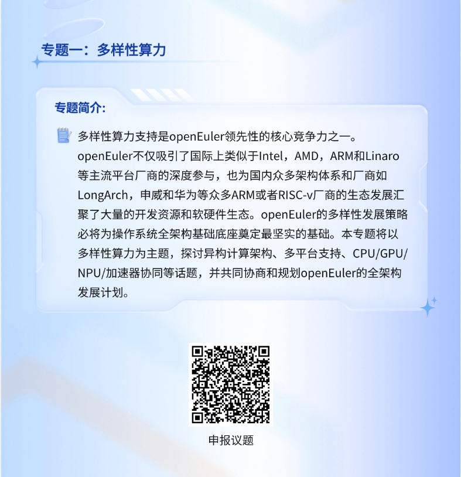

线上聊千遍，不如线下见一面。

OpenAtom
openEuler（简称\"openEuler\"） 社区年度重磅开发者活动，openEuler SIG
Gathering
2024来到北京。今天，正式开放报名，我们诚邀你来一起聊聊，共赴一场属于开发者的无限可能。

今年，我们将与开发者共同探讨openEuler 24.03 LTS
版本的后续重要规划和未来下半年的重要技术方案和开发计划，以跨SIG方式展开线下开放讨论。更有开发者之夜等互动体验，让每位开发者在这里都能找到属于自己的收获与成长。

立即**扫码报名**，我们在openEuler SIG Gathering
2024等你，一起开启无限可能的大门！

**活动信息**

时间：2024年7月26日

地点：北京香格里拉饭店

**活动流程**

10:00-10:20  整体介绍

10:20-12:00  专题研讨

12:00-13:30  豪华午餐

13:30-13:50  轻松健身操

13:50-16:00  专题研讨

16:00-18:00  总结分享

18:30-20:30  开发者之夜

**第一站 听，六大专题研讨！**

本次活动设置了六大专题研讨：多样性算力、全场景应用、AI原生支持、openEuler原生开发、上游原生支持、用户体验研究。每一个专题都是技术前沿的宝藏地图，等你来探险！

**第二站 玩，更多开放活动！**

健身操时间，谁说开发者不懂运动？让身体也加入这场技术狂欢，动起来，让技术狂欢更带劲！

开发者之夜，舞台交给你，才艺展示、幸运抽奖、美食相伴，社交新高度get√！

往期照片

**第三站 来，交流及体验！**

各行各业的开发者、高校学者、业内技术专家、开源大牛等汇聚一堂，是线下交流的绝佳场所。

**更有惊喜连连**

想在开发者之夜成为焦点？快来报名节目表演，舞台属于你！还有好礼相送。联系小助手，微信：openeuler123。

多种颜色的纪念衫，任君选择，穿上它，你就是最靓的开发者！

