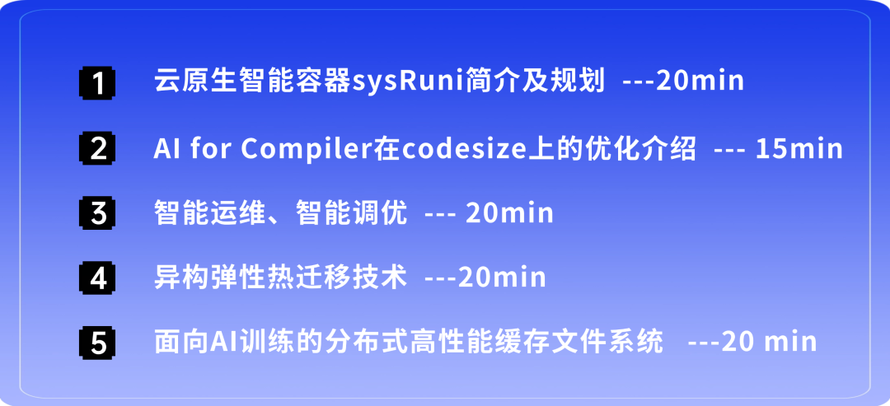
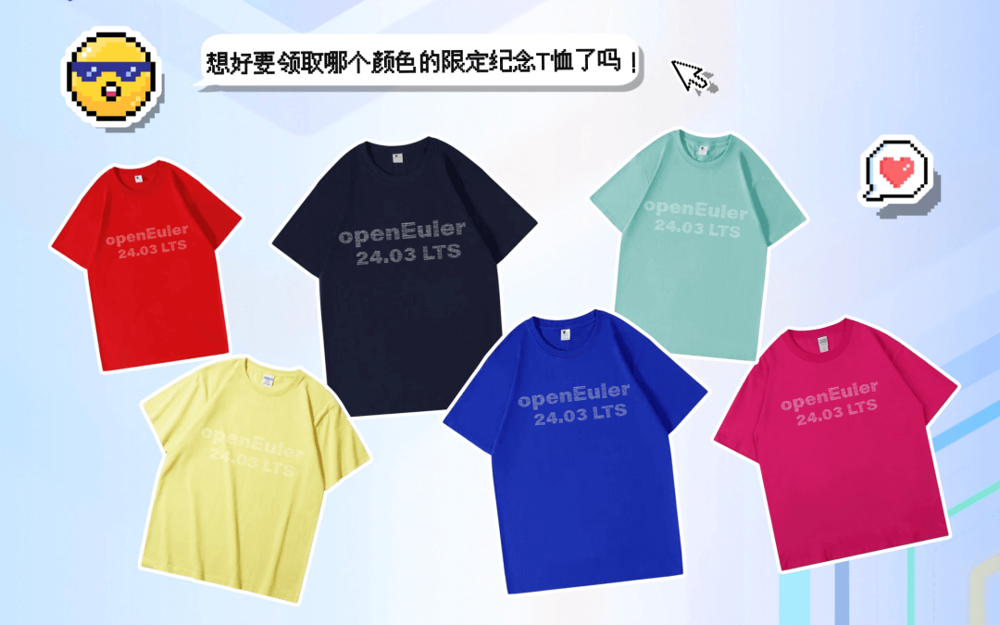
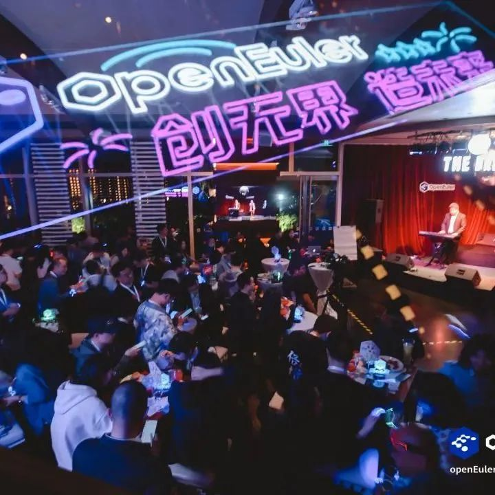

OpenAtom openEuler（简称\"openEuler\"） 社区年度重磅开发者活动-openEuler
SIG Gathering 2024
在盛夏来到北京。经过近期的议题征集和评审，**AI 原生支持专题**的议题已新鲜出炉，快来看看有没有你感兴趣的吧！

**活动详情**
---------

**时间**：2024年7月26日

**地点**：北京香格里拉饭店

北京香格里拉饭店

北京市海淀区紫竹院路29号

**活动报名**

这一次，我们期望在线下与大家一起讨论openEuler最新技术，打开思维的边界，发现问题，讨论问题，解决真问题！全天候聚焦openEuler
24.03 LTS
版本的后续重要规划和未来下半年的重要技术方案和开发计划，以跨SIG方式展开线下开放讨论。

**研讨议题**

**AI 原生支持专题**

持续更新中，最终议题以现场为准\...

**参会福利**

活力，热情，多元，创新，开放怎么少得了一件超shining
的T-恤？来openEuler SIG Gathering 2024现场穿上它你就是社区最靓的崽

> 悄悄话：这件T恤上汇聚了参与openEuler 24.03 LTS 版本贡献者的ID

**还可获取开发者专属形象照拍摄机会！**

你是否期待有一张焕然一新的照片来展示自己的形象，用于openEuler call for
X- Meetup
技术演讲，用于朋友圈的social，用于颁奖舞台上的高光时刻\...敬请期待！

更有精彩的活动：**开发者之夜**等你来\~才艺展示、幸运抽奖、美食相伴，社交新高度！回顾一下往期精彩瞬间\>\>

