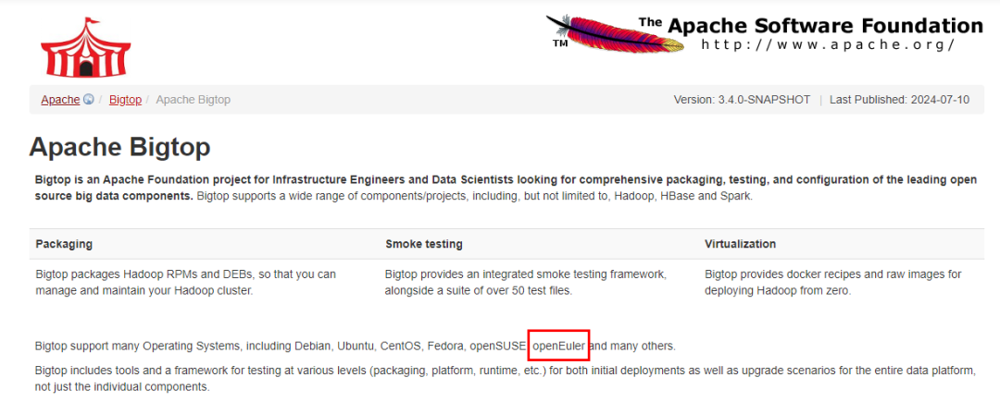

近日，**在OpenAtom openEuler（简称\"openEuler\"）BigData SIG与**Linaro**的携手努力下，Apache
Bigtop于2024年7月8日发布的3.3.0新版本中，正式宣告了对**openEuler**操作系统的原生支持**。这一里程碑式的进展，标志着openEuler在大数据生态适配方面取得了Bigtop社区的权威认可，进一步夯实了openEuler在大数据领域的生态建设基础。

官网链接： https://bigtop.apache.org/

**关于 Apache Bigtop**

Apache Bigtop
作为Apache基金会在大数据领域的顶级项目，始终致力于为基础设施工程师与数据科学家提供前沿的开源大数据组件的全面打包、深度测试与灵活配置服务。

**关于 openEuler**

openEuler，作为面向数字基础设施的开源操作系统，始终秉持"上游优先"的核心理念，积极推动上游开源软件的原生适配，为 openEuler系操作系统的用户在使用这些开源软件或基于其构建的产品与解决方案时，带来前所未有的便捷与高效。openEuler以其全场景覆盖、支持多样性算力的特性，正逐步成为大数据、云计算等关键领域不可或缺的操作系统基石。

**合作共赢**

Apache
Bigtop社区上游正式支持openEuler，不仅是对openEuler技术实力与生态兼容性的高度认可，更是双方在大数据领域深化合作、共同推动技术创新与生态繁荣的重要体现。此次合作，不仅为Bigtop用户提供了在openEuler平台上无缝部署与运行大数据组件的新选择，也为openEuler社区注入了强劲的大数据技术与生态活力。作为openEuler中专注于大数据领域的SIG，BigData
SIG致力于构建和完善openEuler社区下的大数据生态体系，搭建活跃的交流平台，促进大数据组件的功能与性能提升，深入挖掘用户需求，并孵化具有潜力的新组件。在Bigtop社区的助力下，BigData
SIG将加速推动openEuler在大数据领域的全面发展，为全球用户带来更加丰富的大数据解决方案与更加便捷的使用体验。
