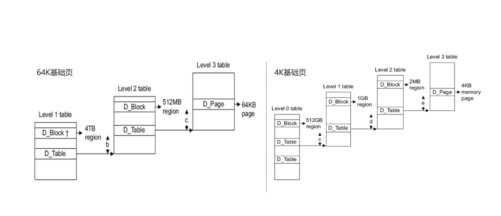
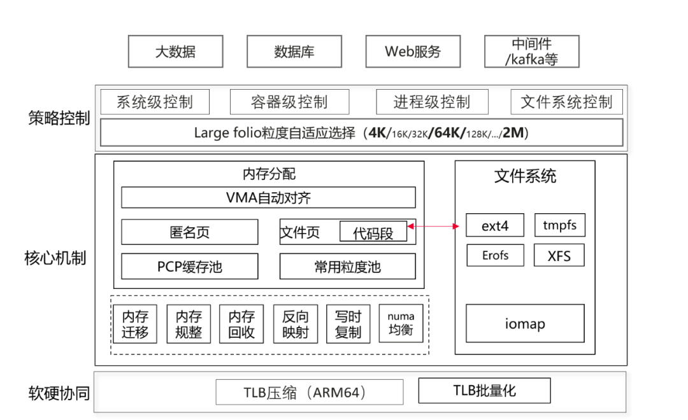
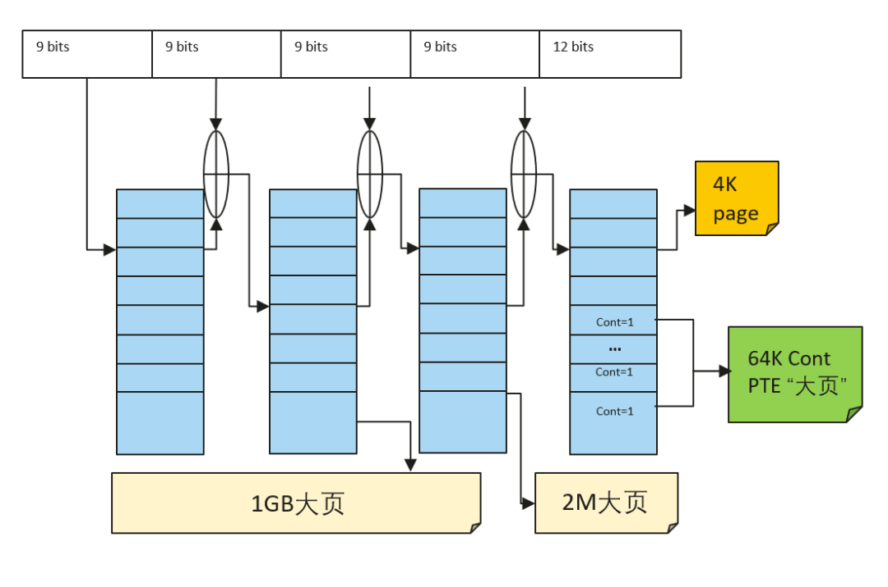
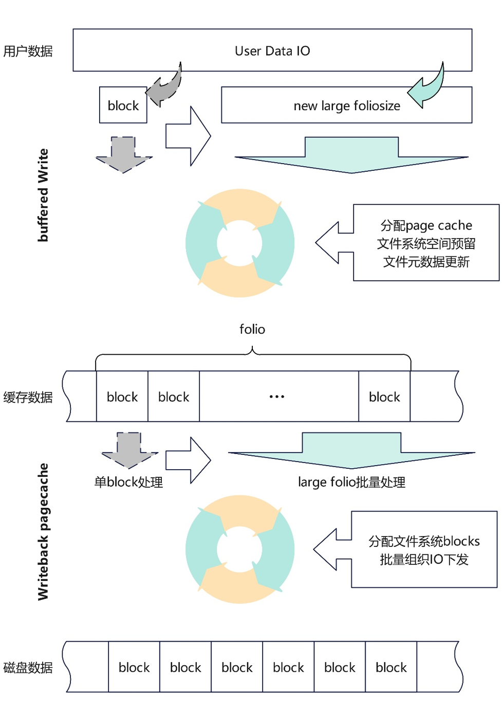
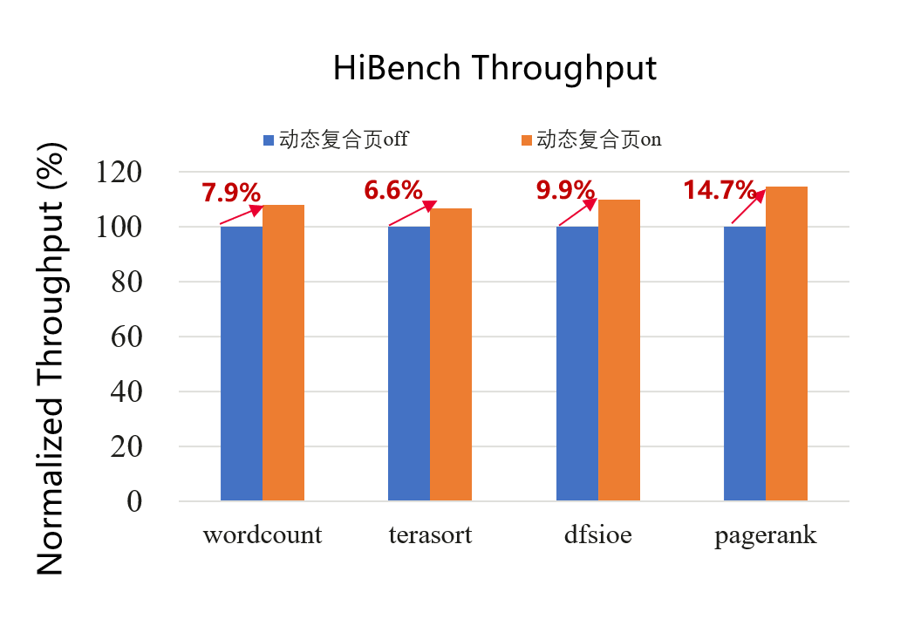
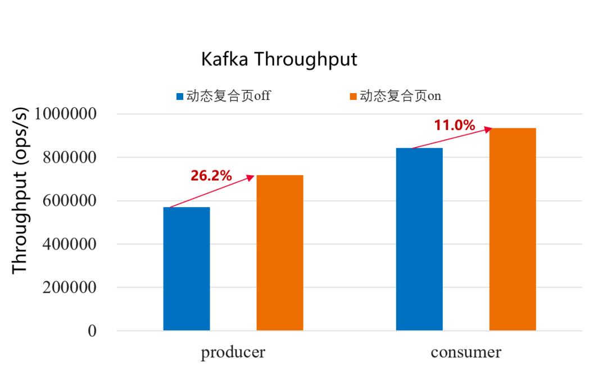
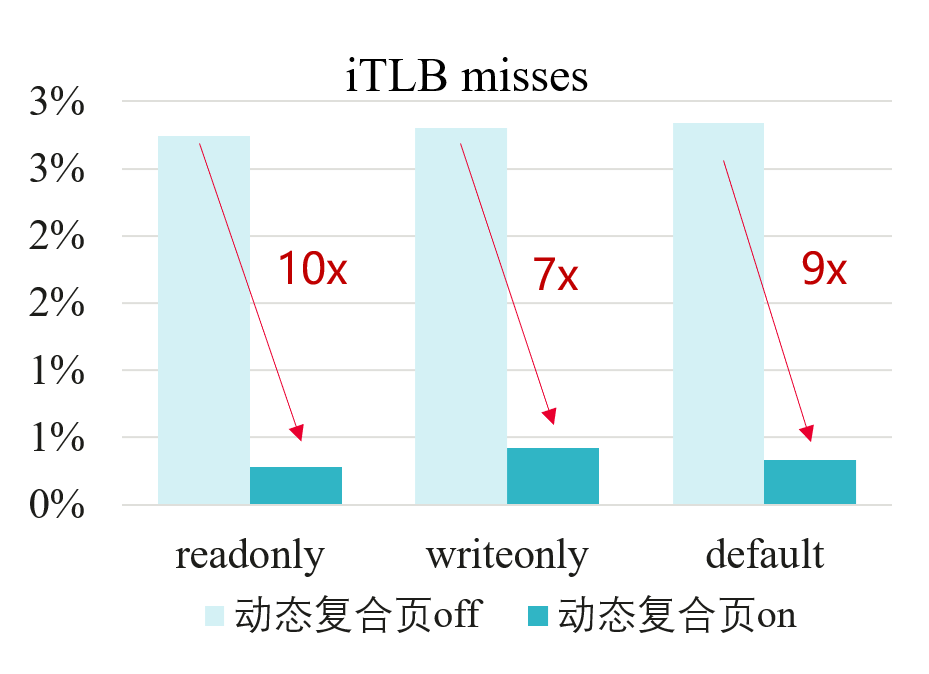
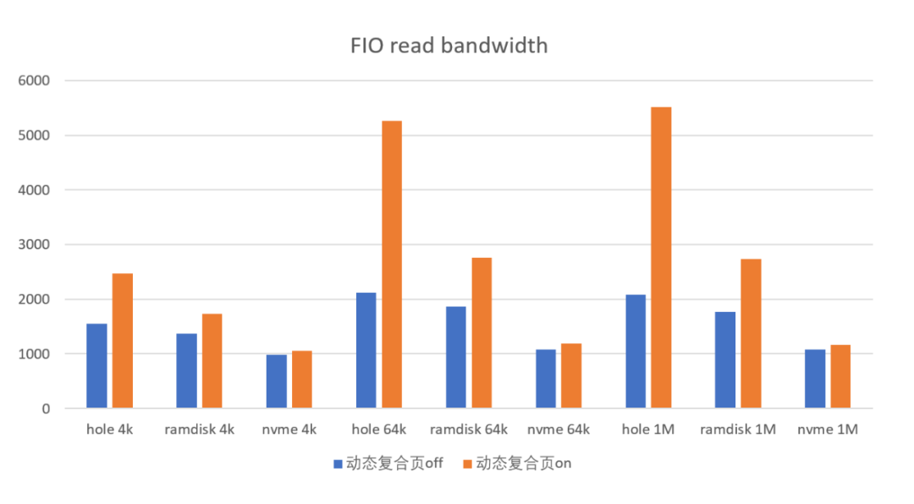
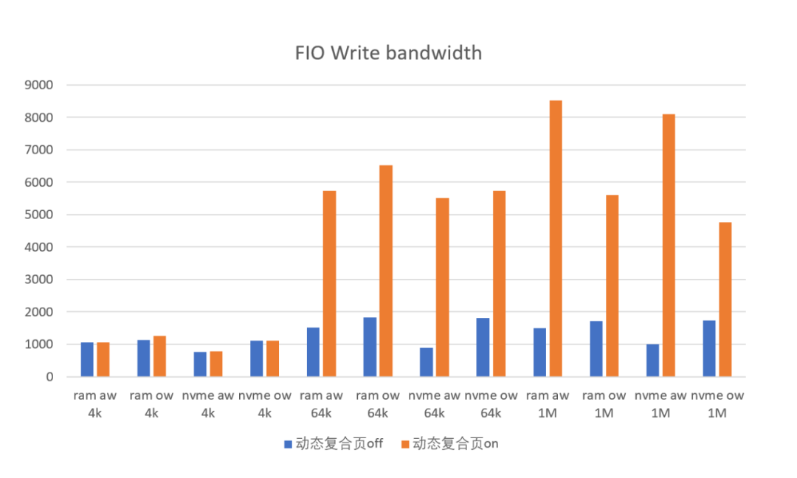
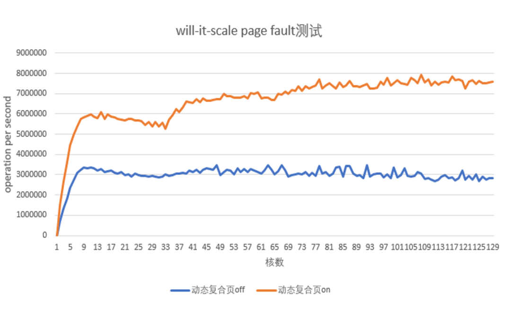

在OpenAtom openEuler（简称\"openEuler\"） 20.03 LTS
历史版本中，ARM64架构下默认基础页大小配置为64KB，相比传统的4KB基础页，在访存方面，64K页面能带来更快的page
tale walk、更低的TLB
miss，在存储IO路径上也能提升读写效率，因此64K基础页能够提升数据库等部分场景下的性能。然而，64K基础页却面临南北向生态问题（部分应用软件和外设驱动需要重新适配或重新编译）和内存底噪开销问题（64K相比4K粒度更粗，内存利用率更低，部分场景会带来巨大的内存消耗）。为此，openEuler在22.03版本将ARM64的默认基础页大小配置改回了4K，在性能上64K基础页有较大优势的场景，则可以单独编译64K基础页的二进制版本来支持，或者采用大页技术，虽然传统大页技术同样能够提升访存性能，但是它面临着使用不够灵活（hugetlb）和性能QoS无法保证（THP）的问题。

> **ARM64内存地址翻译对比**
>
> 那么有没有一种技术，可以在一个内核二进制版本中，实现4K基础页的南北向生态兼容，以及64K页的性能提升，同时应用能够无感使用，并能够有效控制内存底噪？openEuler
> 24.03版本带来的**动态复合页（large folio）技术**正在解决这个难题。

**动态复合页技术架构介绍**
==========================

> 长期以来Linux内核中物理内存是基于struct
> page来管理的，每个page对象描述一个基础页（如4K），随着当前大模型、大数据等业务大内存需求，单个系统上的内存容量可以达到TB级别，以page为单位管理内存越显低效。folio（拉丁语
> foliō，对开本）最早是Oracle的一名工程师提出的，背景是在搭载6TB内存的服务器上，page结构体达到了15亿个，开销巨大，同时内核内存回收模块的LRU链表长度将达到上亿，导致LRU
> lock锁竞争更加严重，持有该spinlock锁期间由于遍历超长链表cache
> miss也会更高，极其低效。Linux内存管理基于page（页）转换到由folio进行管理，相比page，folio可以由一个或多个page组成，采用struct
> folio参数的函数声明，将对整个"页面"进行操作，它可以是单个page，也可以是多个page（large
> folio）。采用large folio后，可以提升LRU管理效率、减少page
> fault次数提高内存分配效率、以large folio粒度建立大页映射可以降低page
> table walk开销，以及降低TLB miss。
>
> openEuler 24.03版本基于linux 6.6 LTS版本作为基线进行演进，linux
> 6.6基线版本已经完成了部分模块对基础folio（4K）的重构，包括：内存分配、内存回收、pagecache、部分文件系统（xfs等），而**对于large
> folio的支持则普遍缺失**。为此，华为内核团队除了在linux社区中积极贡献folio相关补丁的同时，也在openEuler
> 24.03配套的6.6内核中实现了内存管理子系统和文件系统对于large
> folio的大量支持和软硬协同优化，并提供灵活的控制策略，完善了动态复合页技术架构：

> **openEuler24.03 LTS 动态复合页技术架构**
>
> 内存管理子系统在以下方面实现了large
> folio，提升访存性能和内存管理效率：

> 内存分配：支持mmap申请虚拟地址空间范围（VMA）时自适应按多种粒度的large
> folio对齐，如64K、2M，以便建立大页映射；支持应用透明的代码段大页，用户态免修改，支持64K、2M等多种粒度large
> folio以降低代码段iTLB
> miss，提升程序代码段访问性能。支持多粒度的匿名大页（multi-size
> THP），从而降低匿名页TLB
> miss，提升匿名页访问性能。为了加速大页面内存分配，降低伙伴系统zone锁冲突，支持PCP（per-cpu页面缓存）缓存64K粒度的large
> folio（for ARM64 contiguous bit大页）。

> 底层核心机制：fork、munmap、mlock、madvise等系统调用功能实现支持large
> folio和批量化操作。完善了内存迁移、内存规整、NUMA
> balance、内存反向映射对large
> folio的支持，提升相关操作性能。内存交换（swap）支持large
> folio粒度的免拆分交换，提高内存交换效率，并针对ARM64架构完善MTE特性使能时的兼容支持。

> 软硬协同优化：伙伴系统、大页、透明大页的large
> folio优化，支持大页拆分到任意order，内存聚合拆分、内存释放时批量化刷新TLB，避免频繁刷新TLB带来的性能开销。针对ARM64支持基于contiguous
> bit技术的大页，如64K"大页"，充分利用硬件TLB"压缩"机制降低TLB
> miss，提升程序性能。

> **ARM64各级大页示意图**
>
> 文件系统在以下方面实现了large folio优化，大幅提升IO性能：

> iomap框架回写流程支持批量映射block，充分发挥large
> folio的优势提升IO的回写性能：iomap框架脏页回写流程以文件系统block
> size为粒度迭代分配文件系统block并组织IO下发，使能large
> folio后无需经过多轮迭代下发一个dirty
> folio，通过优化支持以folio为粒度进行迭代，可显著减少文件系统空间分配次数。

> 支持ext4默认模式下buffer写批量预留block，提升IO前台写性能：ext4文件系统buffer
> write以block
> size为粒度预留文件系统空间，当用户下发大IO时需要多次迭代处理，无法批量为大IO做空间预留；扩展buffer
> write空间预留接口支持批量按需预留连续空间，可大幅减少迭代操作的次数，提升IO前台写入page
> cache的性能，大幅优化各类benchmark下ext4性能表现。
 

> ext4切换至iomap框架，并实现ext4支持large
> folio，提升读写性能：ext4文件系统buffered
> io读写流程以及pagecache回写流程弃用老旧的buffer
> head框架，切换到iomap框架可使extent分配按照用户下发IO大小迭代，预读和回写IO组装按large
> folio大小迭代，同时弃用jbd2
> data=ordered的日志模式，文件数据无需依赖日志回写进程下发，大幅提升大IO读写性能。

> **Ext4文件系统支持large folio后的数据IO下发流程**
>
> 动态复合页通过多层级的策略控制，提供方便易用的系统级、容器级、进程级的large
> folio开关接口（注：其中容器级、进程级接口将在后续版本更新中提供），以及文件系统large
> folio开关接口，用户按需配置关键应用生效，非关键应用避免不必要的内存开销。
>
> 综上，动态复合页技术通过优化内存管理和文件系统两大核心子系统对于大页的自适应支持，应用无需修改，即可以减少page
> table walk和TLB
> miss从而提升访存性能，在OS内核层面可以做到更多的批量化优化，从而提升内存管理、IO等关键路径上的性能。在底噪控制方面，提供多层级的控制开关，让关键应用按需使用。在兼容性上，操作系统的基础页面管理单元依然是4K，可以保持原生的南北向生态兼容，同一个二进制版本即可兼顾性能和兼容性。

**效果分析**
============

**大数据收益测试**
------------------

> 打开动态复合页后，测试hibench（Spark）结果各项指标平均提升10% 

**Kafka收益测试**
-----------------

> 打开动态复合页后，测试kafka
> benchmark结果：producer带宽提升26%，consumer带宽提升11%

**MySQL收益测试**
-----------------

> 打开动态复合页后，测试MySQL
> benchmark（sysbench），受益于代码段可以用户态无感得合成2M大页从而使**iTLB
> miss率最高降低10倍，sysbench整体结果性能提升3%+**

**IO基础性能benchmark收益测试**
-------------------------------

> 打开动态复合页后，测试FIO读性能平均提升59%，写性能平均提升239%

**内存分配benchmark收益测试**
-----------------------------

> 打开动态复合页后，测试linux社区常用的benchmark工具will-it-scale测试内存分配性能，受益于单次pagefault可批量分配large
> folio从而减少page
> fault次数，以及PCP缓存池的分配加速，匿名页和共享文件页的page fault
> ops平均提升100%

**后续规划**
============

> 未来动态复合页技术将持续聚焦于数据中心常见场景的性能优化，并将与芯片结合充分利用TLB单元以覆盖更大内存，进一步降低TLB
> miss提升性能。同时也将把相关特性持续贡献到Linux社区。

**openEuler Kernel SIG**
========================

> openEuler kernel 源代码仓库：https://gitee.com/openeuler/kernel
> 欢迎大家多多
> star、fork，多多参与社区开发，多多贡献补丁。关于贡献补丁请参考：如何参与
> openEuler 内核开发
>
> openEuler kernel 微信技术交流群
> 请扫描下方二维码添加小助手微信，或者直接添加小助手微信（微信号：openeuler-kernel），备注"交流群"或"技术交流"，加入
> openEuler kernel SIG 技术交流群。

