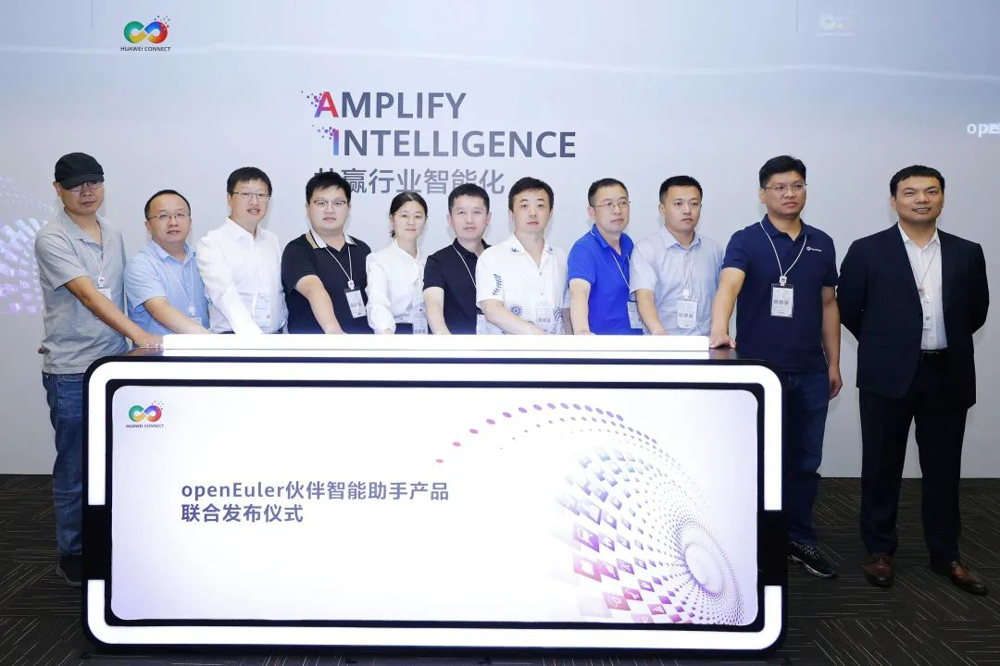
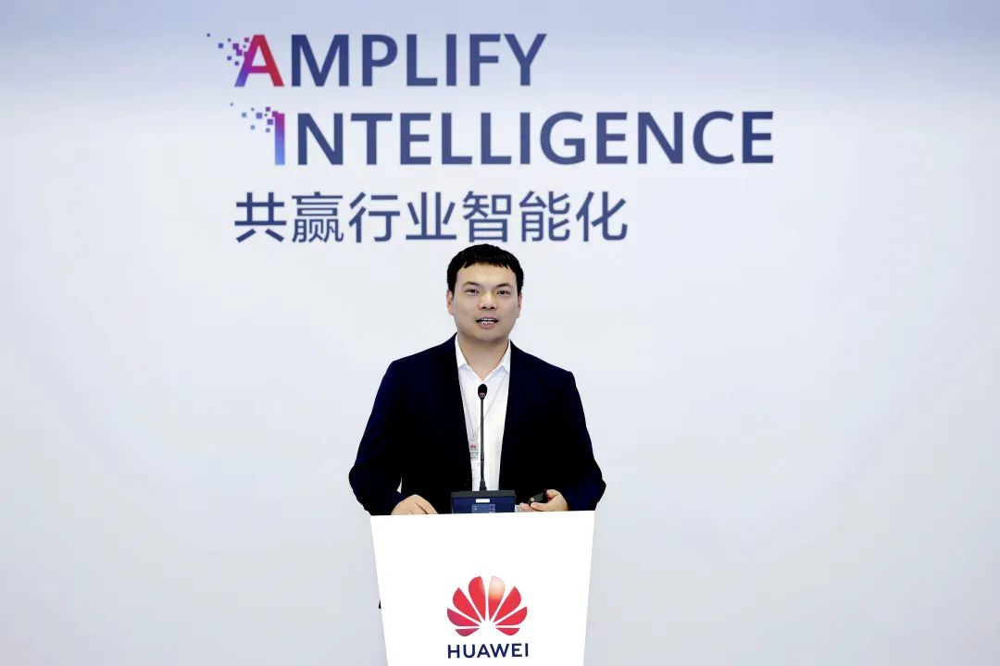
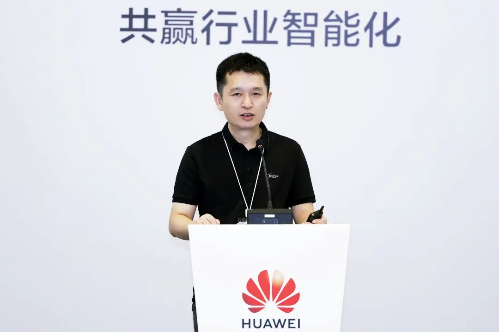
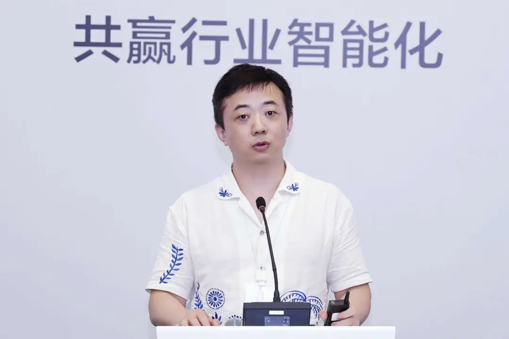
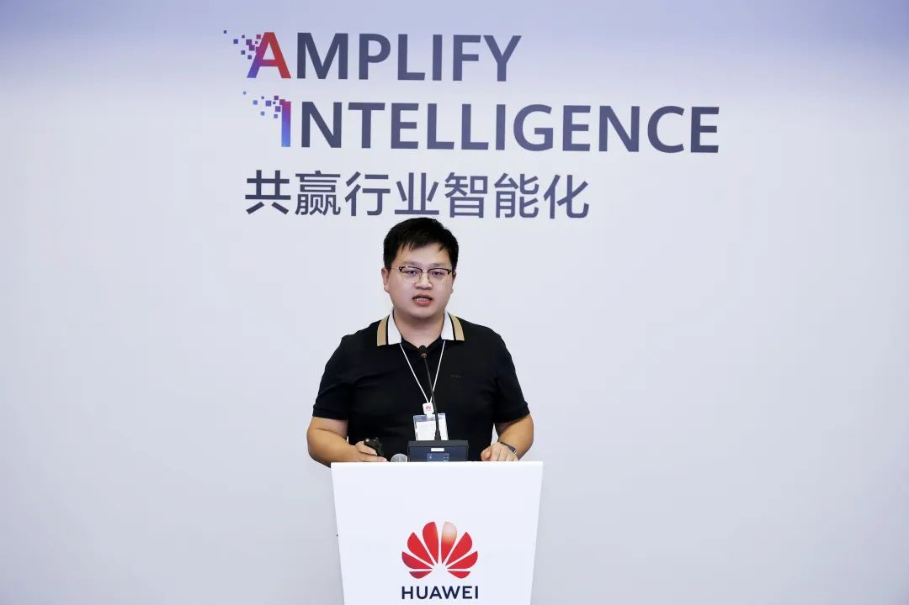
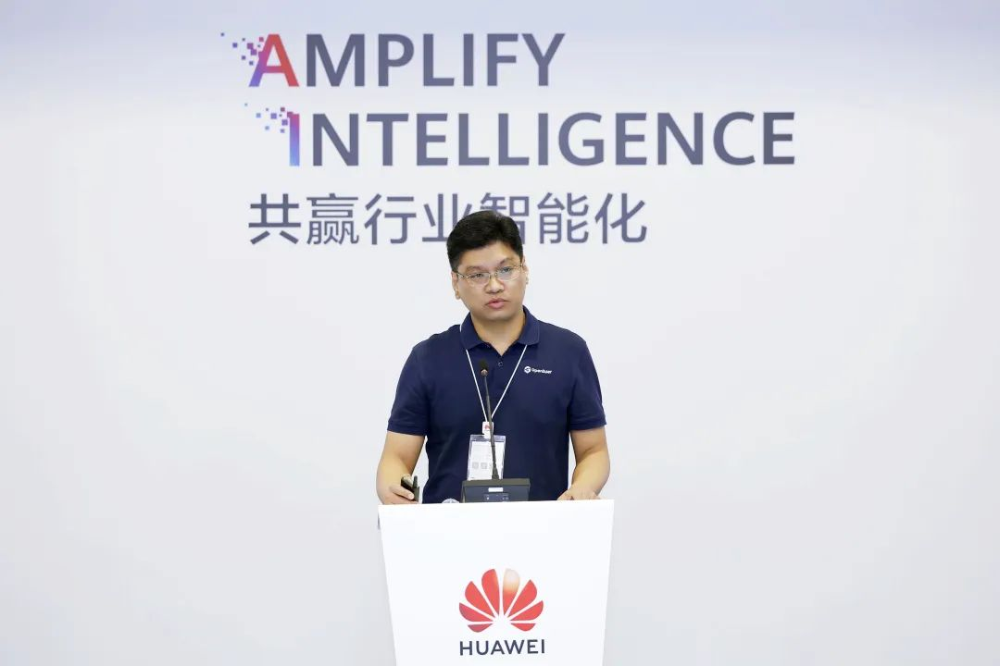
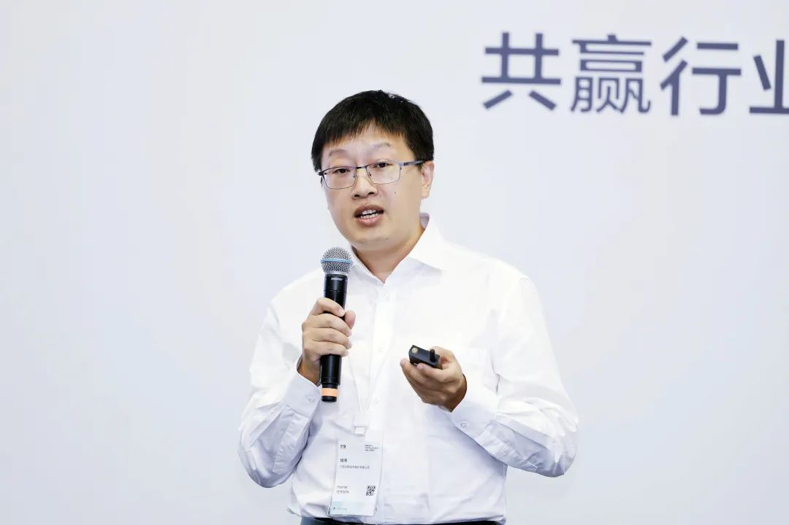
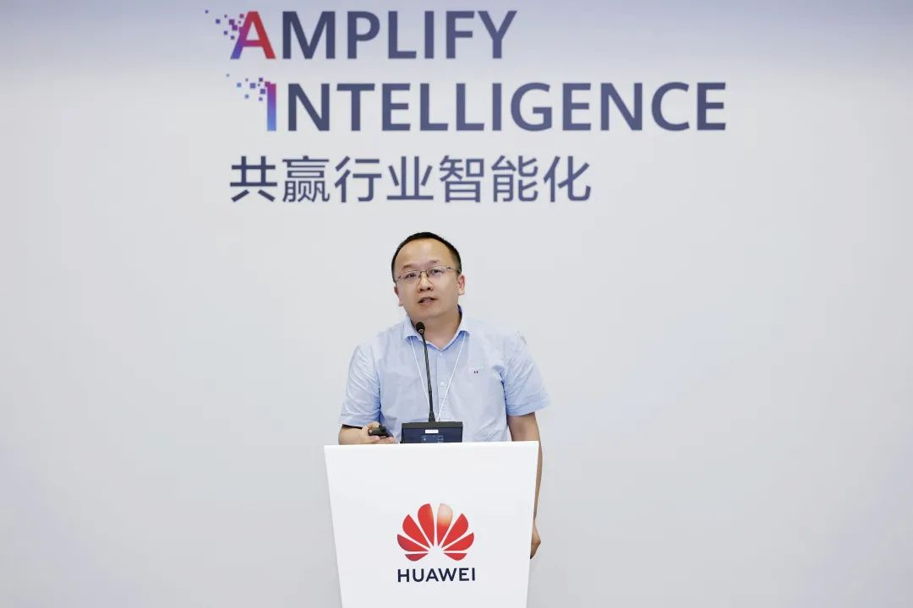
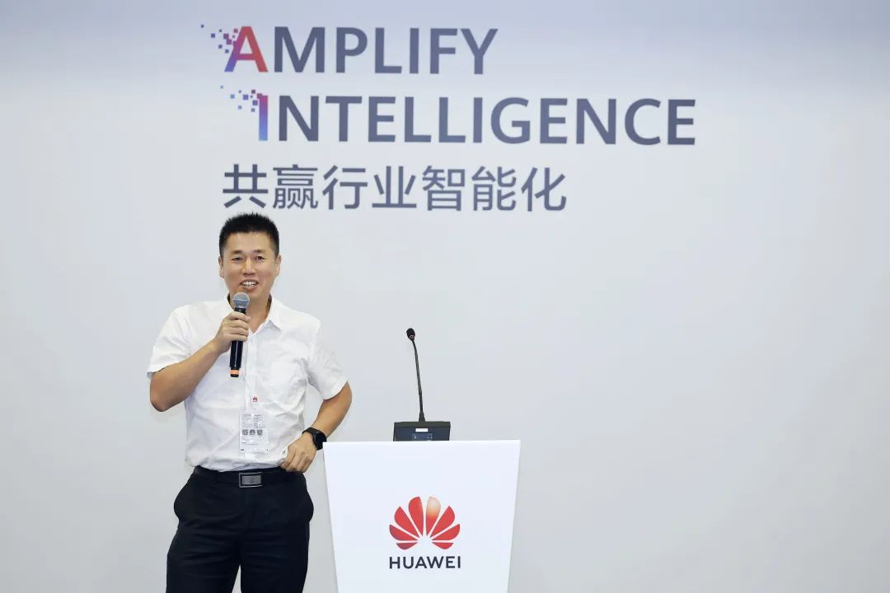

\[中国，上海，2024 年 9 月 20 日\] 在华为全联大会 2024
期间，以"openEuler（OpenAtom openEuler，简称"openEuler"） 使能 AI
和全场景创新，夯实算力底座"为主题的 openEuler
分论坛在上海成功举办。会上，openEuler 社区单位成员和行业用户分享了
openEuler 与产业结合的技术创新和最佳落地实践。openEuler
社区 11家成员单位在现场举行了 openEuler
伙伴智能助手产品联合发布仪式。

**openEuler伙伴智能助手产品联合发布仪式**

**openEuler 社区加速 AI 融合与应用，累计装机量达到850万+台套**
--------------------------------------------------------------

华为鲲鹏计算副总裁、华为计算 openEuler
总经理胡正策表示，华为持续投入openEuler社区建设，在产业界、学术界的各位领导、伙伴与开发者对openEuler
社区的大力支持下，社区开发者突破2万+，企业1700+，ISV
3200+，在国计民生行业、互联网行业实现规模突破，截至目前累计装机量已经达到850万+台套。从2024年6月6日openEuler
24.03 LTS 版本发布首个AI
原生开源操作系统开始，到9月社区在通算智算协同加速、降本增效、ISV智能化升级方面，进一步展开协作创新。在北向应用生态上，openEuler
Copilot system 构建LLM智能交互平台，通过一套北向语义接口标准 ，
一套全流程工具链，一套运行时加速AI应用落地。一方面围绕OS深挖AI应用潜力，通过自然语言交互，使能应用部署，智能调优典型场景性能提升10%+，智能诊断场景配置溯源、CVE巡检效率提升30%。另一方面使能行业应用智能化，围绕生成式AI
行业智能化5个阶段，加速企业ISV
应用智能化升级，在企业知识问答准确率提升至90%，LLM 应用TTM
月级缩短至周级。在南向芯片和硬件生态上，打造异构融合OS
构建异构融合内存、算力切分统一接入框架，支持广泛的设备快速接入，使能通算、智算统一演进，LLM
推理/搜推提升50%+，CV类推理吞吐1x\~2.5x。目前，openEuler
社区已经创建sig-intelligence、sig-AI-infra 两个SIG，10+伙伴基于openEuler
Copilot
System构建AI应用，欢迎广大开发者、伙伴、企业加入，共建AI基础设施及生态互联新生态。

**美团与 openEuler 社区深化合作，优化容器云场景运行效率**
---------------------------------------------------------

美团操作系统负责人曾文斌分享了 openEuler
在美团的应用。美团与 openEuler
社区的合作已逾两年，双方在快速部署、版本规划、生命周期管理及软硬件兼容性等方面取得显著成效。今年，合作进一步聚焦容器云场景下的精细化运营，旨在解决线上运行中的实际问题。美团容器云平台承载了美团
90%以上的在线业务，面临服务器种类多样、业务类型复杂及资源调度挑战。针对这些问题，美团利用
openEuler
社区的技术，结合内部业务场景，创新性地提出了解决方案。通过引入云原生 SLI
及 openEuler Copilot
system，美团实现了对容器资源更精细的监控与分析，有效识别并定位在线业务间的干扰源。同时，借助
openEuler
内核能力，美团开发了动态资源限制策略，确保高敏业务稳定运行，减少业务抖动。目前，该方案已在实际应用中展现出显著效果，干扰问题能在
10
分钟止损，业务稳定性显著提升。未来，美团计划进一步引入智能化技术，提升干扰识别的精确性，并推动
API 化、工具化进程，以便更好地集成 openEuler
社区的能力，持续优化容器云平台的运行效率。

**麒麟软件 openEuler 创新案例 ，推动全产业数字化转型**
------------------------------------------------------

麒麟软件有限公司生态与技术服务中心副总经理、产品赋能部经理杨汇成分享了基于openEuler的创新案例。作为中国操作系统的领军企业，麒麟软件积极参与
openEuler
社区建设，公司在社区中维护超过1700个代码项目，发起创建6个SIG组，参与多个领域的技术创新，是openEuler
社区的第二大贡献者。麒麟软件积极构建多样化的算力支持体系，推出银河麒麟云底座OS、工业OS、智算OS等新型操作系统，以满足不同场景的计算需求。展望未来，麒麟软件将继续坚持自主创新，围绕AI系统底座，打造算力引擎，安全引擎，生态引擎，应用引擎等核心引擎，构建全场景智能操作系统，为数字中国建设贡献力量。

**统信软件在医疗行业信息化建设与经验分享**
------------------------------------------

统信软件技术专家蔡健分享了 openEuler
在医疗行业信息化建设方面的成果与经验。通过两个典型案例，统信软件展示了其在医疗信息化领域的深耕与创新。统信软件在某妇幼保健院成功上线了
PACS 系统，该系统利用
AI、数据引擎及算力，将医生日常工作中产生的非结构化数据转化为结构化数据，极大提升了医疗信息的一致性和共享性。该系统已平稳运行近一年，每日处理实时数据超百人次。其次，针对
CentOS
停服带来的安全挑战，统信软件与东软等医疗行业头部企业合作，完成了医保集团内
70 多个业务系统模块及 400
多台操作系统的升级改造，有效保障了系统的稳定与安全。统信操作系统基于分层分类理论构建，通过垂直分层和水平分类提升系统的兼容性和稳定性。在安全性方面，统信软件采用
Rust
语言重写部分代码，显著降低了内存管理漏洞风险，并构建了生态、自身及供应链的多维度安全体系。未来，统信软件将结合
AI 与算力发展，持续优化操作系统，特别是在硬件适配、AI
大模型及算子库支持等方面，推动医疗行业信息化向更高水平迈进。

**麒麟信安推出大模型智能运维管理平台，推动电力行业智能化转型**
--------------------------------------------------------------

麒麟信安操作系统产品线总监、openEuer
技术委员会委员石勇，分享了麒麟信安近日发布的基于大模型的智能电力运维管理平台。该平台依托麒麟信安在电力行业多年积累的运维经验，旨在提升运维效率，降低运维门槛，以对复杂电网环境下的运维挑战；通过将大语言模型的智能化推理和机器学习小模型在时序数据方面的处理和分析能力相结合，实现了服务器操作系统运维的精准异常分析、高效资源分配及性能监控，解决了传统运维中人员依赖度高、异常定位难、资源调配不合理等问题。

**润和软件推出 HopeOS 大数据与 HopeOS+AI 解决方案，赋能 AI 与智慧城市**
-----------------------------------------------------------------------

江苏润和软件解决方案总监魏博分享了基于 openEuler 的
HopeOS 操作系统的战略蓝图，重点展示了在 AI
技术与智慧城市领域的创新应用与实践。面对 AI
与大模型技术的快速发展，润和软件推出了 HopeOS 大数据与 HopeOS+AI
解决方案，向下使能鲲鹏与昇腾硬件，向上结合容器版实现模型封装与创新。润和专注于
L1 级行业大模型与 L2 级应用落地，推出 RAG+、数字人、CV
大模型等关键技术。在实际案例中，润和软件为政府互联网+服务平台提供智能问答解决方案，通过
RAG+技术提升老年人友好度，节省预算 30%，并大幅提升应用效率，展现了其在
AI 与智慧城市领域的强大实力与市场潜力。

**基于凝思安全操作系统 openEuler 版构建 AI 新生态**
---------------------------------------------------

凝思软件研发总经理分享了基于凝思安全操作系统 openEuler
版构建 AI
新生态的演讲内容。凝思软件凭借在操作系统领域的深厚积累，已广泛应用于电力、轨道交通、通讯及金融等多个关键基础设施行业。凝思软件与
openEuler 社区紧密合作，积极参与开源生态建设。2024 年，凝思安全操作系统
openEuler 版通过安全可靠测评，标志着其技术实力的进一步提升。面对 AI
技术的快速发展，凝思软件与华为昇腾深入合作。凝思操作系统支持主流 AI
芯片，并内置 AI
套装软件，实现开箱即用，极大地方便了用户部署和使用。此外，凝思还针对智谱、通义千问等大模型进行了适配，实现了秒级响应的问答能力。凝思软件内部也在积极开展
AI
实践，包括文本转图片、编程助手和本地知识库构建等领域。未来，凝思软件将继续深化
openEuler
社区和华为昇腾的合作，推动软硬件协同发展，为行业全场景创新提供坚实的基础，与各界伙伴共同打造更加繁荣的
AI 新生态。

**粤港澳大湾区（广东）国创中心携手 openEuler 共建工业软件新生态**
-----------------------------------------------------------------

粤港澳大湾区（广东）国创中心操作系统业务负责人柯善风分享了在嵌入式操作系统领域的探索成果。粤港澳大湾区（广东）国创中心推出的基于
openEuler
的整体解决方案，通过"1+2+1"模式，即一个混合部署底座、两个关键产品（GPOS
及
IDE）及一系列生态合作，有效提升了嵌入式操作系统的性能与可靠性，在抖动等关键指标上实现了行业领先，为高端数控机床等高精度设备提供了有力支持。此外，粤港澳大湾区（广东）国创中心已与国内多家头部企业合作，成功将
openEuler
嵌入式操作系统应用于工业机器人及数控系统中，实现了显控一体、智能识别等创新功能。开源开放是粤港澳大湾区（广东）国创中心愿与所有合作伙伴共享技术成果，共同推动工业软件产业的快速发展。
