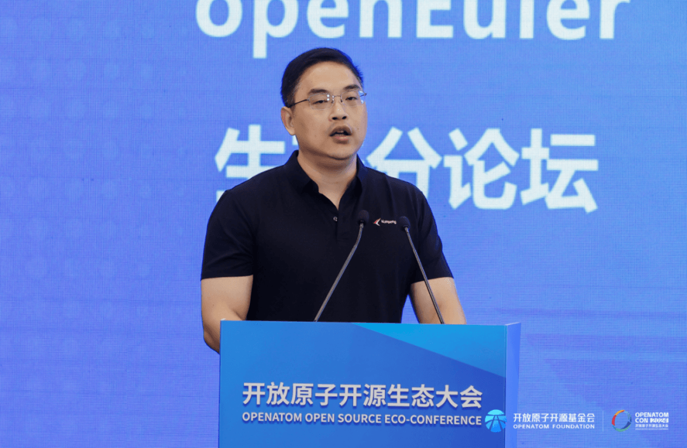

2024开放原子开源生态大会于9月25-27日在北京举办，来自政府、企业、学术界、研究机构的专家学者，共同探索开源赋能各领域创新的有效路径，推动开源生态可持续发展。

作为本次大会的一部分，openEuler生态分论坛顺利召开，来自openEuler社区的核心成员单位分享基于openEuler
24.03 LTS版本和即将发布的openEuler
24.09版本的技术创新、社区贡献、商业计划、生态发展等方面的成果和经验，呈现openEuler社区如何汇聚产业力量打造一个开放、创新、协作的开源生态系统。

下面就让我们来回顾本次活动的精彩瞬间\~

**开场致辞**

openEuler委员会主席江大勇为本次活动进行开场致辞，他表示openEuler社区自成立以来，成员单位和贡献者数量显著增长，下载量突破356万次，服务范围扩展至150多个国家地区。openEuler
24.03
LTS版本，实现了多项技术升级，包括内核更新和全场景能力提升。商业发行版在多个领域得到广泛应用，市场占比显著。openEuler积极推进全球化战略，与国际伙伴合作，并通过ISO18974软件供应链安全认证，拓展海外市场。他表示openEuler社区将继续推动技术创新和全球合作，为开源生态体系贡献智慧。

openEuler委员会主席江大勇

**EulerMaker：赋能openEuler，构筑全场景技术与生态新纪元**

EulerMaker是一套全新的构建系统，旨在打造全场景操作系统。它基于openEuler社区，支持从嵌入式到主流架构的广泛设备。EulerMaker的核心优势在于其源码和二进制镜像的定制能力，能够从统一源码构建出适应不同场景的操作系统，支持广泛设备和深度定制。经过两年开发，已服务多家客户。它提供统一的构建测试平台，优化资源管理，引入弹性调度和快照功能。EulerMaker
支持新旧格式并存，简化定制过程，满足多版本、原子升级等新需求，为全场景需求提供了强大支持。

openEuler技术委员会委员吴峰光

**拥抱开源，共建生态 ---基于openEuler的服务器操作系统应用与性能优化**

麒麟软件是openEuler开源社区的重要贡献者，深度参与社区发展和商业化应用，在openEuler
24.03
LTS版本PR贡献排名第一。麒麟软件在openEuler社区中推动多项技术创新，并在性能优化方面取得显著成果，如通过引入智能调优引擎A-Tune，显著提升了应用性能。麒麟软件现已形成桌面操作系统、服务器操作系统、万物智联操作系统、工业操作系统、智算操作系统产品等为代表的产品线，达到国内最高的安全等级，在多个行业建立生态适配中心，共同促进生态发展。麒麟软件与华为深度合作，基于openEuler社区推动服务器操作系统性能优化。随后华为专家陈功还介绍了openEuler性能优化的策略和实践，包括全栈效能、运行时在线优化和定制场景下的极致调优。

董军平   麒麟软件生态与技术服务中心副总经理

华为计算产品线OS性能技术优化专家 陈功

**共创openEuler生态，携手鲲鹏打造数智化统信UOS操作系统**

统信软件积极参与openEuler社区的贡献，超过200名开发者在社区参加贡献，其中18位担任了Maintainer的关键角色。基于openEuler，统信软件推出了商业版操作系统UOS
V20，并计划在2025年推出新一代产品UOS
V25。统信UOS通过分层分类的方法实现系统定制，采用Rust语言重构关键组件，以提升系统的安全性。

此外，统信软件与华为鲲鹏紧密合作，在鲲鹏架构上实现了统信UOS操作系统的资源智能调度和性能智能优化。统信UOS构建了全栈安全体系，包括国密算法支持和漏洞管理。它还提供了自动化的运维监管平台，以实现高效的运维管理。统信UOS广泛应用于党政机关和行业用户，助力推动数智化转型。

吕从庆 openEuler技术委员会委员

华为计算产品线操作系统专家李洋

**麒麟信安基于openEuler 24.03 LTS商业发行版本创新特性和行业应用案例**

麒麟信安操作系统是基于openEuler的商业发行版，提供安全增强、虚拟化增强等功能，支持多架构，包括X86\_64、鲲鹏、飞腾等。V3.6版本特性包括供应链安全、高可用冗余网络、内核性能优化、AI技术栈等。openEuler
24.03 LTS采用全新 Linux 6.6内核，实现全场景体验升级，基于openEuler 24.03
LTS
，麒麟信安操作系统版本的主要创新特性为基于ebpf的运维工具集，Bond3+链路冗余方案持续优化；OS
for
AI，加速AI应用落地；供应链安全全生命周期管理。典型案例包括能源、交通、金融等行业应用，如电力系统监控、地铁监控系统、银行等。

石勇 openEuler技术委员会委员

华为2012实验室操作系统高级架构师高贵锦

**openEuler RISC-V 2024：向 Server Platform 前进**

在 openEuler 24.03 LTS 中，中国科学院软件研究所主导的 RISC-V
版本首次实现了与x86/ARM
版本的统一软件源码、统一基础设施、统一质量标准、以及统一社区发布，达成了openEuler
对 RISC-V 原生支持的里程碑。依托 24.03  LTS，软件所发起 RVAize
标准演进计划、RVCI 战略基建计划、RVCK 内核同源计划与 RAVA
测试补全计划，旨在联合RISC-V上下游机构积极应对
RISC-V碎片化问题，将openEuler打造成为 RISC-V 服务器发行版典范。

作为国内首个达到 SPECCPU2006 单核 15 分/GHz 的 RISC-V
开源处理器，香山紧跟 RISC-V 基金会服务器平台规范，计划 2024
年完成服务器必备标准的功能开发，于此同时，积极向 EDK2，Linux
Kernel，QEMU 和 LLVM 等关键基础软件上游贡献，2024 上半年已合入 9
组补丁。此外，香山团队正规划开源自研验证用例gos，并贡献到 openEuler
社区，加速 openEuler RISC-V生态建设。

屈晟 中国科学院软件研究所 高级工程师

张健 北京开源芯片研究院 产品经理

**开放原子开源基金会授权openEuler培训伙伴**

产业发展与人才培养密不可分，抓产业必须抓人才。为了提升openEuler人才培养规模和质量，以适应产业高速发展的人才诉求，开放原子开源基金会及
openEuler社区共同构建了openEuler人才认证体系，已有多家企业申请加入openEuler人才生态共建。经openEuler社区委员会决议，对以下
9 家单位进行正式授牌。

（授牌单位：软通动力信息技术（集团）股份有限公司、中软国际科技服务有限公司、广州神州数码信息科技有限公司、统信软件技术有限公司、东软集团股份有限公司、南京柯普瑞信息技术有限公司、湖南麒麟信安科技股份有限公司、青软创新科技集团股份有限公司、北京凝思软件股份有限公司）
