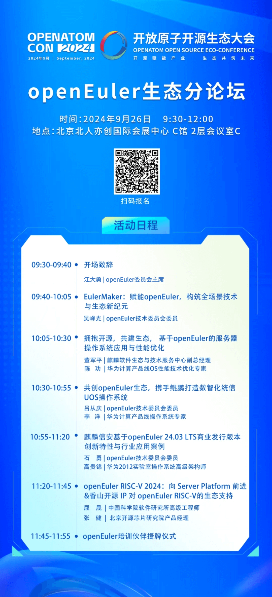
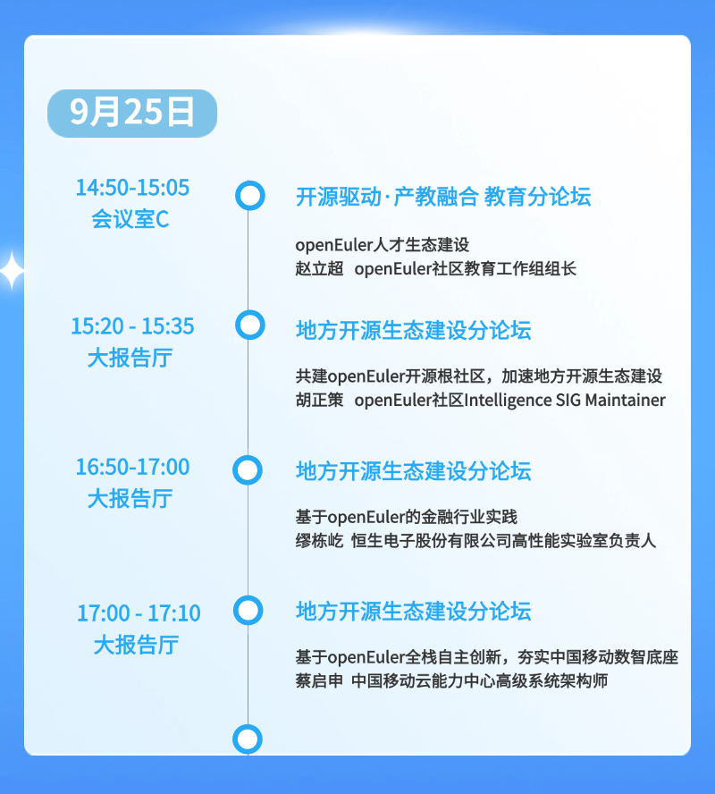

2024开放原子开源生态大会将于9月25-27日在北京盛大开幕，来自政府、企业、学术界、研究机构的专家学者，共同探索开源赋能各领域创新的有效路径，推动开源生态可持续发展。

在此次大会中，openEuler社区将举办openEuler生态分论坛以及openEuler展区，此外其他分论坛还有更多openEuler相关议题等你来！

**Part 1 openEuler 生态分论坛**

9月26日上午，openEuler社区将在大会上举办openEuler生态分论坛。届时将由来自openEuler社区的核心成员单位分享基于openEuler
24.03 LTS版本和即将发布的openEuler
24.09版本的技术创新、社区贡献、商业计划、生态发展等方面的成果和经验，呈现openEuler社区如何汇聚产业力量打造一个开放、创新、协作的开源生态系统。

欢迎报名参与！

**Part 2 openEuler 相关议题**

在本次大会上，openEuler分论坛之外，还设有多个分论坛，它们同样围绕openEuler展开了丰富的议题分享。我们热烈欢迎对此感兴趣的朋友前来参与，共同交流学习。

**Part 3 openEuler 展区**

在本次大会中，openEuler 社区将会在活动现场设置展区。如果您对
openEuler感兴趣，欢迎来 openEuler 展区交流。

展区地址：A4门口-openEuler展区
