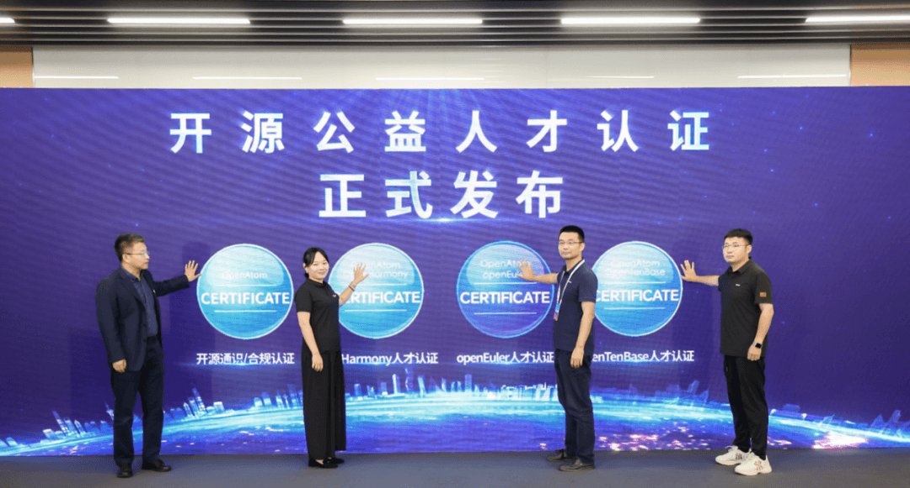
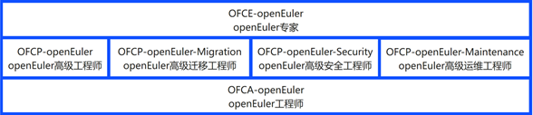
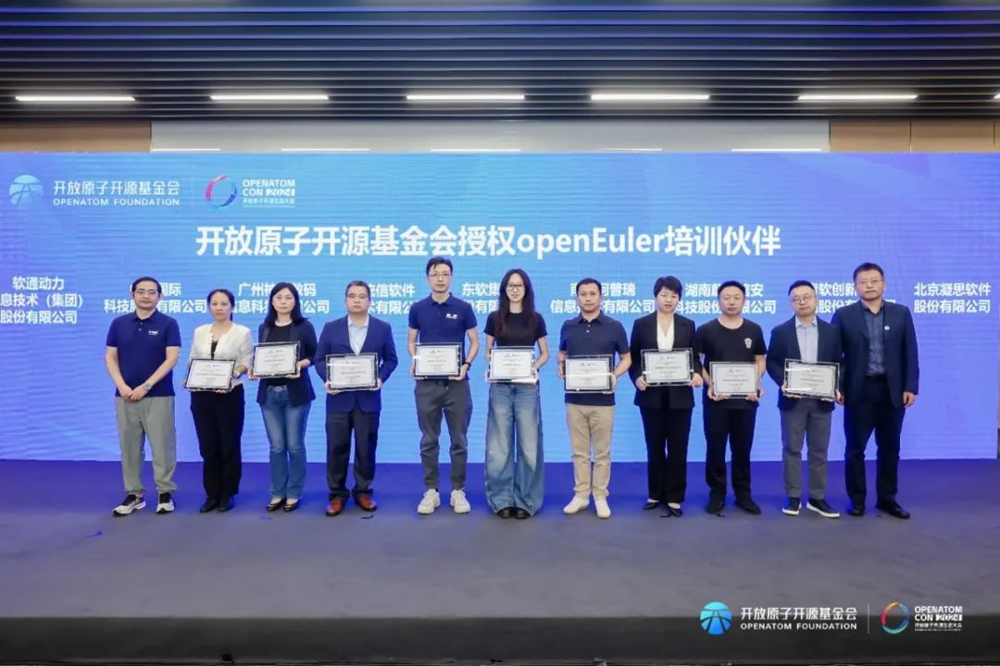

产业发展与人才培养密不可分，繁荣生态，人才先行。自openEuler项目开源以来，openEuler系市场占有率不断增加，openEuler业务快速增长，带动了openEuler人才需求的增长。为了快速培养openEuler专业生态人才，2024年6月6日，经openEuler社区委员会决议，openEuler社区人才认证纳入开放原子开源基金会开源人才认证体系，并于2024年9月25日在开放原子开源基金会的"开源驱动·产教融合"教育分论坛上进行了正式发布。

openEuler人才认证体系共分为工程师、高级工程师和专家三个等级。具体如以下框架图：

当前OFCA-openEuler认证课程已上线开放原子开源基金会学习考试平台（链接，<https://www.devedu.net/goods/show/24?targetId=30&preview=0>，可前往学习），OFCA-openEuler认证课程主要面向openEuler操作系统的初级服务管理人员。要求掌握openEuler操作系统的基本安装及配置管理，包括物理存储管理、系统服务的配置管理、网络连接和防火墙管理、进程管理、文件系统管理、用户和组管理、系统日志管理等。

为了提升openEuler人才培养规模和质量，以适应openEuler产业高速发展的人才诉求，已有多家企业申请加入openEuler人才生态共建。为了规范人才培养体系运作，经openEuler社区委员会决议，于2024年9月26日在开放原子开源生态大会的openEuler生态分论坛上对软通动力信息技术（集团）股份有限公司、中软国际科技服务有限公司、广州神州数码信息科技有限公司、统信软件技术有限公司、东软集团股份有限公司、南京柯普瑞信息技术有限公司、湖南麒麟信安科技股份有限公司、青软创新科技集团股份有限公司、北京凝思软件股份有限公司共9家单位进行正式授牌。

授权以上9家单位成为openEuler培训伙伴，与开放原子开源基金会及openEuler社区共同建设openEuler人才培养体系，共同繁荣openEuler人才生态。
