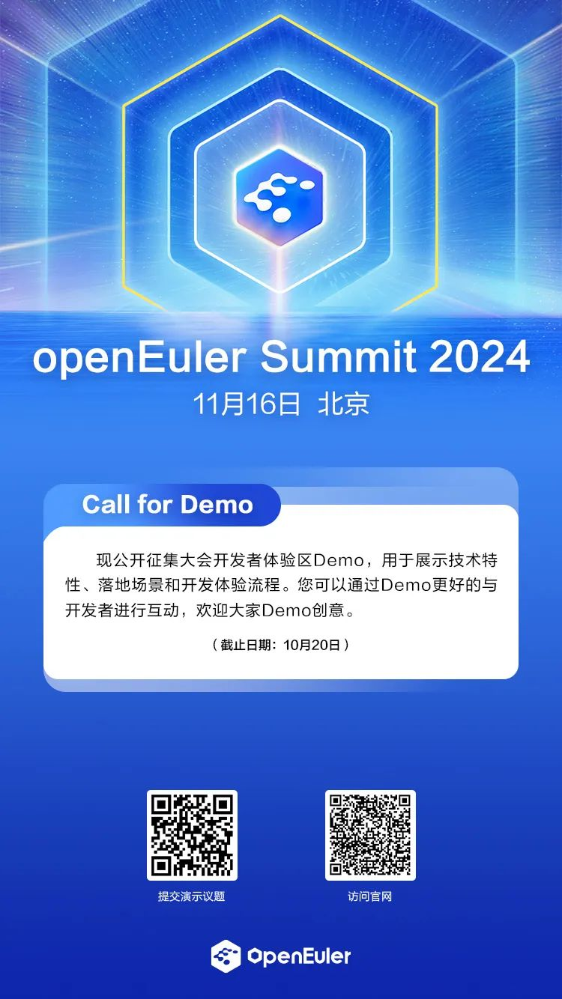

数智技术驱动第四次工业革命，带来生产力的显著跃升。作为千行百业的数字底座，openEuler五年来持续创新，为全球开源新生态的建设贡献力量。2024年11月16日，openEuler
社区将在北京中关村国际创新中心举办操作系统大会＆openEuler Summit
2024，本次大会旨在汇聚全球产业发展力量，邀请思想领袖、商业精英、技术专家、合作伙伴以及全球开源基金会等业界同仁，共同探讨操作系统产业发展方向和未来机遇，联合伙伴展示最新合作成果，分享数字化转型实践，以技术驱动创新不断激发新质生产力。开源是一种态度，分享是一种精神。

**Call
for Speaker、Call for SIG、Call for Sponsor、Call for Demo**
现已全面开放报名。我们诚挚的邀请您提交演讲议题、发表联合演讲、申报现场
SIG 会议、成为共建单位、贡献展示方案、参与社区建设。

3.jpeg)

