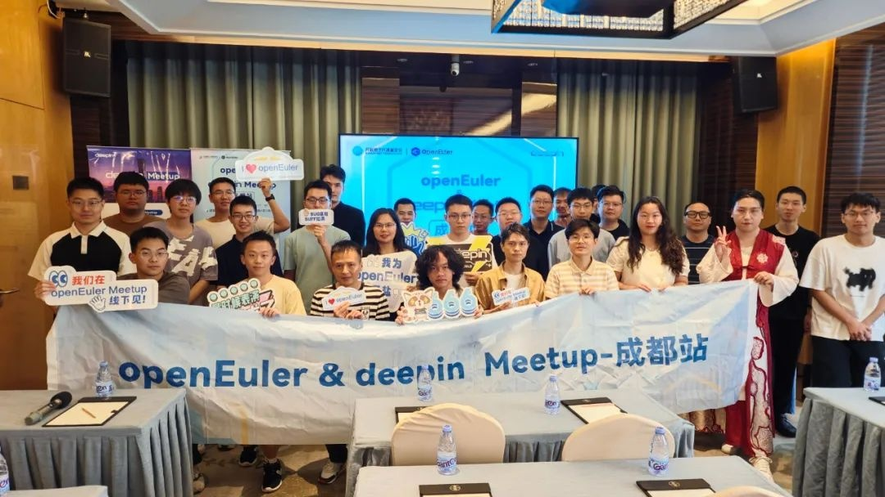

初夏的成都，开源热潮涌动。2025 年 5 月 24 日，由 OpenAtom
openEuler（简称\"openEuler\"） 社区、deepin
社区联合主办，如意玲珑社区承办的 openEuler&deepin Meetup
成都站已圆满落幕。

这场汇聚技术专家与开源爱好者的盛会，以 "共建开源生态"
为核心，带来了一场横跨文档生态、应用分发、AI
编程、开源工具与悬赏激励的思想盛宴。现在，让我们一起回顾这场活动的高光时刻！

主题演讲：技术前沿的深度分享

**代码之外：文档、翻译与写作的力量**

openEuler G11N SIG Maintainer
苏琴在会议中以「文档是开源项目的灵魂」为核心，揭示了文档生态建设在
openEuler 开源社区中的关键作用。她提到，G11N SIG 与 doc SIG
通过标准化体系构建了从内容生产到全球化传播的完整链条：已完成 162
个软件仓库 README
的优化重构，通过统一目录结构、强化操作指南可读性等措施，有效提升新人入门效率；同时组织翻译
200 + 技术博客，依托 CI Bot
自动化流程实现双语内容的高效产出，将传统翻译周期从数天压缩至 2
小时。

苏琴  \| openEuler G11N SIG Maintainer

**如意玲珑与 openEuler：Linux 应用分发新范式**

如意玲珑社区 Maintainer
陆子杰在分享中揭示如意玲珑项目的核心架构：通过应用层沙箱隔离（解决权限安全问题）、运行环境层跨平台适配（支持
X86/ARM/ 龙芯架构）、OS 层深度集成（兼容 openEuler
等主流发行版）的三层设计，构建「安全隔离 + 跨端适配 +
高效分发」的技术体系。

### Ziggy \| 如意玲珑社区 Maintainer

随后，在活动现场演示了主流应用在 openEuler
下的运行实例，直观验证「一次打包、多平台运行」的技术可行性。作为生态发展的技术基石，如意玲珑未来将进一步拓展
openEuler
在服务器操作系统领域的生态应用场景，持续强化应用接入效率与场景覆盖深度。

**从 "敲代码" 到 "说需求"：AI 编程的三体革命**

deepin 架构师卢桢以「AI 重构人机代码共生关系」为核心，系统阐释了 AI
编程从工具辅助向任务主导的演进逻辑。他提出三层协作模型
------「人类定义需求→AI
拆解任务→机器生成代码」，并通过双重技术演示直观呈现这一模型的实践价值：其一，DeepSite
基于自然语言指令在 1 分钟内完成 HTML5 游戏生成；其二，Cursor 的 AI Agent
实现「需求输入 - 代码生成 - 调试优化」的全流程闭环，清晰展现 AI
对传统编码范式的颠覆式重构。

卢桢（deepin-mozart） \| 中国发明协会成员，统信软件系统架构师

实践表明，AI
正推动编程范式向「自然语言需求定义」演进，使「说需求」逐渐成为数字化时代的新型编程语言。

**灵感源自生活：一个开源工具的诞生之路**

开源工具「简传」作者张鹏在活动现场分享了这款工具的诞生背景：因工作中频繁遭遇陌生电脑文件传输难题，促使其开发「本地发送端+ 浏览器接收端」的轻量化方案。技术上凭借 Electron-egg 与 Uni-app
国产框架组合，仅用 3 个月完成从开发到开源，并在过程中深度适配 deepin
系统，支持 10MB
以内文件跨设备传输。值得一提的是，张鹏透露未来将适配玲珑格式，让更多操作系统的用户可以共享便捷的文件传输服务。

张鹏 \| 开源工具「简传」作者

他的分享以真实的办公场景引发共鸣，展现了「需求驱动创新」的开源本质。正如张鹏所说：开源不是空中楼阁，而是把每个人遇到的小麻烦，变成大家都能用的解决方案。简传的诞生，正是国产开源生态「以用为本」理念的生动注脚。

**开源悬赏：贡献激励的普适性探索**

最后，开源社区实践者水歌在活动现场提出的「悬赏众包」模式，将 GitHub Flow
工作流与任务经济深度结合：通过把开发需求拆解为带赏金的 Issue
任务卡，开发者可自主认领并完成代码提交，经 Code Review
后直接获取报酬。以「需求拆解 - 任务悬赏 -
成果验收」的轻量化闭环，让开源贡献从「情怀驱动」转向「价值可量化」。

水歌  \| idea2app 创始人、fCC 成都社区主理人

水歌的探索不止于模式创新，更指向一个核心命题：当经济激励与开源精神有机结合，我们或许能见证更蓬勃的生态图景。

以上为本次 openEuler&deepin Meetup 活动回顾。
