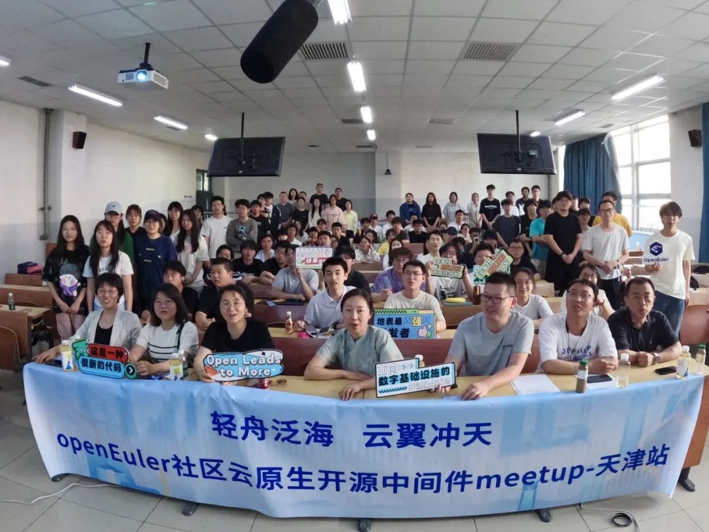
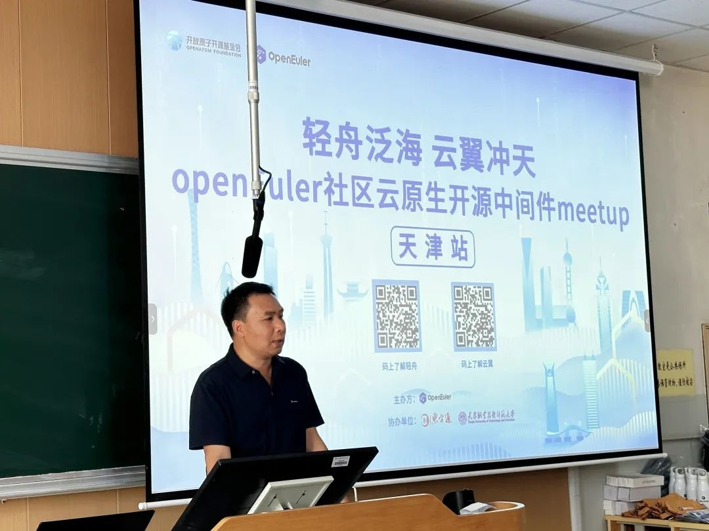
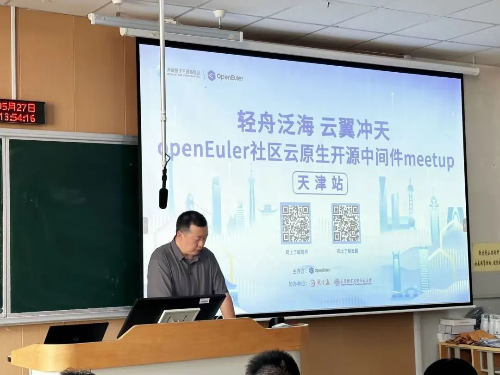
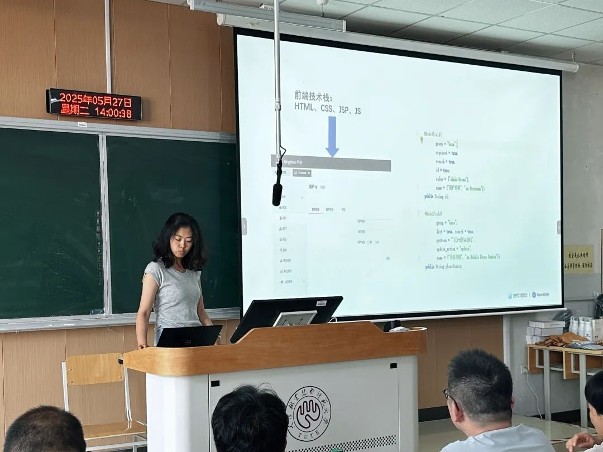
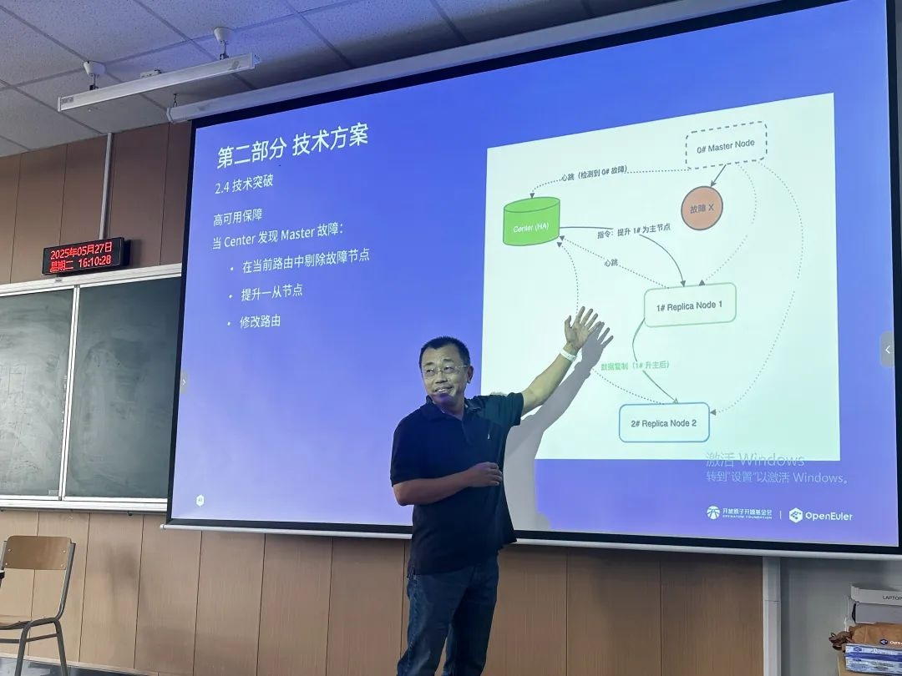
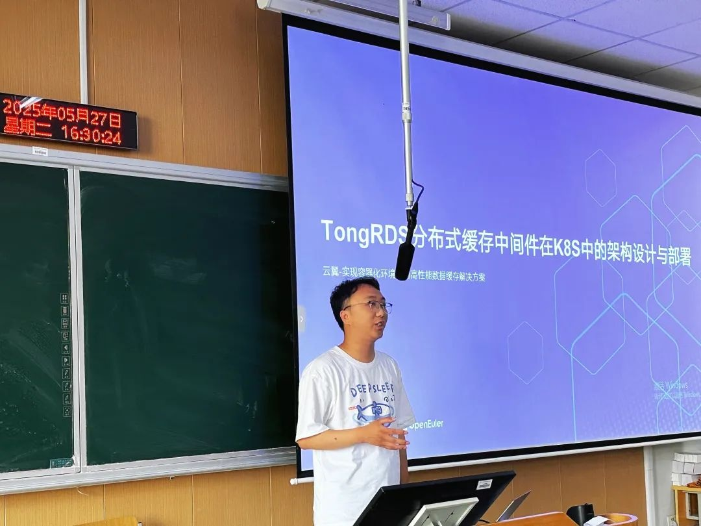
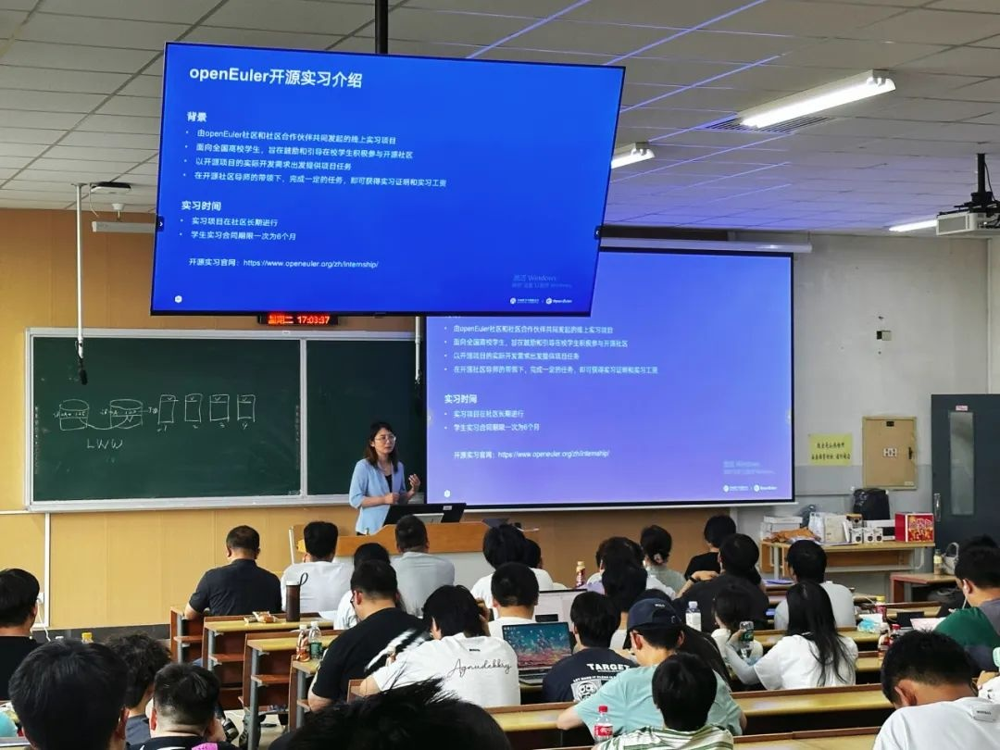

5月27日，东方通与OpenAtom
openEuler（简称\"openEuler\"）社区联合主办的openEuler社区云原生开源中间件Meetup天津站在天津职业技术师范大学圆满落幕。此次活动以轻舟融合管理平台和云翼数据缓存中间件云原生管理平台两大开源项目为核心，聚焦云原生中间件技术实践与开发者赋能，通过技术分享、实战演示与openEuler开源实习计划发布，培养兼具创新思维与实践能力的技术人才，携手推动云原生中间件技术赋能研发效能提升。

**校企联合 共促开源项目交流**

天津职业技术师范大学信息技术工程学院教学副院长武志峰发表致辞，他表示，此次与东方通合作举办开源技术沙龙，旨在为学生提供接触实战技术的机会，帮助他们在实践中提升技能，培养具备实战能力的创新型人才。这种产教深度融合的模式，不仅能为学生职业发展奠定坚实基础，更能为国家科技自主创新输送"新鲜血液"。

东方通开发部经理王普在致辞中强调，基础软件是软件工程的核心组件，在数字化转型中发挥着关键作用，而开源是推动技术进步的重要方式。非常期待年轻开发者能积极参与到轻舟、云翼等开源中间件项目中来，这些项目不仅能帮助开发者提升开发效率，更能借助年轻开发者的创新思维，激发项目的持续进化，形成
"技术赋能人才 --- 人才反哺技术"
的正向循环，为产业技术革新与企业效能升级开拓更多可能性。

**云原生中间件技术演进**
----

**轻舟与云翼开源项目解析**

面对业务快速迭代与算力需求激增的双重挑战，中间件的云原生化已从技术选择变为必然趋势，东方通技术专家在沙龙现场深入解析了openEuler社区的轻舟与云翼两大开源项目的技术特性与创新价值。

**轻舟开源项目：云原生时代的开发效率"加速器"**

东方通核心技术与轻舟项目Committer程福娟介绍了轻舟开源项目，作为开源的轻量级Web管理软件开发平台，轻舟能够支持开发者通过编写Java
Bean，自动生成业务模块对应的前端网页、REST接口、JMX接口、国际化等服务，并能开箱即用内置的用户管理、认证授权、监视自动化、文件上传下载、本地和远程集中管理、公共组件等能力，大幅提升开发效率。同时，程福娟以实践项目展示了如何快速基于轻舟搭建完整的应用程序，让在场师生直观感受到该平台的便捷性、开发的高效性。

**云翼开源项目：高性能缓存的技术突破**

openEuler社区云翼项目Committer李东升在分享环节，系统讲解了TongRDS分布式数据缓存中间件的技术优势与应用场景等。TongRDS不仅全面兼容Redis，而且凭借自主创新能力及面向云原生和现代多核硬件设计的全新架构，在性能、可靠性、可扩展性和云原生适应性上超越同类传统产品。能够在Web
加速、会话管理、热点数据缓冲、实时数据计算与推送等关键业务场景发挥重要支撑。在互动交流环节，通过现场研讨与思维碰撞，全面加深了同学们对
TongRDS技术特性的理解与认知。

openEuler社区云翼项目Committer张聪进一步聚焦TongRDS如何适配云原生环境（Kubernetes/K8S）进行解析。详细介绍了K8S自动化管理容器化应用平台的主要特性、技术架构等，指出传统集群模式在K8S中存在Pod
IP变动致连接失效、分片伸缩难、客户端连接复杂等问题。为此，TongRDS引入中心节点和Proxy代理层，采用代理集群与可伸缩集群模式，通过代理层屏蔽底层变化，利用备份资源池实现故障恢复，使客户端只需连接单一地址端口，即可实现在K8S环境下的高效部署与运行。该开源平台，既助力开发者提升分布式系统开发能力，又为企业云原生转型提供平滑上云路径，现场的师生对此也报以热烈反响。

**开源实习计划**
-----

**助力年轻开发者实战能力跃迁**

东方通生态发展经理祝晓阳介绍了东方通openEuler社区的开源实习计划。该计划面向全国高校学生，提供轻舟和云翼两大项目的实战任务，学生可通过线上方式参与开发，积累积分兑换实习证明及奖金。祝晓阳详细讲解了实习方式、实习流程、实习任务、奖励机制等，根据积分进阶机制，表现突出者最高可得8000
元实习工资及证明。同时，通过理论知识与实战开发结合的实践机会，将帮助年轻开发者更好地融入实际开发环境，提升创新能力与实际开发技能。

轻舟项目地址： https://gitee.com/openeuler/qingzhou

云翼项目地址： https://gitee.com/openeuler/yunyi

想要加入实习项目的小伙伴可通过以下方式联系 

轻舟项目联系方式: wangpl@tongtech.com 

云翼项目联系方式: wuyd@tongtech.com

**积极拥抱开源 **

**技术赋能与人才培养双轮驱动**

东方通积极拥抱开源生态，作为openEuler社区的重要参与者与推动者，深度参与openEuler社区，持续推进轻舟、云翼两大开源项目发展，秉持开放共享精神，依托openEule社区的技术资源和人才优势，持续优化项目性能，显著加速了云原生中间件技术迭代进程，为开发者提供了更高效的开发模式，让企业能够缩短开发周期，加速上云效率，切实解决数字化转型中的核心痛点。

本次东方通＆openEuler
Meetup走进高校，通过深入解析轻舟、云翼两大开源项目，并结合实际案例演示，让更多年轻开发者接触到前沿云原生技术，吸引更多新鲜力量参与openEuler社区贡献开源力量，通过校企联合的创新模式，将产业需求与教育实践紧密结合，为开源生态培育了新生力量。

开源不仅是技术的共享，更是生态的共建。期待更多年轻开发者投身开源与基础软件，与东方通一起，共同书写云原生时代的技术新篇章！
